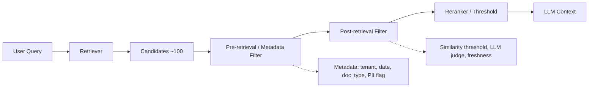

# Filtering

> **Learning Path:** RAG Architecture
> **Section:** 8.1.20 — Learn

### 1. The problem

RAG retrieval is recall-oriented by design. A vector search returns the top-k nearest chunks, not the correct chunks.

In production that means:
* Semantically close but irrelevant documents get in
* Stale versions, drafts, and duplicates pollute the context
* Documents from the wrong tenant, region, or permission set leak in
* Low similarity neighbors add noise that degrades LLM answers and increases cost

Without a control point, you are feeding the LLM a noisy bag of text. The model will try to use it, hallucinate around it, or waste tokens on it.

Filtering is the architectural control that turns recall into precision before the context reaches the LLM.

### 2. Mental model

Think of retrieval as a wide net and filtering as the mesh.

Retriever maximizes recall: get candidates that *might* help.
Filter maximizes precision: keep only candidates that *should* be used.

A good filter sits on a trust boundary: between unstructured similarity and structured policy.

### 3. How it works

Filtering in RAG is layered, not one step.

* **Pre-retrieval / metadata filtering**: applied before or as part of the vector query. Structured constraints pushed to the database: `tenant_id = X`, `doc_type IN [...]`, `published_at > 2024-01-01`, `sensitivity <= user clearance`. Cheap, deterministic, zero LLM cost.
* **Post-retrieval filtering**: applied after candidates are returned. Relevance checks: similarity score threshold, cross-encoder rerank score, recency decay, deduplication, LLM-as-judge for factual relevance or policy compliance.
* **Thresholding and gating**: drop candidates below a similarity floor, keep top-N after rerank, enforce max tokens per source.

The filter criteria are a mix of static policy and dynamic query signals.

### 4. Architectural reasoning

Filtering solves: *How do I keep recall high enough to find the answer, but precision high enough that the LLM doesn’t get confused or violate policy?*

When it helps:
* Multi-tenant RAG where isolation is mandatory
* Large corpora with versioned or time-sensitive content
* Compliance requirements: PII, regulated data, legal hold
* High cost / latency budgets where context window is expensive

Alternatives and why filtering wins:
* **Retrieve more and let LLM sort it out**: works for small corpora, fails on noise and cost at scale.
* **Only metadata filtering**: misses semantic irrelevance.
* **Only reranking**: expensive and still allows policy-violating docs in.

The decision is where to place the filter. Push as much as possible pre-retrieval for latency and cost, keep semantic/policy checks post-retrieval for accuracy.

### 5. Trade-offs and failure modes

* **Precision vs Recall.** Tight filters improve answer quality but increase miss rate. Loose filters improve coverage but add noise. This is a business decision, not an engineering one.
* **Latency vs Quality.** Metadata filters are cheap. Cross-encoder rerank and LLM judges add 50-300ms per query and cost per token. Architect for tiered filtering: cheap first, expensive last.
* **Static vs Dynamic.** Static metadata rules are reliable but brittle. Dynamic similarity thresholds adapt to query difficulty but can drift. Combine both.
* **Over-filtering.** The most common failure. An overly aggressive date filter removes evergreen content. A tenant filter with inconsistent metadata silently drops results. Monitor filter hit rates and recall.
* **Metadata quality.** Filters are only as good as the metadata. Missing `tenant_id` or incorrect `published_at` means policy bypass or false negatives.
* **Filter bypass via retrieval.** If the vector DB can’t express a constraint, you must filter post-retrieval, which means you already paid retrieval cost for junk.

### 6. Example

Enterprise support RAG with 10M internal articles.

Query: "How to reset MFA for customer X in EU?"

Pre-retrieval filter: `tenant_id = internal`, `region = EU`, `doc_type IN [kb, runbook]`, `published_at > 2023-01-01`, `sensitivity <= internal`. This cuts 10M to ~40k.

Retriever returns top 100 candidates. Post-retrieval filter drops:
* similarity < 0.72
* duplicates with same URL
* documents flagged `PII = true` for non-privileged users

Reranker keeps top 8, ~3k tokens. Result: correct, current, compliant context, no leakage of US procedures or draft drafts.

Without filters, the LLM would see US MFA steps, a 2019 article, and a redacted draft. With filters, latency stays <400ms and answer is trustworthy.

### 7. Reasoning challenge

You have a medical RAG system. Clinicians query for drug interactions. You can filter by `license_tier` and `last_reviewed_date`. Should you also run an LLM judge to filter for "clinically relevant" after retrieval?

Consider: cost per query, risk of a false negative vs a false positive, and who owns the policy. What do you choose and where do you put the threshold?

### 8. Key takeaway

* Filtering converts retrieval recall into LLM-ready precision and enforces policy.
* Push deterministic, cheap constraints pre-retrieval; use semantic/policy checks post-retrieval.
* The core trade-off is precision vs recall, governed by latency, cost, and risk tolerance.
* Monitor filter drop rates and metadata quality; over-filtering is silent and dangerous.
