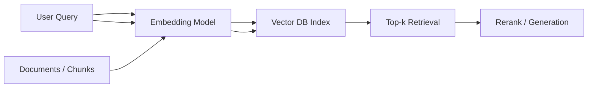

# Semantic search

> **Learning Path:** RAG Architecture
> **Section:** 8.1.21 — Learn

**Semantic search**

### 1. The problem

Keyword search works when users know the exact terms you indexed. It fails when meaning matters.

A user asks: "How do I cancel my subscription if I paid by credit card?" The knowledge base contains: "To terminate recurring billing, navigate to Billing > Payment Methods and select Remove."

No shared keywords. BM25 returns nothing useful. The problem is not retrieval speed, it's semantic mismatch: query and relevant doc are close in meaning but far in vocabulary.

Constraints that create the need:
* Natural language queries with synonyms, paraphrase, and implicit intent
* Unstructured corpora where key terms are not known in advance
* Need for recall across concepts, not just terms

### 2. Mental model

Semantic search maps text to a vector space where meaning is proximity.

Same meaning → vectors close. Different meaning → vectors far.

You don't match words, you match positions in an embedding space learned from language.

### 3. How it works

Three steps, repeated at query time:

1. **Encode.** An embedding model turns chunks of documents and the user query into dense vectors, typically 768-3072 dimensions.
2. **Compare.** Similarity is measured with cosine similarity. The vector DB finds nearest neighbors to the query vector.
3. **Return.** Top-k chunks are returned to the downstream system, often RAG.

Chunking matters more than the model. Too small = loss of context. Too large = dilution. Most RAG systems chunk 200-800 tokens with overlap.

### 4. Architectural reasoning

Semantic search solves: *find relevant information when wording differs.*

When it helps:
* Conversational Q&A over support docs, contracts, codebases
* Discovery where user intent is vague
* Multilingual retrieval

Alternatives:
* **Keyword BM25:** fast, exact, explainable. Best for precise terms like IDs, error codes.
* **Hybrid:** semantic + keyword. Use semantic for recall, BM25 for precision, then fuse scores. This is the default for production RAG.

Decision rule: Use semantic when recall of meaning > exact term match. Use hybrid when you need both.

### 5. Trade-offs and failure modes

* **Recall vs precision.** Embeddings retrieve broadly. You get conceptually related chunks, sometimes irrelevant ones. Reranking with cross-encoder or LLM is usually needed.
* **Index choice.** HNSW = low latency, high memory. IVF / PQ = lower memory, tunable recall. Pick by corpus size and latency SLO.
* **Model drift and freshness.** Embeddings are static to a model version. New jargon, product names, or domain shift degrades relevance. You need re-embedding pipelines.
* **Context loss.** Embeddings compress meaning. They struggle with negation, numerical comparisons, and long-range dependencies. "Cancel subscription" vs "cannot cancel subscription" can be close vectors.
* **Cost.** Embedding every chunk at ingest and at query time is compute. Vector DB adds operational surface.

Failure mode to watch: semantic false positives. A query about "refund policy" retrieves a "refund request form" because vectors are close, but the form is not the answer.

### 6. Example

Enterprise support RAG.

Corpus: 200k support articles, release notes, contracts. Chunked to 512 tokens with 64 token overlap. Embedded with a domain-tuned model and stored in a vector DB with HNSW.

User asks: "I was overcharged after upgrading my plan last month."

Keyword search finds nothing. Semantic retrieval returns chunks about prorated billing, upgrade charges, and credit notes. Reranker picks the most relevant. LLM generates an answer with citations.

Without semantic search, the system would require users to phrase queries exactly like the docs.

### 7. Reasoning challenge

You are building a legal clause search for contracts. Users search by clause type like "indemnification cap" and also ask natural language questions like "who is liable if data is breached?"

Would you use pure semantic search, pure keyword, or hybrid? What would you use as the primary retriever and what as the guardrail?

### 8. Key takeaway

* Semantic search exists to bridge wording gaps between user intent and document language.
* It works by mapping text to vectors and retrieving by similarity, not term match.
* Use it for meaning-based recall; combine with keyword for precision.
* Chunking, embedding model, and index type are architectural decisions with real recall/latency/cost trade-offs.
* Expect semantic drift, context loss, and false positives. Mitigate with hybrid retrieval and reranking.
