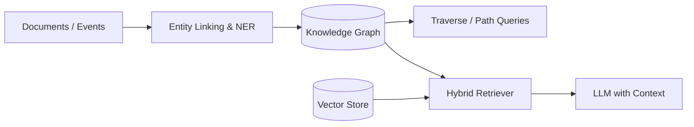

# Knowledge graphs

> **Learning Path:** RAG Architecture
> **Section:** 8.1.22 — Learn

### The problem

Vector RAG retrieves by semantic similarity. That works for "find me a passage about X", but fails for structured relationships.

You get:
* **Entity ambiguity.** "Apple" is a company, a fruit, and a record label. Vectors don't disambiguate without context.
* **Multi-hop reasoning loss.** "Who is the current CTO of the company that acquired X in 2021?" Requires linking AcquiredBy -> Company -> CurrentCTO. Vector chunks rarely contain the whole chain.
* **No explicit provenance and updates.** A fact changes. With vectors you re-embed everything. With a graph you update one edge.
* **Hallucinated connections.** LLMs infer relations that aren't in the data. You need a source of truth for relationships.

The problem is not retrieval recall, it's *relational fidelity*.

### Mental model

A knowledge graph is an explicit memory of entities and how they relate.

Nodes = entities. Edges = typed relationships with properties. It's a graph database optimized for "who is connected to whom, how, and why".

Think of it as the schema you wish your documents had, but built from them.

`Person --[worksFor {since:2020}]--> Company --[acquired {date:2021}]--> Company`

Vector search answers: "what is similar". Graph traversal answers: "what is connected".

### How it works

Ingestion extracts entities and relations from documents, code, CRM, etc., and normalizes them.

Core mechanisms:
* **Entity resolution.** Same real-world entity gets one ID. `Apple Inc.` = `AAPL`. This collapses duplicates.
* **Schema, loosely.** Types for nodes and edges, but most graphs are schema-flexible. You add new relation types as you learn.
* **Graph queries.** Path queries like `(:Person)-[:MANAGES]->(:Team)<-[:MEMBER]-(:Person)` replace multi-step retrievals.
* **Hybrid retrieval.** Vectors find candidate passages; the graph provides structured context and constraints for those passages.

In RAG architecture the graph is not a replacement for vectors. It's a companion: vectors for recall, graph for precision and reasoning.

### Architectural reasoning

Use a knowledge graph when you need:

* **Reasoning over connections.** Multi-hop questions, lineage, impact analysis.
* **Entity-centric consistency.** One source of truth for who/what is what, with provenance.
* **Explainability and audit.** You can trace a fact back to `entity -> relation -> source document -> timestamp`.
* **Dynamic updates.** Incremental edits to facts without full re-embedding.

Alternatives:
* **Vector-only RAG.** Simpler, good for open-ended Q&A. Fails on structured relationships.
* **Relational DB + vectors.** Works if schema is stable and well-known. Knowledge graphs win when schema evolves and relationships are many-to-many and heterogeneous.
* **LLM internal knowledge.** Fast, hallucinated.

Decision rule: If your questions are mostly "tell me about X", stay vector. If they are "how does X relate to Y under condition Z", add a graph.

### Trade-offs and failure modes

* **Extraction quality is the bottleneck.** Garbage triples = garbage graph. NER, relation extraction, and entity linking errors propagate. You need confidence scores and human review loops for critical edges.
* **Write amplification.** Maintaining the graph costs ingestion complexity: entity resolution, deduplication, versioning. Operational overhead vs. just embedding chunks.
* **Query latency for deep paths.** 3-5 hop traversals can be expensive. Pre-compute common paths or use materialized views.
* **Schema drift.** Unconstrained extraction creates a messy graph. Without governance you get `works_for`, `employed_by`, `employee_of` all meaning the same thing.
* **Freshness vs. consistency.** Real-time events need fast writes; analytical views need consistency. Pick your storage engine accordingly.

### Example

Enterprise support RAG for a SaaS product.

Docs: tickets, release notes, API specs, internal wiki.

Vector-only retrieves similar tickets but can't answer: "Show me all customers on plan X who were impacted by incident Y and have an open contract renewal in Q4".

With a graph:
`Customer -[onPlan]-> Plan`
`Customer -[affectedBy]-> Incident {severity}`
`Customer -[hasRenewal]-> Contract {date}`

Query = graph traversal filtered by plan and incident, then retrieve only relevant ticket chunks for those customers. Answer is grounded, explainable, and auditable.

Graph also powers entity linking in the LLM prompt: "Apple" is resolved to `Company:Apple_Inc` before retrieval.

### Reasoning challenge

You are designing RAG for a financial compliance assistant. Queries include:
1. "Summarize recent news about Company A"
2. "List all subsidiaries of Company A that have active sanctions, and show the ownership path"

You have budget for one retrieval system now. Do you start with vector-only, graph-only, or hybrid? What data would you need to collect first to make the graph viable, and what is the failure mode if you skip it?

### Key takeaway

* Knowledge graphs exist to make relationships explicit, traversable, and auditable, not to improve semantic recall.
* They solve entity disambiguation and multi-hop reasoning that vector RAG alone cannot guarantee.
* The hard part is not storage, it's high-quality extraction, entity resolution, and governance.
* Architecturally, use vectors for recall and graphs for precision + reasoning; hybrid retrieval gives both.
* If you cannot maintain extraction quality and schema hygiene, a graph will be slower and less trustworthy than vectors.
