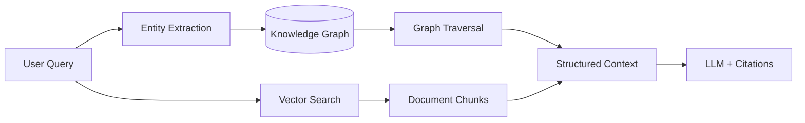

# Graph RAG

> **Learning Path:** RAG Architecture
> **Section:** 8.1.23 — Learn

**Graph RAG — 8.1.23 Learn**

### 1. The problem

Vector RAG solves "find similar text". It fails on "how are these things connected".

With pure vector retrieval you get chunks that match the query embedding. That works for factual recall. It breaks for:
* Multi-hop reasoning: *Who approved the budget for Project X and what was their previous role?*
* Relational constraints: *Find suppliers for component A that are not in a sanctioned country*
* Entity disambiguation and provenance: you retrieve a chunk about "Apple", but is it the company or the fruit?

The constraint is the LLM's context window and the retrieval model. Similarity != structure. The model has to infer relationships from text, which causes hallucinations and misses implicit links.

Graph RAG exists to make relationships first-class citizens in retrieval, not inferred.

### 2. Mental model

Think of Vector RAG as a bag of needles found by smell. Graph RAG is a map with roads.

Documents are parsed into entities and relations, then stored as a graph: `Entity --relation--> Entity`. Retrieval becomes a graph traversal problem starting from entities mentioned in the query, not just a similarity search over chunks.

You keep the vector index for recall, and add the graph for reasoning.

### 3. How it works

The pipeline is extract → build → traverse → augment.

1. **Extraction:** From ingested documents, extract entities and relations with an LLM or NER model. `Acme Corp founded_by Alice`, `Alice works_at Acme`, `Acme supplies Widget to Beta Ltd`.
2. **Graph build:** Store in a graph DB or as triples. Entities get embeddings too for hybrid linking.
3. **Query time:** Extract entities from the user question. Find them in the graph. Traverse 1-3 hops for relevant subgraphs.
4. **Context assembly:** Merge the traversed subgraph with top vector chunks. The subgraph provides structure; chunks provide evidence text.
5. **Generate:** LLM answers with both the retrieved text and the explicit relational context.

### 4. Architectural reasoning

When it helps:
* Questions are relational or multi-hop
* Domain has a stable ontology: org charts, supply chains, regulations, biomedical pathways
* You need explainability and provenance: *why* was this fact returned

Alternatives:
* **Vector RAG:** Cheaper, faster, sufficient for single-fact QA
* **Hybrid RAG:** Vector + keyword. Better recall, still no structure
* **Graph RAG:** Adds explicit relationships at cost of extraction and maintenance

Choose Graph RAG when the cost of a wrong connection > cost of building and maintaining a graph. If your queries are mostly "what does this doc say", don't add a graph.

Decision drivers: query pattern, data volatility, need for citation chains, compliance.

### 5. Trade-offs and failure modes

* **Extraction quality is the bottleneck.** Bad entity linking or hallucinated relations poison the graph. You need validation, confidence scoring, and human-in-the-loop for critical domains.
* **Freshness vs consistency.** Graphs are expensive to update incrementally. Streaming documents require change data capture and reconciliation.
* **Latency.** Traversal + vector search + context assembly is slower than pure vector. You trade latency for precision.
* **Over-retrieval.** Unconstrained traversal returns noisy subgraphs. You need hop limits, relevance pruning, and community detection.
* **Operational complexity.** You now operate two retrieval systems and a graph schema. Schema drift is real.

Failure mode to remember: a beautiful graph with bad extraction is worse than no graph. Garbage in, graph out.

### 6. Example

Enterprise compliance assistant. Documents: contracts, sanctions lists, internal policies.

Query: *"Can we onboard vendor X?"*

Vector RAG returns contract clauses about vendor X and a sanctions list mentioning X. It may miss that X is a subsidiary of Y, and Y is owned by a sanctioned individual.

Graph RAG extracts entities: `Vendor X` `subsidary_of` `HoldCo Y`, `HoldCo Y` `owned_by` `Person Z`, `Person Z` `on` `Sanctions List`. Traversal yields the chain in one hop, and the LLM can cite each edge with source documents.

You get a verifiable answer with a reasoning path, not just similar paragraphs.

### 7. Reasoning challenge

You are architecting a customer support RAG for a SaaS product with 10M support tickets updated daily. Queries are mostly "how do I do X?" with occasional "why did my feature stop working after update Y?"

Do you build Graph RAG now? What would you need to observe first about queries and data before deciding?

### 8. Key takeaway

* Graph RAG solves relational reasoning, not just recall.
* Value comes from explicit entities and relations, not bigger embeddings.
* Use it when queries require multi-hop connections and explainable provenance.
* The architecture is extract → graph → hybrid retrieve → augment. Extraction quality dominates success.
* Pay the price in latency, maintenance, and schema governance.
