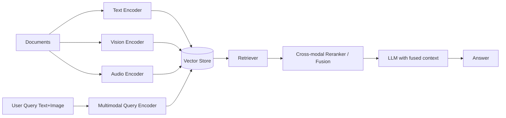

# Multimodal RAG

> **Learning Path:** RAG Architecture
> **Section:** 8.1.24 — Learn

### The problem

Text-only RAG works when knowledge is text and the question is text. It breaks when the user's question references a diagram, a screenshot, a chart, a voice note, or when the relevant evidence is not text at all.

Example: "Why is my dashboard showing red spikes on Tuesday?" The answer is in a PNG chart + a text alert log + a short Loom video. A text-only system can only search the captions you added, if any. You lose the signal.

The constraint is not just retrieval, it is *alignment*: a query in one modality must find evidence in another modality, and the final answer must fuse them coherently.

### Mental model

Multimodal RAG is RAG with a multimodal index and a multimodal retriever.

Think of it as three layers:
1. Ingestion: each modality is encoded into a representation the system can search.
2. Retrieval: the query, in any modality or combination, is encoded and matched against the index.
3. Fusion: retrieved pieces from different modalities are combined into a single context the LLM can reason over.

The key idea is a shared semantic space, not a shared format. You don't convert everything to text, you map everything to embeddings that mean the same thing.

### How it works

**Ingestion**
Documents are chunked per modality. Text chunks go to a text encoder. Images, charts, video frames go to a vision encoder. Audio goes to an audio encoder. Many systems use a joint multimodal encoder like CLIP-style or a large vision-language model to project all modalities into one vector space. Others keep modality-specific indexes and join later.

Metadata and modality tags are stored alongside vectors for filtering.

**Query encoding**
A user query can be text only, image only, or text+image. The same encoder family is used to embed the query into the shared space.

**Retrieval and fusion**
Retrieve top-k from each modality-specific or joint index. Then rerank with a cross-modal model that can compare query-image to text evidence, or do late fusion: score per modality then combine with learned weights.

The fused context is passed to the LLM with modality markers, e.g., `[Image 1: chart]` and the caption or OCR.

### Architectural reasoning

Use it when answers require evidence that cannot be reduced to text without loss.

Helps:
* Support / operations where KB contains screenshots, diagrams, and manuals
* Product analytics where questions reference charts
* Medical / scientific where images and reports are linked
* Customer experience where users upload a photo and ask "what is this error?"

Alternatives:
* Text-only RAG + captioning. Cheaper, but captions are lossy and you need a human or model to generate them upfront.
* Separate pipelines per modality with manual stitching. Works for narrow cases, does not scale.

Choose multimodal RAG when recall across modalities is a business requirement and you can pay the cost.

### Trade-offs and failure modes

**Alignment quality.** Different encoders drift. An image of a "spike" may be closer to the word "peak" than to the log entry "error 503". You need evaluation on cross-modal recall, not just text recall.

**Modality imbalance.** Text embeddings are dense and well trained. Vision/audio embeddings are noisier. Without calibration, retrieval is biased toward text.

**Latency and cost.** Encoding and searching multiple indexes, plus reranking, adds 200-800ms and multiplies embedding compute. Video and audio are especially expensive.

**Context limits.** You cannot feed 10 images raw into an LLM. You need summarization, selection, or using a vision-capable LLM with image tokens, which increases cost.

**Failure modes to watch:** hallucinated cross-modal links, retrieving a visually similar but semantically wrong image, and privacy leakage when images contain PII that text redaction missed.

### Example

Enterprise IT support bot.

Knowledge base: Confluence pages, runbooks with architecture diagrams, incident post-mortems with screenshots, recorded Zoom calls.

User uploads a screenshot of Grafana with red spikes and asks "What caused this?"

System encodes the screenshot, retrieves the nearest diagram of the service topology, the text runbook section on autoscaling, and the transcript of the incident call where the engineer mentions the Tuesday deploy. Fusion ranks the runbook and transcript higher than unrelated diagrams. LLM answers with causal chain and cites sources per modality.

### Reasoning challenge

You are architecting a multimodal RAG for a retail returns app. Users can submit a photo of a damaged product and type "Is this covered?" You have product photos, policy PDFs, and thousands of historical return photos with text notes.

Do you build one joint embedding space for all modalities, or keep separate indexes for image-image and text-text retrieval with late fusion? What changes if latency budget is <500ms p95?

### Key takeaway

* Multimodal RAG exists to retrieve and reason over evidence that lives in different modalities, not just text.
* The core architectural problem is alignment: mapping queries and documents to a shared semantic space and fusing results reliably.
* Choose it when cross-modal recall drives accuracy, not for convenience.
* The main costs are embedding quality, retrieval latency, and context fusion complexity, with failure modes around misalignment and modality bias.
