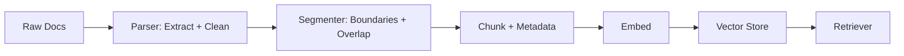

# Parsing

> **Learning Path:** RAG Architecture
> **Section:** 8.1.3 — Learn

**Parsing in RAG Architecture**

### 1. The problem

RAG needs retrievable units. Raw documents are not retrievable.

You ingest PDFs, DOCX, HTML, emails, images with text. An LLM cannot search them. An embedding model cannot embed them. You need structured text with context before you can embed, store, and retrieve.

The problem is threefold:
* **Format heterogeneity:** The same information lives in bytes with layout, not semantics.
* **Context window limits:** Even after extraction, a 200 page contract won't fit in context.
* **Retrieval relevance:** The unit you embed determines what you can find. A bad unit = bad retrieval.

Parsing exists to turn *unstructured bytes* into *structured, semantically coherent chunks with metadata* that are safe to embed.

### 2. Mental model

Think of parsing as a pipeline, not a single step.

```
Raw Document -> Extraction -> Normalization -> Segmentation -> Chunk with Metadata -> Embed
```

Extraction gets text out of the format. Normalization cleans it. Segmentation decides where to cut. The output is not just text, it is text + provenance: source doc, page, section, heading hierarchy, table caption, etc.

Parsing is the bridge between document ingestion and vector store.

### 3. How it works

The essential mechanism is **preserve structure while making it retrievable**.

* **Format detection & extraction:** PDF -> text via layout-aware parser. HTML -> DOM walk. DOCX -> paragraph + style. Images -> OCR + layout.
* **Structural normalization:** Strip boilerplate, fix encoding, unify whitespace, keep meaningful delimiters like headings, lists, tables.
* **Segmentation / chunking:** Split into units small enough for embedding and large enough for context. Strategies:
  * Fixed size + overlap: simple, robust
  * Semantic boundaries: split on headings, paragraphs, sections
  * Hybrid: respect boundaries, then enforce max tokens

Metadata is attached at parse time: `doc_id, page, section_path, heading, chunk_index, start_char`. This metadata is what makes retrieval actionable and enables reranking and citations.



### 4. Architectural reasoning

When it helps:
* Documents with rich structure where meaning lives in hierarchy: legal contracts, research papers, manuals.
* Need for accurate citations and grounding.
* Mixed formats in a single corpus.

What it solves: Decouples ingestion fidelity from retrieval quality. You can change chunking later without re-parsing if you kept raw normalized text.

Alternatives:
* **Naive split:** Read file as text, split by 1000 chars. Fast, loses layout and tables.
* **LLM-based extraction:** Use a model to summarize/ restructure. High fidelity, high cost/latency, non-deterministic.
* **No parsing:** Embed whole files. Impossible for long docs, retrieval fails.

Choose layout-aware parsing when structure matters for correctness. Choose fast text extraction when you only need bag-of-words retrieval and speed/cost dominate.

### 5. Trade-offs and failure modes

* **Fidelity vs speed:** Layout-aware PDF parsing is slow and fragile. Simple text extraction is fast but destroys tables and multi-column layout.
* **Chunk size vs recall:** Too small = loss of context, fragmented answers. Too large = diluted embedding, context window waste.
* **Overlap cost:** Overlap improves continuity but increases vector store size and cost.
* **Metadata loss:** If you drop headings/page numbers, you cannot cite correctly. RAG becomes ungrounded.
* **Failure modes:** Tables flattened to gibberish, footnotes merged into body, page breaks splitting sentences, OCR errors on scanned PDFs, language detection mistakes.

Parsing errors are silent. Bad extraction = bad embeddings = bad retrieval, and you won't see it until answers hallucinate.

### 6. Example

Enterprise support KB: PDFs of product manuals + HTML help articles + Jira tickets.

Architecture: 
* Parser detects format. PDFs use layout-aware extraction preserving headings and tables. HTML uses DOM walker keeping h1-h3 hierarchy.
* Normalizer removes headers/footers, normalizes units.
* Segmenter splits on semantic boundaries: first at section heading, then enforce 800 token max with 150 token overlap.
* Metadata stored: `doc_id, source_type, product_version, section_path`.

Result: Retrieval for "how to reset error E42 on v3.2" finds the specific troubleshooting table, not a generic page. Citations point to Section 4.2 Page 12.

### 7. Reasoning challenge

You are building RAG for legal contracts. Each contract is 50-200 pages with numbered clauses, exhibits, and tables.

Do you chunk by fixed 1000 token windows with overlap, or by clause/section boundaries?

Consider retrieval precision for clause-level questions, citation accuracy, and what happens when a clause spans > token limit.

### 8. Key takeaway

* Parsing is extraction + normalization + segmentation with metadata, not just "read the file".
* The chunk is the atomic retrieval unit. Parsing quality determines retrieval quality.
* Preserve structure and provenance early. You can re-chunk cheaply, you cannot recover lost layout later.
* Choose parsing depth based on document type and required citation fidelity, not on convenience.
