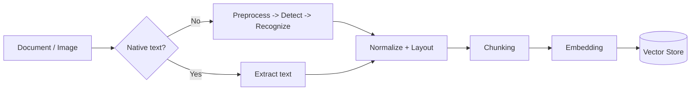

# OCR

> **Learning Path:** RAG Architecture
> **Section:** 8.1.4 — Learn

**OCR in RAG Architecture**

### 1. The problem

RAG needs text to embed. The problem is that enterprise data is not text.

Inboxes, DMS, SharePoint, legacy archives are full of scanned PDFs, photos of whiteboards, faxes, contracts with stamps, invoices with tables. The content is visually present but not machine-readable.

Without readable text, you cannot chunk, embed, or retrieve. The retrieval recall is zero for those documents.

The constraint is: make unstructured visual documents queryable by a LLM, without manual transcription, at scale and with acceptable accuracy/cost.

### 2. Mental model

OCR is a conversion boundary.

`Image pixels -> Structured text + layout -> Embeddable chunks`

Think of it as an ingestion adapter. It does not create knowledge, it unlocks data that is otherwise invisible to the vector store.

In a RAG pipeline it sits between ingestion and chunking, and only fires when native text extraction fails.

### 3. How it works

Essential mechanism is three steps, not one model:

1. **Preprocess** - deskew, denoise, binarize, upscale. Quality in > quality out.
2. **Detect** - find text regions, lines, tables, reading order.
3. **Recognize** - map glyphs to characters, with language model correction.

Traditional OCR like Tesseract is step 3 only. Modern document understanding services do 1+2+3 and return structured output: text, bounding boxes, tables as markdown/JSON.

The key architectural output is not just raw text, it is text with structure. For RAG, preserving reading order and table structure beats raw character accuracy.

### 4. Architectural reasoning

When it helps:
* Scanned PDFs, image-only PDFs, photos of documents
* Mixed content: text + tables + forms
* Need to build a searchable corpus from legacy archives

Alternatives:
* **Native extraction** - `pdfminer`, `PyMuPDF` for born-digital PDFs. Fast, cheap, 100% accurate. Use first.
* **Vision-Language Models** - GPT-4o, Claude 3.5, Gemini for OCR + understanding in one call. Great accuracy on layout and handwriting, high cost and latency.
* **Specialized Document AI** - AWS Textract, Azure Document Intelligence, Google Document AI. Good table/form extraction, managed scale.

Why choose dedicated OCR vs VLM?
Choose dedicated OCR when you have high volume, need predictable cost/latency, and can tolerate preprocessing. Choose VLM when accuracy on messy layouts, handwriting, or multi-language mixed docs outweighs cost, or you already use VLM for embedding.

Decision rule: Extract native text first. Fallback to OCR only for image-based pages. Route high-value or low-confidence pages to VLM.

### 5. Trade-offs and failure modes

* **Accuracy vs cost.** Traditional OCR is cheap per page but fails on low DPI, skew, handwriting. VLM is expensive but robust. At scale, a hybrid tiered approach wins.
* **Layout loss.** Plain OCR gives a string. You lose tables and columns. That destroys retrieval quality for invoices, financial reports. You need layout-aware OCR or post-processing to reconstruct tables as markdown.
* **Latency and async.** OCR is CPU/GPU bound. Do not block ingestion. Use a queue, pre-process in workers, store intermediate artifacts for reprocessing.
* **Failure modes:** low contrast scans, rotated pages, multi-column reading order errors, handwritten annotations, stamps covering text, merged cells in tables. Monitor confidence scores and route low-confidence pages for human review or VLM re-pass.

Operability tip: store original image, OCR output, and confidence metadata. You will need to re-run OCR when models improve.

### 6. Example

Enterprise contract Q&A.

Contracts arrive as scanned PDFs from vendors. Pipeline:
Classifier detects image-only pages -> sends to Document AI with table extraction -> normalizer converts tables to markdown, keeps reading order -> chunk with overlap preserving section boundaries -> embed -> vector store.

Query "What is the termination clause for vendor X?" retrieves the correct chunk because the table of clauses was preserved, not flattened to gibberish.

Without OCR + layout preservation, retrieval returns nothing or hallucinated clauses.

### 7. Reasoning challenge

You are designing RAG for a bank's loan application archive: 20M pages/year, 70% scanned forms with hand-written fields, 30% born-digital PDFs. Latency budget for ingestion is 24h. Cost is a primary constraint.

Do you use one OCR service for all pages, or a tiered pipeline with native extraction + traditional OCR + VLM fallback? What signals would you use to route pages?

### 8. Key takeaway

* OCR is an ingestion adapter for RAG, not a feature. It exists to make visual documents queryable.
* Always try native text extraction first, fallback to OCR only when needed.
* Layout and structure preservation matters more than character-level accuracy for retrieval.
* Architect for hybrid: cheap traditional OCR for bulk, VLM for hard cases, with async processing and reprocessing capability.
