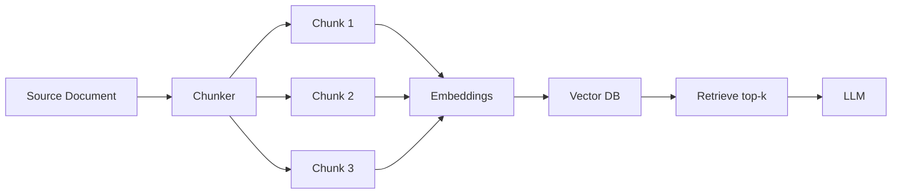

# Chunking

> **Learning Path:** RAG Architecture
> **Section:** 8.1.5 — Learn

**Chunking — 8.1.5 Learn**

### The problem

You want RAG to find the right information in a large document and give it to an LLM. Two constraints collide:

1. **Context window is finite.** An LLM cannot ingest a 200-page contract.
2. **Embedding models have a sweet spot.** They encode meaning best over a few hundred tokens, not tens of thousands. Embed a whole doc and you get one vector that averages everything; the signal for a specific clause is drowned out.

If you embed the document as-is, you get either too much context to retrieve or too little granularity to retrieve. You need a way to make large documents retrievable and usable.

### Mental model

Think of chunking as creating an index with good page breaks.

You are not just splitting text. You are deciding the unit of meaning that can be retrieved independently and still be useful to the LLM. A chunk is a retrieval unit: small enough to be relevant, large enough to be self-contained.

### How it works

`Document -> Chunking strategy -> Chunks -> Embed -> Vector DB -> Retrieve`

The essential knobs are:

* **Size:** tokens per chunk. Typical 500-1,000 tokens for retrieval, 256-512 for dense models.
* **Overlap:** 10-20% token overlap between adjacent chunks. Prevents information loss at boundaries.
* **Boundary:** where to split. Fixed-size windows vs semantic boundaries like paragraphs, headings, sentences.

A common production pattern is recursive splitting: split on headings first, then paragraphs, then sentences, respecting max size, with overlap on the last step.

### Architectural reasoning

When does chunking help?

* **Recall:** A question about a single clause should match the chunk containing that clause, not the whole contract.
* **Context budget:** The LLM gets only top-k chunks. Smaller units let you pack more relevant facts into the same budget.
* **Cost and latency:** Embedding and storing many small chunks is cheap compared to re-embedding whole documents on every query.

Alternatives and why they fail:

* **Whole document embedding:** One vector per doc. Good for coarse classification, terrible for fine-grained QA.
* **No chunking + truncation:** You lose most of the document.
* **Character-level tokenization only:** Loses semantic coherence.

Choose chunking when your corpus has long documents and queries are localized. Choose larger, fewer chunks when queries need broad context, e.g., summarization of a meeting transcript.

### Trade-offs and failure modes

**Size vs signal dilution.** Too small: you lose context, e.g., "the liability cap" makes no sense without the preceding sentence. Too large: embedding averages out details, retrieval precision drops.

**Overlap vs cost.** Overlap preserves cross-boundary meaning but increases embedding volume and can cause the same fact to be retrieved multiple times.

**Boundary choice vs fidelity.** Fixed-size windows are simple and fast. Semantic chunking respects meaning but is more complex and can produce very uneven chunk sizes.

**Common failures:**

* Splitting mid-sentence breaks the embedding.
* No overlap causes a fact to be cut in half and become invisible.
* Inconsistent chunking across updates leads to orphaned references.
* Chunk size tuned for embedding model but not for the LLM's reasoning window.

### Example

Enterprise support knowledge base. Articles average 3,000 tokens.

Decision: recursive splitter with max 800 tokens, min 200, 15% overlap, split first on H2/H3 headings, then paragraphs.

Result: A query "How to reset MFA after device loss?" retrieves the exact 2-paragraph procedure, not the whole 10-section article. The LLM receives 3 chunks ~2,000 tokens total and can answer without hallucinating unrelated sections.

If chunks were 2,000 tokens with no overlap, the MFA procedure would be mixed with unrelated troubleshooting steps, lowering retrieval rank.

### Reasoning challenge

You are building RAG for financial 10-K filings. Queries are both: "What was revenue in Q3?" and "Explain the risk factors related to supply chain."

Do you use one chunking strategy for both? What size and boundary would you pick, and what would you monitor to know it is wrong?

### Key takeaway

* Chunking exists to make long documents retrievable and fit inside LLM context windows.
* The unit of chunking is a trade-off between retrieval granularity and semantic completeness.
* Overlap and semantic boundaries prevent information loss at cuts.
* Tune size to your embedding model and query type, not to a generic best practice.
* Monitor retrieval recall and LLM answer fidelity, not just chunk count.
