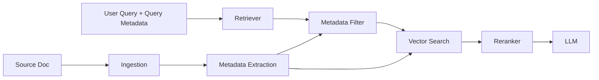

# Metadata

> **Learning Path:** RAG Architecture
> **Section:** 8.1.6 — Learn

**Metadata in RAG**

### 1. The problem

Semantic similarity alone is a blunt retriever. Two chunks can be semantically close but completely wrong for the task because they are:

* From the wrong tenant, user, or region
* Outdated vs current
* From an unreliable source
* Labeled confidential
* In a different language or product version

Without signals beyond vector distance, you get noise, leakage, and hallucinations from irrelevant context. Re-ranking helps, but it can't fix retrieval of data you should never have returned.

Metadata exists to constrain the search space *before* similarity is computed.

### 2. Mental model

Think of embeddings as answering "what does this say?". Metadata answers "what is this, who can see it, and when is it valid?".

It is a structured index layered on top of unstructured content. You first filter by facts, then rank by meaning.

### 3. How it works

During ingestion you extract and attach properties to a chunk and to its parent document. Those properties are stored alongside the vector and are queryable.

Typical metadata layers:

* **Document-level:** `source_id, doc_type, tenant_id, product, language, author, created_at, updated_at, version`
* **Chunk-level:** `chunk_id, section, page, hierarchy_path`
* **Operational:** `access_level, pii_flag, retention_policy, freshness_score`
* **Retrieval hints:** `entity_types, topics, keywords` extracted via NER/classification

At query time you build a filter from query context: user tenant, role, time window, product. The vector DB applies it as a pre-filter, then does ANN search on the reduced set. This is hybrid retrieval: `metadata filter + semantic search`.

### 4. Architectural reasoning

**When it helps**
* Multi-tenant SaaS RAG where isolation is mandatory
* Compliance and access control, e.g., only return HR docs to HR users
* Time-sensitive knowledge, e.g., pricing, policies, medical guidelines
* Large corpora where semantic search alone is too noisy

**Alternatives and why metadata wins**
* Larger context windows: reduces cost but does not remove bad data
* Better chunking: improves granularity but not correctness
* Re-ranking only: expensive and can't rescue a bad candidate set

Metadata lets you *architecturally* enforce constraints rather than hope the model ignores irrelevant context.

Decision rule: If you can express a hard requirement as a property, encode it as metadata and filter on it. Use semantics for soft requirements.

### 5. Trade-offs and failure modes

* **Precision vs recall.** Over-filtering drops relevant chunks. Under-filtering lets in noise. Filter design is a product decision.
* **Schema drift.** Teams add ad-hoc fields. Without a schema registry, filters break silently.
* **Metadata quality.** Garbage in, garbage out. Wrong `updated_at` or missing `tenant_id` is worse than no metadata.
* **Cost of maintenance.** Metadata must be extracted, validated, and kept in sync on updates/deletes. Stale metadata causes silent retrieval errors.
* **Filter pushdown limitations.** Some vector DBs can't combine complex filters with ANN efficiently. You may need a two-stage filter: coarse filter in DB, fine filter in app.

Failure mode to watch: filtering after retrieval. If you retrieve 100 vectors then filter in app, you pay for wasted compute and risk truncation before filtering.

### 6. Example

Enterprise support RAG with 10M tickets across 3 products and 5 regions.

Ingestion pipeline extracts: `tenant_id, product, region, severity, created_at, resolved_at, agent_tier`.

Query from a Tier-1 agent in EU for Product A: 
Filter = `tenant_id = X AND product = A AND region = EU AND agent_tier <= 1 AND created_at > now-90d`. 
Vector search runs only on that subset, then reranker picks top 5.

Result: 40ms latency, no cross-tenant leakage, no US pricing shown to EU users, and no 2019 tickets.

Without metadata, the same query would need a prompt-based guardrail to ask the LLM to ignore wrong data — unreliable.

### 7. Reasoning challenge

You are designing a RAG for a bank's customer service bot. Regulations require that any advice about mortgages is only returned from documents approved by compliance and updated within the last 30 days. The compliance team updates documents weekly.

Do you enforce this with:
A) Metadata filters on `compliance_approved = true` and `updated_at`
B) A system prompt telling the LLM to ignore unapproved content
C) Both

What breaks if the ingestion pipeline fails to update `updated_at` when a doc is re-approved?

### 8. Key takeaway

* Metadata turns RAG from pure similarity into a constrained retrieval problem
* Filter first on hard facts, rank later on meaning
* Metadata is an architectural control for security, freshness, and relevance
* The cost is schema discipline, extraction quality, and ongoing sync
* If a requirement can't be expressed as metadata, it can't be guaranteed

You should be able to reason: what properties must I capture at ingestion to make retrieval safe and useful for this use case, and where will my metadata go stale.
