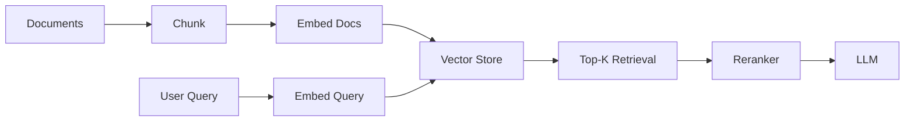

# Embeddings

> **Learning Path:** RAG Architecture
> **Section:** 8.1.7 — Learn

### The problem

You need to give an LLM relevant context, but you can't feed it everything. Keyword search fails for RAG because users don't phrase queries the way authors wrote documents.

* "How do I reset my password?" vs "Password reset instructions"
* "Refund policy for damaged items" vs "Claims process"

You need retrieval that matches meaning, not string overlap. And you need it fast, at scale, with a context window budget.

Constraints that create the need:
* LLM context is limited and expensive
* Document corpus is large and growing
* Queries are semantically varied
* You need recall over precision in first pass

That forces a representation where similar meaning = close proximity.

### Mental model

An embedding is a dense numerical fingerprint of meaning.

Think of a high-dimensional space where each document chunk is a point. The encoder is trained so that points with similar meaning cluster together, even if wording differs.

Similarity is measured by distance, typically cosine similarity. No keywords needed, just geometry.

### How it works

Text → encoder model → fixed-size vector.

For RAG the flow is:

Implementation essentials:
* **Chunking** before embedding. Embeddings are local. A 500-page PDF as one vector is useless. Typical 200-800 tokens with overlap.
* **Embedding model** is the encoder. Smaller models are faster and cheaper, larger models are more semantically nuanced. Domain matters.
* **Vector store** indexes vectors for ANN search. Retrieval is `embed query → nearest neighbors → top-K`.
* **Rerank** is almost always needed. First pass is recall, reranker is precision.

### Architectural reasoning

When it helps:
* Semantic retrieval across large, unstructured corpora
* Multilingual search without translation
* Personalization and dynamic knowledge bases

Alternatives and when to choose them:
* **BM25 / keyword**: Fast, interpretable, great for exact terms, IDs, codes. Fails on paraphrase.
* **Hybrid**: Vector + BM25 with reciprocal rank fusion. This is the default production choice for RAG. You get semantic recall + keyword precision.
* **Graph / structured retrieval**: When relationships matter more than text similarity.

Decision: Use embeddings when you need meaning matching at scale and you can afford an embedding pipeline + vector store. Don't use them as a replacement for good chunking and reranking.

### Trade-offs and failure modes

* **Model choice = quality vs cost vs latency.** A 3072-dim model may be 5% better on benchmarks but 3x the storage and latency. For most RAG, a good general-purpose model + reranker beats a huge embedding model alone.
* **Chunking strategy dominates quality.** Wrong chunk boundaries cut meaning in half. Overlap helps but adds cost. No universal size; it depends on content type.
* **Embedding drift.** Model updates change the vector space. You must re-embed the whole corpus on model change, or accept degraded results.
* **False semantic neighbors.** Embeddings conflate related but not relevant topics. "Apple stock" near "Apple fruit". That's why reranking and metadata filtering are essential.
* **Dimensionality and storage.** Millions of chunks × 1536 dims × 4 bytes = tens of GB. ANN indexes add overhead. Plan for indexing time, recall tuning, and vector DB operational cost.

### Example

Enterprise support RAG.

Corpus: 80k support articles, release notes, internal Slack threads. User asks: "My order hasn't arrived after 3 weeks, can I cancel?"

Keyword search finds nothing. Embedding retrieves chunks about shipping delays, cancellation windows, and exception handling, even with different phrasing. Metadata filter restricts to `product: ecommerce, region: EU`. Top 8 chunks reranked by cross-encoder, 4 fed to LLM. Answer is grounded and citeable.

### Reasoning challenge

You have a legal document corpus where exact clause matching is critical, but users ask in natural language. You have limited GPU budget and a requirement for explainability.

Do you deploy pure vector search, hybrid vector+BM25, or vector + keyword filter on metadata only? What changes if the corpus is 10M pages vs 10k pages?

### Key takeaway

* Embeddings solve semantic retrieval, not keyword retrieval. They turn meaning into geometry.
* Retrieval quality is a system property: chunking > embedding model > vector store > reranker. Weakness in any layer degrades the whole RAG pipeline.
* Production RAG is almost always hybrid: vector for recall, BM25 for precision, reranker for quality.
* The biggest operational costs are re-embedding on model changes and maintaining recall-latency trade-offs in the vector index.
