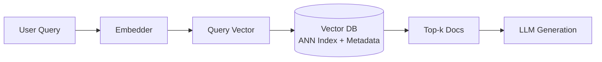

# Vector databases

> **Learning Path:** RAG Architecture
> **Section:** 8.1.8 — Learn

### 1. The problem

RAG needs to find relevant documents for a natural language query. Keyword search fails for paraphrase and intent. Embeddings solve semantic matching, but then you have a new problem:

You have millions of high-dimensional vectors, e.g. 1536-d or 3072-d. For each query you need the k most similar vectors by cosine distance.

Brute force is O(N * d) per query. At 10M documents that's ~15 billion operations per query. Unacceptable latency and cost.

You also need:
* Sub-100ms retrieval
* Dynamic inserts/deletes as knowledge updates
* Metadata filtering: only return docs for tenant X, product Y, updated after date Z
* Recall you can tune, not perfection

This is not a relational problem. It's an approximate nearest neighbor problem at scale.

### 2. Mental model

A vector database is an ANN index with a storage layer, not just a key-value store for floats.

Think of it as a specialized index for semantic proximity. Like a library where books are placed by meaning, not title. HNSW builds a navigable graph where similar items are neighbors. IVF partitions space into coarse clusters and only searches promising ones.

It stores vectors + metadata and answers: "give me the top k vectors nearest to this query vector, optionally filtered".

### 3. How it works

Query flow:

Essential mechanisms:
* **Index structure.** HNSW for low-latency, high-recall reads with incremental updates. IVF-PQ for large static collections with compression. Most systems let you choose.
* **Metadata filtering.** Two strategies: pre-filter then search, or search then post-filter. Pre-filter reduces candidates but can hurt recall if filter is selective. Post-filter is fast but may waste search budget.
* **Hybrid search.** Vector score blended with BM25 keyword score for recall.
* **Persistence and replication.** Vectors are immutable blobs, metadata is relational-like. Writes trigger index updates, which are eventually consistent.

### 4. Architectural reasoning

When it helps:
* Semantic retrieval is core to RAG, recommendation, clustering.
* Collection size > ~100k vectors where brute force fails.
* You need tunable recall/latency trade-off.

Alternatives:
* **Brute force + GPU.** Works for small corpora, batch jobs. Not for online RAG.
* **Search engine with vector support.** Elasticsearch/OpenSearch for hybrid keyword+vector with existing ops. Simpler if you already run it, but ANN quality and scale are lower than dedicated stores.
* **In-process FAISS.** Lowest latency, no network hop. Good for single-node, read-heavy, static indexes. Painful for multi-tenant, sharding, and freshness.

Why choose a dedicated vector DB: you get managed ANN indexes, horizontal scaling, metadata filtering, and consistency semantics without building your own distributed ANN layer.

### 5. Trade-offs and failure modes

* **Recall vs latency vs cost.** Higher ef_search in HNSW = better recall, higher latency and CPU. More layers = faster graph traversal but larger memory. You tune this per query tier.
* **Freshness vs index stability.** Frequent inserts degrade HNSW graph quality. Many systems batch updates or rebuild periodically. If you need second-level freshness, expect higher cost.
* **Filter pushdown.** Filtering after ANN can return empty results when filter is selective. Filtering before ANN reduces search space but can miss neighbors that straddle cluster boundaries. Architect for hybrid: coarse filter in index, fine filter post.
* **Distribution skew.** Hot tenants cause hot shards. Vector DBs shard by ID, not by similarity, so query load can be uneven.
* **Embedding drift.** Model updates change vector space. Old embeddings become stale. You need versioning and re-indexing strategy, not just a DB migration.

### 6. Example

Enterprise support RAG with 5M KB articles, multi-tenant.

Architecture: Ingest pipeline embeds chunks with `text-embedding-3-large`, writes to vector DB with metadata: tenant_id, product, lang, last_updated. Query path: user query embedded -> vector DB search with filter `tenant_id = X AND product = Y`, top 20 results -> re-rank with cross-encoder -> context to LLM.

Vector DB provides <50ms p95 ANN search with IVF-HNSW hybrid index, separate indexes per tenant for isolation, and daily rebuilds for drift correction. Elasticsearch handles keyword fallback.

### 7. Reasoning challenge

You have 50M vectors, 2k QPS, 80% reads, 20% writes per day, need <100ms p95 and 0.85 recall. Writes are batched hourly. Would you choose HNSW with incremental updates or IVF-PQ with periodic rebuilds? What happens to recall if you add a strict metadata filter on a high-cardinality field?

### 8. Key takeaway

* Vector DBs exist to make semantic similarity search fast at scale via ANN indexes, not to store vectors.
* Choose index type by workload: HNSW for low-latency dynamic, IVF-PQ for large static.
* Retrieval quality is a system property: embedding model + chunking + index params + filtering strategy + re-ranking.
* Plan for embedding drift, update latency, and filter selectivity from day one, not as an afterthought.
