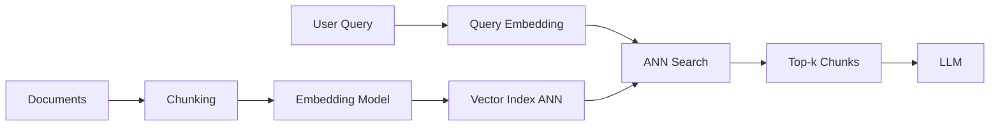

# Similarity search

> **Learning Path:** RAG Architecture
> **Section:** 8.1.9 — Learn

**Similarity search in RAG**

### 1. The problem

RAG needs the right context, not just matching words. Keyword search fails on paraphrase, synonyms, and intent.

* "How do I reset my password?" should match "Forgot password reset flow"
* A product spec about "latency SLA" should match a query about "response time guarantee"

You have millions of chunks. You need to find the semantically closest ones to a query in <100ms, with high recall, and you cannot re-read the whole corpus per request.

That creates the need for similarity search: map meaning to numbers, then find nearest numbers fast.

### 2. Mental model

Think of an embedding model as a translator from language to geometry.

Similar meanings → close points in high-dimensional space. Dissimilar → far apart.

Similarity search is then: place all your documents as points, place the query as a point, return the k nearest neighbors.

The model you choose defines the geometry. The index defines how fast you can find neighbors.

### 3. How it works

**Ingest**
Documents → chunking → embedding model → dense vector per chunk → ANN index.

**Query**
User query → same embedding model → query vector → ANN search → top-k vectors → retrieve original chunks → pass to LLM.

Similarity is usually cosine distance. ANN structures like HNSW, IVF-PQ trade exactness for speed. You get approximate nearest neighbors at scale.

### 4. Architectural reasoning

When it helps:
* Semantic relevance matters more than exact term match
* Corpus is large and dynamic
* You need recall of conceptually related passages

Alternatives:
* **BM25 keyword search.** Fast, explainable, great for exact entities, IDs, dates. Fails on paraphrase.
* **Hybrid.** Vector for semantics + BM25 for lexical signals, then rerank. This is the current default for production RAG.

Why choose similarity search:
* It decouples retrieval from language surface form.
* It enables retrieval of relevant context the LLM cannot know a priori.

Decision drivers: query latency SLA, corpus size, update frequency, need for explainability, cost of embeddings.

### 5. Trade-offs and failure modes

* **Approximation vs recall.** ANN is faster but drops recall. HNSW gives high recall with more memory. IVF-PQ is memory efficient with lower recall. Tune k and ef_search.
* **Embedding quality > index quality.** A bad model with perfect ANN still retrieves garbage. Model drift and domain mismatch hurt more than index choice.
* **Chunking is a retrieval bottleneck.** Too small = loss of context. Too large = diluted vector. Overlap helps but increases index size.
* **Stale vectors.** Documents change but embeddings do not. You need an update pipeline and versioning.
* **Curse of dimensionality and cost.** 768-3072 dim vectors are expensive to store and search. Quantization reduces cost but adds error.
* **Security / leakage.** Similarity search returns raw text to LLM. Need access control at chunk level, not just collection level.

Common failures: semantic drift where unrelated topics cluster, query vectors that are too generic returning high recall low precision, and no reranking leading to noisy context.

### 6. Example

Enterprise support RAG.

1M support articles chunked to 512 tokens with 20% overlap.
Embedding model: domain fine-tuned 1024-dim model.
Index: HNSW on managed vector DB, partitioned by product line.
Query path: user question → embed → ANN search top 50 → hybrid rerank with BM25 on title/entities → final top 8 chunks → LLM answer with citations.

Result: 85ms p95 retrieval, 42% improvement in answer relevance vs BM25 alone. Trade-off: $12k/mo embedding compute + vector DB, plus a nightly rebuild job for updated KB.

### 7. Reasoning challenge

You have a 50M chunk legal corpus, updates hourly, and a strict 80ms p95 retrieval SLA. Do you put everything in one HNSW index, shard by client, or use a two-stage coarse filter + precise search? What changes if you must provide per-chunk audit provenance for every retrieval?

### 8. Key takeaway

* Similarity search exists to retrieve meaning, not keywords. It solves semantic recall at scale.
* Embedding model quality and chunking strategy dominate retrieval quality; the ANN index is an engineering optimization.
* Approximate search is a deliberate recall-latency-cost trade-off. Know your recall target.
* Production RAG is hybrid: vector for semantics, BM25 for lexical precision, reranker for quality.
* Operate the pipeline: embeddings drift, indexes go stale, and retrieval is a system with freshness, cost, and security constraints.
