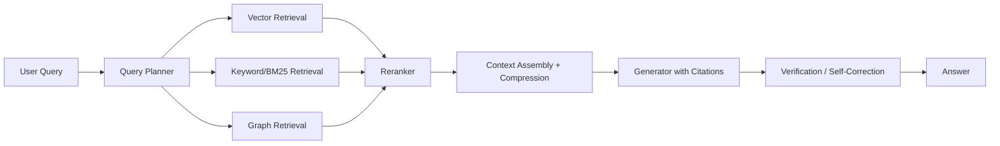

# Advanced RAG

> **Learning Path:** RAG Architecture
> **Section:** 8.2.2 — RAG architecture

**Advanced RAG Architecture**

### 1. The problem

Naive RAG works for simple Q&A, then it breaks. You get irrelevant chunks, the model hallucinates over bad context, answers drift on multi-hop questions, and latency spikes when you stuff the whole context window.

The real constraints are not just retrieval recall. They are:
* **Relevance under ambiguity** - queries are vague, domain-specific, and require synthesis
* **Context budget** - you can only feed ~ few k tokens to the generator
* **Freshness and provenance** - answers need to be current and citable
* **Cost/latency** - each retrieval + rerank + generation step costs money and time

Advanced RAG is not a better retriever. It is an architecture that adds quality control gates between retrieval and generation.

### 2. Mental model

Think of RAG as a pipeline with filters, not a single lookup.

Query -> Planning -> Multi-retriever -> Rerank -> Context assembly -> Generation -> Verify

Each stage trades latency for accuracy. You add stages only where the problem demands it.

### 3. How it works

* **Ingestion & Indexing:** Chunking with overlap, metadata enrichment, and multiple indexes. Hybrid: dense vector + sparse keyword + structured graph for relationships.
* **Query Planning:** Decompose complex questions into sub-queries, expand synonyms, and route to the right retriever.
* **Multi-retriever:** Vector for semantic similarity, BM25 for exact terms, graph for entities and relationships. This covers recall gaps.
* **Reranking:** A cross-encoder re-scores top-N candidates for relevance to the query. This is expensive but dramatically improves precision.
* **Context Assembly:** Select, deduplicate, and compress. Keep only passages that add new information and stay inside the token budget. Attach citations.
* **Generation with grounding:** Prompt forces citations and "no answer" when confidence is low.
* **Feedback loop:** Log query, retrieved docs, answer, and user feedback for continuous re-indexing and evaluation.

### 4. Architectural reasoning

When does this help?

* **Enterprise knowledge bases** where a single document is not enough. Multi-hop retrieval connects policy -> procedure -> exception.
* **High-stakes domains** like finance or healthcare where hallucination cost > latency cost.
* **Dynamic data** where freshness matters. Ingestion pipeline with CDC or change streams keeps indexes fresh.

Alternatives:
* Fine-tuning: expensive, slow to update, loses citation traceability.
* Naive RAG: cheap and fast, but fails on relevance and multi-hop.
* Pure search + LLM summarize: loses semantic reasoning.

Choose advanced RAG when you need **grounded, citable, up-to-date answers** and can afford an extra 200-600ms for reranking and planning.

### 5. Trade-offs and failure modes

* **Latency vs accuracy.** Rerankers and query decomposition improve precision at the cost of p95 latency. Mitigate with async pre-fetch and caching.
* **Recall vs context budget.** More chunks = better recall but overflow the window. You need aggressive compression and selection.
* **Complexity vs operability.** Multi-index, reranker, and feedback loop are hard to monitor. You need observability on retrieval recall@k, rerank precision, and citation coverage.
* **Stale indexes.** Retrieval is only as good as ingestion. Without incremental updates and versioning, you get silent hallucinations from outdated context.

Common failure: retrieving good chunks but assembling them poorly. Order, redundancy, and conflicting sources kill generation quality.

### 6. Example

Enterprise IT support bot.

Ingestion pipeline processes Jira tickets, Confluence, and runbooks into three indexes: vector for semantic, BM25 for error codes, graph for service dependencies.

Query "API gateway 502 after deploy" is planned into sub-queries: error code, recent deploys, related services.

Hybrid retrieval returns 40 candidates, reranker picks top 8, context assembler compresses to 2k tokens with citations. Generator returns a step-by-step fix with ticket IDs.

Result: first-contact resolution up, and every answer is auditable.

### 7. Reasoning challenge

You are building a customer-facing RAG for product docs that must answer in <800ms p95 and support 10k RPS. You can afford one rerank per query.

Would you put reranking before or after context assembly, and would you use query decomposition? What is the trade-off you accept?

### 8. Key takeaway

* Advanced RAG is a quality-gated pipeline, not a single vector search.
* Use hybrid retrieval + reranking to raise precision, query planning for multi-hop, and context assembly to respect token budgets.
* Architecture decisions are driven by latency budget, hallucination cost, and freshness requirements.
* Monitor retrieval recall, rerank precision, and citation coverage, not just end-to-end accuracy.
