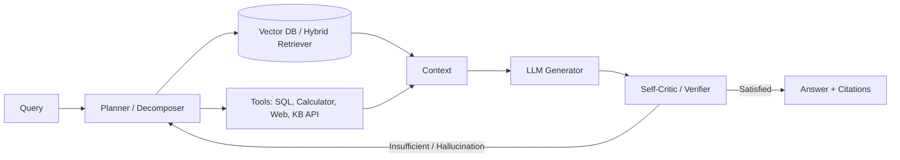

# Agentic RAG

> **Learning Path:** RAG Architecture
> **Section:** 8.2.3 — RAG architecture

**Agentic RAG**

### 1. The problem

Classic RAG solves: *generate an answer grounded in retrieval*. One query -> retrieve -> generate.

It fails when the answer requires more than one retrieval, or when you don't know what to retrieve first.

Problems that emerge:
* **Multi-hop reasoning:** "Who approved the contract that superseded the Q1 pricing agreement?" Requires finding pricing agreement, then its superseding contract, then approver.
* **Ambiguity and missing context:** Query is underspecified. You need to disambiguate before retrieving.
* **Dynamic evidence needs:** The first retrieval is noisy or insufficient. You need to reformulate the query based on what you learned.
* **Tool use beyond docs:** Need to call a calculator, DB, code executor, or API to verify a claim.

Constraint: LLM context is finite, retrieval is expensive, and a single static retrieval set is rarely enough for complex tasks.

### 2. Mental model

Classic RAG is a pipeline. Agentic RAG is a loop with an agent in charge.

Think of it as: **Planner -> Retrieve/Tool -> Generate -> Critic -> repeat**.

The agent decides *what information is still missing* and *how to get it*. Retrieval is no longer a single step, it's an action the agent can take multiple times, in any order.

### 3. How it works

Essential mechanism is a closed loop, not a straight line.

1. **Plan / Decompose:** Break query into sub-tasks. "Find X, then find Y given X."
2. **Act:** Choose an action: retrieve, call tool, ask clarification.
3. **Observe:** Get results, add to working memory.
4. **Reflect:** Critic evaluates if answer is complete, grounded, and consistent. If not, loop.

Implementation is usually a ReAct-style loop with a system prompt defining the agent's tools: `retrieve(query)`, `search_web(query)`, `execute_sql(query)`, etc.

### 4. Architectural reasoning

When it helps:
* Multi-hop, compositional questions where each hop depends on previous results
* Need for high fidelity / citations and self-correction
* Queries that require mixing retrieval with computation or external tools
* Long-running research tasks where iterative exploration is acceptable

Alternatives:
* **Classic RAG + better query expansion:** Cheaper, lower latency. Works if you can pre-plan all retrieval needs.
* **Fine-tuned LLM with parametric knowledge:** No retrieval cost, but stale and ungrounded.
* **Human-in-the-loop:** Gold standard for accuracy, but not scalable.

Choose Agentic RAG when correctness and completeness outweigh latency and cost, and when the query distribution is unpredictable.

### 5. Trade-offs and failure modes

* **Latency vs quality:** Each loop adds LLM + retrieval latency. 1-3 iterations is typical; >5 is a red flag.
* **Cost:** Token usage grows non-linearly with iterations. You pay for planning, critic, and repeated retrieval.
* **Control vs autonomy:** Agent can retrieve irrelevant docs and reinforce errors. Needs guardrails: max steps, retrieval budget, tool allow-list.
* **Failure modes to design for:**
  * **Retrieval amplification:** Agent keeps retrieving slightly different variants, never converges.
  * **Tool misuse / hallucinated tool outputs:** Agent calls tools with bad parameters.
  * **Infinite loop / prompt drift:** Critic never satisfied.
  * **Citation collapse:** Final answer cites intermediate but incorrect context.

Mitigations: step budget, scoring-based termination, retrieval result re-ranking, separate verifier model.

### 6. Example

Enterprise support copilot.

User: "Is customer ACME eligible for the expedited refund under the new policy?"

Agentic flow:
1. Planner decomposes: find customer ACME, find current refund policy, find ACME's contract tier.
2. Retrieve customer record -> finds ACME is Enterprise.
3. Retrieve policy doc -> finds expedited refund applies to Enterprise with <48h SLA breach.
4. Tool call to tickets API -> finds ACME had breach 72h ago.
5. Critic notes conflict: policy says <48h. Agent retrieves exception clause for Enterprise.
6. Final answer grounded with 3 citations, concludes not eligible unless exception approved.

Classic RAG would have retrieved all three sources at once, likely missing the exception link.

### 7. Reasoning challenge

You are architecting a medical Q&A system. Queries are from clinicians, require up-to-date guidelines + patient record, and must be verifiable.

Would you use Agentic RAG with open web search enabled? What guardrails would you add, and what would you *not* allow the agent to do?

### 8. Key takeaway

* Agentic RAG exists to solve the problem of *not knowing what to retrieve until you have already retrieved something*.
* It trades latency and cost for completeness, self-correction, and tool use.
* The core architectural decision is loop control: plan-act-observe-reflect with explicit termination criteria.
* Without budgets and verification, it becomes expensive hallucination amplification.
