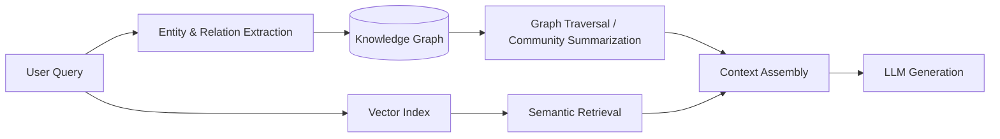

# Graph RAG

> **Learning Path:** RAG Architecture
> **Section:** 8.2.4 — RAG architecture

**The problem**

Vector RAG is great at finding similar text, but similarity is not structure. 
It struggles with:
* Multi-hop questions: "Who approved the contract that Vendor X signed with the team led by Alice?"
* Relationship-heavy reasoning: roles, ownership, causality, temporal chains
* Explainability: you get chunks, not a provable path

Embeddings collapse a graph into a flat vector space. Two entities that are related but described differently will be far apart. The model then has to infer the connection from retrieved passages, which leads to hallucinated links and lost context.

**Mental model**

Graph RAG keeps the structure. Entities become nodes, relations become edges. Retrieval becomes graph traversal, not just nearest-neighbor search.

Think of vector RAG as a library with a good search engine. Graph RAG is the library with a card catalog of who wrote what, who cited whom, and which topics connect.

**How it works**

The pipeline is build-time graph construction + query-time graph-augmented retrieval.

Build:
Docs -> LLM extraction of entities and relations -> canonicalize entities -> build graph in Neo4j/Neo4j Vector, Neptune, or networkx -> optionally create community summaries for high-level retrieval.

Query:
Extract query entities -> find seed nodes via vector + string match -> traverse 1-3 hops for relevant subgraphs -> retrieve linked text chunks -> assemble graph context + vector context for LLM.

The key is hybrid recall: vector for broad semantic recall, graph for relational precision.

**Architectural reasoning**

Choose Graph RAG when the domain is relationship-first.

It helps when:
* Questions are multi-hop and require chaining facts
* You need provenance and explainable paths: "Show me the reasoning path"
* Entities are stable and re-used across queries: org charts, product catalogs, regulations, medical knowledge

Alternatives:
* Pure vector RAG: faster, cheaper, simpler. Sufficient for single-hop Q&A.
* Hybrid RAG with metadata filtering: adds structure but no explicit relations.
* Closed knowledge graph QA: strong for curated domains, brittle for open text.

Decision rule: If your failure mode is "the model missed a connection that is explicitly in the data", you need a graph.

**Trade-offs and failure modes**

* Build cost and freshness. Graph extraction is LLM-heavy and error-prone. Entity linking mistakes propagate. Stale graph = wrong answers. You need incremental updates and monitoring for drift.
* Query latency. Traversal + community summarization adds 100-500ms vs pure vector.
* Complexity of operability. You now operate two indexes: vector and graph, plus extraction pipeline.
* Over-traversal. Too wide a subgraph floods context window with noise. Too narrow misses the hop.

Failure modes to watch: hallucinated relations during extraction, synonym fragmentation of entities, and the temptation to retrieve the whole connected component.

**Example**

Enterprise IT support KB with 50k tickets.

Vector RAG finds tickets mentioning "VPN timeout". Graph RAG extracts entities: User, Device, ErrorCode, VPN_Server, Ticket, Resolution. Edges: REPORTS, AFFECTS, RESOLVED_BY.

Query: "Why are users in Berlin getting VPN timeouts after the patch on Monday?"

Vector finds timeout tickets. Graph finds Berlin users -> VPN_Server DE-01 -> Patch KB-4421 deployed Monday -> related error code 0x8001 -> resolution: rollback. The LLM gets both the similar passages and the causal path.

**Reasoning challenge**

You have a legal contract repository with 10k contracts, updated daily. Queries are mostly "What obligations does Company X have regarding data sharing in agreements signed after 2023?"

Do you invest in Graph RAG now, or stick with hybrid vector + metadata filters? What data would you need to decide, and what is the cost of being wrong?

**Key takeaway**

* Graph RAG solves relational recall, not semantic recall. Use it for multi-hop, connection-heavy questions.
* Value comes from explicit entities and relations, not from a bigger vector index.
* The hard part is extraction quality and keeping the graph fresh, not the traversal.
* Hybrid is the norm: vector for recall breadth, graph for reasoning depth.
* Architect for trade-offs: accuracy and explainability up, build complexity, latency, and maintenance cost up.
