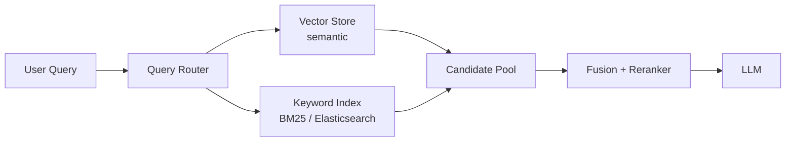

# Hybrid RAG

> **Learning Path:** RAG Architecture
> **Section:** 8.2.5 — RAG architecture

**The problem**

Vector RAG works well for semantic similarity: "how to reset password" finds "reset your credentials". It fails badly on the things architects care about in production.

* Exact entities: invoice #INV-2024-8841, SKU, error code `ERR_5032`
* Numeric ranges and filters: orders > $10k in last 30 days
* Rare or unseen terms where embedding quality is poor
* Typos and synonyms that keyword indexes handle better

Keyword / BM25 search is the opposite: great for exact match, prefix, and structured filters, terrible for paraphrase.

You cannot pick one. You need both, but you need a way to fuse them without paying 2x latency for no gain.

**Mental model**

Hybrid RAG = two retrieval specialists answering the same query in parallel, then a judge picks the best.

Think of a library with two catalogs: a semantic catalog that finds "books about distributed consensus" and a keyword catalog that finds "Raft paper 2014". Hybrid retrieval queries both, merges the candidate sets, and re-ranks.

**How it works**

Query → parallel retrieval → fusion → rerank → LLM context

Essential mechanism:
1. **Parallel retrieval.** Vector search returns top-k semantic neighbors. Keyword search returns top-k BM25 matches, often with filters like `created_at > ...` or `type = policy`.
2. **Candidate union.** Deduplicate by doc id, keep ~100-300 candidates.
3. **Fusion.** Reciprocal Rank Fusion or weighted score combines the two rankings. RRF works well with no training.
4. **Rerank.** Cross-encoder reranker scores query-candidate relevance to cut to top 5-10 for the LLM.
5. **Generate.** Context goes to LLM with provenance.

Implementation is just two retrievers and a fusion step. No new model required.

**Architectural reasoning**

When it helps:
* Enterprise knowledge bases with mixed content: manuals, tickets, contracts, code.
* Queries contain both intent and identifiers: "Why did order INV-2024-8841 fail payment?"
* Need controllable recall for compliance / audit where missing a doc is costly.

Alternatives:
* Vector only → better semantic recall, loses exact match and filters.
* Keyword only → precise but brittle to paraphrase.
* Larger context window → just pushes the problem downstream to LLM, increases cost and hallucination.

Choose hybrid when recall quality is a business constraint and you can tolerate ~1.3-2x retrieval cost.

**Trade-offs and failure modes**

* **Latency.** Two retrievals + rerank adds 50-200ms. Mitigate with async fan-out and pre-warmed caches.
* **Tuning burden.** Fusion weights, k per retriever, and reranker threshold become new operational knobs. Bad tuning = keyword drowning semantic or vice versa.
* **Duplicate and noisy results.** Same doc appears in both paths with different scores. Deduplication and stable ranking matter.
* **Cost.** Double indexing: vector embeddings + inverted index. Storage and update pipeline complexity rises.
* **Filter interaction.** Keyword filters are precise. Vector filters are approximate. If you need hard constraints, apply them on the keyword side before fusion.

Common failure: treating hybrid as "more is better". Returning 200 fused docs to LLM degrades quality. Fusion should increase recall, rerank should restore precision.

**Example**

Enterprise support RAG over product docs + support tickets.

Vector store catches "user can't log in after password reset". BM25 catches ticket ID `TKT-9921` and error code `AUTH_401`. Query: "Customer with error AUTH_401 on login after reset, ticket TKT-9921".

Vector alone misses the ticket ID. Keyword alone misses the paraphrased "can't log in". Hybrid retrieves both the relevant KB article and the exact ticket, reranker surfaces the ticket first, LLM answers with the root cause and resolution steps with citations.

**Reasoning challenge**

You have a finance RAG with 10M documents. 70% of queries are entity-heavy: invoice numbers, account IDs, dates. Vector retrieval recall@10 is 0.61, keyword is 0.88. Latency SLO is 400ms p95.

Do you deploy hybrid for all queries, route by query type, or keep keyword only? What metric would you watch to decide?

**Key takeaway**

* Hybrid RAG exists to fix the recall blind spots of pure vector search, not to replace it.
* Architecture is parallel retrieval + fusion + rerank; the value is in recall quality, not retrieval novelty.
* Pay for it in latency, indexing cost, and tuning complexity.
* Use it when queries mix semantic intent with exact entities/filters and missing a document has real cost.
