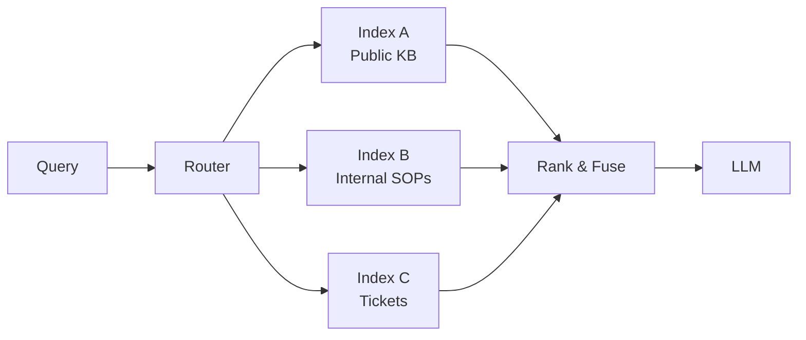

# Multi-index RAG

> **Learning Path:** RAG Architecture
> **Section:** 8.2.6 — RAG architecture

**Multi-index RAG**

### 1. The problem

A single vector index works until it doesn't. One index forces one embedding model, one chunking strategy, one update cadence, and one recall policy for all data.

In production you hit:
* **Heterogeneous data.** Legal contracts need 512-token chunks with a legal-tuned embedding. Support tickets need 2k-token chunks with a general model. Code needs tree-sitter chunks with a code model.
* **Conflicting freshness requirements.** Product specs change weekly, company policies change daily, historical research is static.
* **Isolation and compliance.** Customer A data must never be retrievable for Customer B. HR data needs stricter access than public docs.
* **Retrieval quality collapse.** A monolithic index optimizes for average recall, which means poor recall on your most important slice.

Single index = one set of trade-offs for everything.

### 2. Mental model

Multi-index RAG is retrieval with specialization. Instead of one big haystack, you have several purpose-built haystacks, each tuned for a data class, query class, or tenancy boundary. A router decides which haystacks to search, and a fusion layer merges results.

Think: library with separate sections, not one giant pile of books. You wouldn't search the children's section for tax code.

### 3. How it works

* **Indexes:** Each is independent: own embeddings, chunking, metadata filters, refresh policy.
* **Router:** Classifies intent and applies guardrails. Rule-based, lightweight classifier, or LLM-based. Example: `query contains "pricing" AND user.tier = enterprise → Index A + B, not C`.
* **Fusion:** Reciprocal rank fusion or score normalization across indexes, then re-rank. Often with per-index quotas to prevent one noisy index from drowning signal.

Implementation is usually: retrieve k from each selected index, fuse top N, pass context to LLM with provenance tags.

### 4. Architectural reasoning

When it helps:
* Different SLAs. Freshness-critical index updated hourly via streaming ingest; archival index updated nightly.
* Security/tenancy isolation. Per-tenant or per-PII-class indexes avoid cross-contamination and simplify redaction.
* Model specialization. Code index uses code embeddings; legal index uses legal embeddings. No compromise.
* Cost control. Expensive re-ranking only on high-value indexes.

Alternatives:
* Single index with metadata filters. Cheaper, but one embedding model and chunking strategy for all data. Fails on heterogeneity.
* Query-time routing to one index only. Simpler, but loses cross-domain answers.

You choose multi-index when recall quality, compliance, or update cadence variance outweighs operational complexity.

### 5. Trade-offs and failure modes

* **Routing errors.** Misclassification sends query to wrong index → hallucination from lack of context. Mitigate with fallback retrieval and confidence thresholds.
* **Fusion dilution.** Adding too many indexes adds noise. More indexes ≠ better. You need per-index weight tuning and result caps.
* **Operational surface area.** N indexes = N pipelines, N embeddings, N monitoring dashboards. Cost and latency grow linearly with number of active indexes per query.
* **Consistency.** Same fact stored in two indexes can diverge. You need a source-of-truth registry and provenance in context.
* **Latency.** Parallel fan-out helps, but fusion adds tail latency. Most systems cap to 2-3 indexes per query.

### 6. Example

Enterprise support assistant.

Indexes:
* **Public KB:** Product docs, changelog. Embedding: `text-embedding-3-large`, chunk 800 tokens, refresh weekly.
* **Internal SOPs:** Agent playbooks. Embedding: same model, chunk 400 tokens, refresh daily, RBAC filter by team.
* **Ticket History:** Last 12 months, per-tenant index. Embedding: `text-embedding-3-small`, chunk 1200 tokens, refresh hourly.

Router logic: If user is customer → KB only. If agent → SOPs + tenant tickets. If query is "how to reset password" → KB. If "refund policy for enterprise" → KB + SOPs.

Fusion returns 3 docs from each, tagged with source. LLM cites source and tenant.

### 7. Reasoning challenge

You are building RAG for a fintech with 10k tenants. Each tenant has <1GB of private documents, and a shared 50GB public knowledge base.

Option A: One index per tenant + one shared index = 10,001 indexes.
Option B: One shared tenant-partitioned index with metadata filter + one shared index.

When does A make sense vs B? What breaks first with A?

### 8. Key takeaway

* Multi-index RAG exists to avoid one-size-fits-all retrieval.
* Specialize indexes by data type, freshness, security, and embedding needs.
* Route queries, don't search everything, then fuse with explicit provenance.
* The real cost is operational complexity and routing correctness, not vector search itself.
* Start with 2-3 indexes max; add only when recall or compliance demands it.
