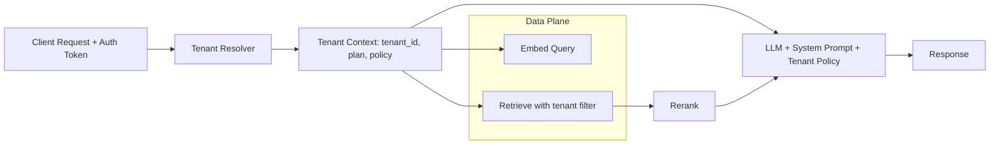

# Multi-tenant RAG

> **Learning Path:** RAG Architecture
> **Section:** 8.2.7 — RAG architecture

**The problem**

Single-tenant RAG works for one company. You index its docs, embed them, retrieve from its vector store, answer with its data. It breaks when you need to serve hundreds of customers from one platform.

Now you have conflicting requirements:
* Data isolation. Tenant A must never see Tenant B's documents, embeddings, or prompts.
* Cost efficiency. One vector DB, one LLM cluster, one embedding model per request is cheaper than N copies.
* Operational reality. Tenants onboard, update docs, and churn constantly. You cannot rebuild infrastructure per tenant.

That tension creates multi-tenant RAG: shared retrieval and generation infrastructure with strict per-tenant data boundaries.

**Mental model**

Think of an apartment building. Shared plumbing and electricity, separate apartments. The building is the RAG platform. Each tenant gets a private apartment = its own knowledge corpus and access controls. The hallway is the shared retrieval pipeline. The key is that the door lock is checked on every request, not just at move-in.

**How it works**

Tenant identity is resolved first, then it scopes everything downstream.

Essential mechanisms:

* **Tenant scoping at index time.** Documents are ingested with `tenant_id`. In a shared store this is a metadata field; in a siloed store it is the database name.
* **Tenant scoping at query time.** Every retrieval is `WHERE tenant_id = X`. No filter = no data.
* **Tenant context in the LLM call.** System prompt, allowed tools, and guardrails are loaded per tenant. This prevents prompt leakage and enforces brand voice / compliance.
* **Embedding isolation.** Same embedding model is fine for most SaaS, but high-security tenants may require a dedicated model or key.

Two architectural patterns emerge:

* **Shared store, logical isolation.** One vector DB, one Postgres, with `tenant_id` on every row. Cheaper, easier ops.
* **Siloed stores.** One vector DB / index per tenant or per tenant group. Stronger isolation, more cost.

Most platforms start shared, move to silos for enterprise tiers.

**Architectural reasoning**

Choose multi-tenant RAG when you need SaaS economics for a knowledge product.

It solves:
* Cost per tenant. You amortize embeddings, vector storage, and LLM inference.
* Operational velocity. One deployment, one monitoring stack.
* Consistent retrieval quality via shared rerankers and caching.

Alternatives:
* Single-tenant RAG. Best isolation, worst cost. Only viable for a handful of large customers.
* No RAG. Works if knowledge is static and small enough for prompt stuffing.

Decision rule: If tenant data is sensitive but not legally required to be physically separate, shared store + strict filters wins. If you have HIPAA, legal hold, or custom models, silo.

**Trade-offs and failure modes**

* **Isolation vs cost.** Shared store is cheap until a noisy tenant pollutes the embedding space or causes retrieval latency spikes. Silo eliminates cross-tenant interference but multiplies storage and cold start cost.
* **Filter correctness is the whole system.** A missing `tenant_id` filter is a data leak. Enforce it at the data access layer, not in application code. Use row-level security and test with adversarial queries.
* **Token and context leakage.** Retrieval is only half the problem. System prompts, tool outputs, and conversation history must be tenant-scoped. A shared conversation cache without tenant key is a leak.
* **Index sprawl.** Tenant churn leaves orphaned vectors. You need a lifecycle policy for delete-on-unsubscribe and TTL for stale docs.
* **Evaluation drift.** RAG metrics averaged across tenants hide a bad tenant. Track recall and answer quality per tenant.

**Example**

Enterprise support SaaS. 300 companies upload internal docs. Platform uses one Pinecone index with `tenant_id` metadata, one OpenAI embedding model, and one LLM cluster.

On request:
1. API gateway extracts tenant from JWT.
2. Query embedded, retrieval runs with `where: {tenant_id: "acme"}`.
3. Top 5 chunks passed to LLM with Acme's system prompt and data retention policy.
4. Response logged with tenant_id for audit.

Enterprise customer on a compliance plan gets its own dedicated index and separate API key. Same application code, different routing config.

**Reasoning challenge**

You have 10,000 tenants, average 50k docs each. Retrieval latency p95 is fine, but one tenant uploads 10M docs and suddenly p95 doubles for everyone. Do you add a hard retrieval cap per tenant, move that tenant to a siloed index, or shard the shared index by tenant size? What do you measure first to decide?

**Key takeaway**

* Multi-tenant RAG is about enforcing tenant boundaries at every stage: ingest, embed, retrieve, generate.
* Shared store with mandatory `tenant_id` filters gives cost efficiency; siloed stores give stronger isolation. Most systems are hybrid.
* The risk is not performance, it is data leakage. Make tenant scoping non-optional in the data layer.
* Design for observability per tenant from day one, or you will not see failures until a customer does.
