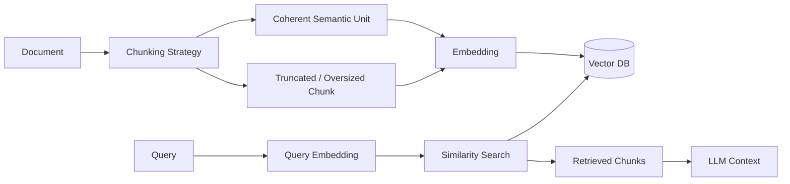

# Bad chunking

> **Learning Path:** RAG Architecture
> **Section:** 8.3.1 — RAG failure modes

## 1. The problem

You have a RAG pipeline that retrieves the right document, but the LLM still hallucinates or misses key facts. The retrieval scores look good, but the answer is incomplete or contradictory.

The failure is not in the model or the vector DB. It is in the retrieval unit: the chunk.

RAG does not retrieve documents, it retrieves chunks. The LLM can only reason over what you put in context. If a chunk cuts a concept in half, merges unrelated concepts, or is too noisy to be distinguished, similarity search will return a technically relevant but unusable piece.

The problem is created by a constraint: embeddings need fixed-size text, LLMs have a context window, and similarity works best on coherent semantic units.

## 2. Mental model

Think of chunking as defining the atomic unit of meaning your system can return.

A good chunk is like a self-contained paragraph with a clear topic: one idea, complete, and retrievable on its own.

Bad chunking is a retrieval unit that is semantically broken. It is either too big to be specific, too small to be complete, or cut at the wrong boundary so the meaning is lost.

The embedding and search are only as good as the unit they operate on.

## 3. How it works

Chunking sits between ingestion and retrieval. The strategy determines the shape of your vector space.

The essential decisions are: size, boundary, and overlap.

* **Size:** token or character budget per chunk. Controls specificity vs completeness.
* **Boundary:** where to split. Fixed window, sentence, paragraph, section header, or semantic boundary from a model.
* **Overlap:** carry-over tokens between chunks to avoid hard cuts.

Bad chunking happens when these choices ignore document structure and query patterns.

## 4. Architectural reasoning

Chunking is an architectural decision, not preprocessing hygiene.

Choose it based on what questions you need to answer:

* **Fact lookup, short answers:** small, tight semantic chunks with overlap. You want high precision retrieval.
* **Multi-step reasoning, long form:** larger chunks with hierarchical context. You want completeness over precision.
* **Structured docs like APIs, contracts:** split on logical units — headings, tables, clauses — not fixed tokens.

Alternatives exist: fixed-size sliding window is cheap and simple. Recursive or semantic chunking is more expensive but preserves meaning. The right choice is driven by the trade-off between retrieval precision and context completeness for your workload.

## 5. Trade-offs and failure modes

The three failure modes architects need to recognize:

**Semantic rupture.** Splitting mid-argument. Example: a chunk ends with "The refund is processed within..." and the next starts "7 business days if...". Each chunk is now incomplete. The embedding averages noise and the LLM cannot reconstruct the rule.

**Size mismatch.** Too large: a 2000-token chunk contains a procedure, an exception, and a footnote. Similarity is diluted, the chunk matches many queries weakly, and the LLM has to filter internally. Too small: a single sentence loses subject and context. Retrieval is precise but the answer requires 5 fragments that never fit together in context.

**Context loss.** No hierarchy. A chunk about "termination clause" with no document, section, or parent context. The LLM sees the clause but not which contract version or customer tier it applies to. You get correct text, wrong interpretation.

Trade-off summary: coherence vs coverage, precision vs recall, ingestion cost vs retrieval quality.

## 6. Example

Enterprise support KB with product manuals.

Fixed 500-token chunks with no boundary awareness split a troubleshooting step across two chunks: "Step 3: Reset the controller" ends at token limit, "by holding the button for..." starts next chunk.

A query "how to reset controller" retrieves both chunks with medium similarity, but neither chunk alone is actionable. The LLM either hallucinates the missing part or asks for clarification.

Changing to recursive split on headings + 150-token semantic window with 50-token overlap keeps each step intact. Retrieval precision rises and answer completeness improves without changing the model.

## 7. Reasoning challenge

You are architecting RAG for a SaaS pricing engine with 10k customer-specific contract PDFs. Queries are: "What is the renewal discount for customer X?" and "Summarize all termination rights in contracts signed in 2023."

Would you use one chunking strategy for both query types? What boundary and size would you pick, and what would you store alongside the chunk to avoid context loss?

## 8. Key takeaway

* Bad chunking is a retrieval failure mode, not an LLM failure mode.
* A chunk must be a complete semantic unit for the questions you ask.
* Size and boundary decisions are architectural: they set precision vs completeness.
* Always preserve hierarchy and overlap to avoid semantic rupture and context loss.
