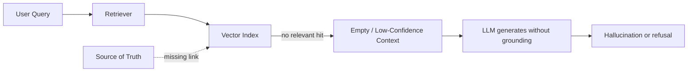

# Missing documents

> **Learning Path:** RAG Architecture
> **Section:** 8.3.2 — RAG failure modes

### The problem

What happens when a user asks about something that exists in your source of truth but not in your RAG index?

The retriever returns nothing useful, or worse, returns a near miss. The LLM has no grounding, so it hallucinates confidently. From the user's perspective the system is wrong. From your perspective the system is working exactly as designed — it just has a blind spot.

Missing documents is a silent failure mode. Unlike a bad chunk or a slow query, there is no error. Recall is zero for that query and you don't know it happened.

### Mental model

Think of RAG as a library with a card catalog.

Ingestion is cataloging. Retrieval is looking up the card and fetching the book. If a book was never cataloged, was removed from the catalog, or is under a different call number, the lookup fails even though the book is on the shelf.

Missing documents = coverage gap between source of truth and index.

### How it works in practice

A coverage gap appears when:

* **Ingestion lag.** Source changes but the index is stale. Policy updated yesterday, reindex runs nightly.
* **Ingestion filter.** Document was dropped by permissions, file type, size, or PII filter.
* **Chunking loss.** The relevant sentence exists but was split away from its context, or the chunk is too small to match.
* **Source drift.** Doc was renamed, moved, or deleted in source but the index still references it, or the reverse.
* **Scope mismatch.** Query asks for a domain you never indexed, e.g., internal Slack vs Confluence.

The failure path is consistent:

No error is raised. The system returns an answer with high confidence.

### Architectural reasoning

You need a way to know what you don't know.

The decision is not "better embeddings". It's observability over coverage.

Options:

* **Inventory + provenance.** Keep a manifest of source documents and their indexed state: source_id, version hash, last indexed at, chunk count. Compare source inventory to index inventory continuously.
* **Coverage testing.** Periodically sample queries from logs and check if expected source docs are retrievable. If a known doc is not found, alert.
* **Query-time detection.** Use signals at retrieval time: low max similarity score, high query perplexity, or no citation within threshold. Treat that as a possible miss, not just a bad retrieval.
* **Fallback retrieval.** When vector confidence is low, fall back to keyword/BM25 over the full source or to a broader corpus. This trades precision for recall on misses.
* **Grounding check.** Ask the LLM to cite. If it cannot cite, or cites a doc that doesn't contain the answer, downgrade confidence.

When to choose which:

* Use inventory for freshness and completeness guarantees.
* Use query-time detection for operational safety — prevent hallucination now.
* Use fallback when cost of a miss is high, e.g., customer support.

### Trade-offs and failure modes

* **Recall vs latency vs cost.** Reindexing continuously improves coverage but costs compute and write load. Batch indexing is cheaper but increases miss window.
* **False positives on missing.** Aggressive low-score thresholds cause unnecessary refusals or expensive fallbacks.
* **Monitoring blind spot.** If you only monitor retrieval latency and hit rate, you miss the case where the right doc was never indexed. You need source-to-index reconciliation, not just query metrics.
* **Partial misses.** A document is indexed but the relevant paragraph was chunked out or filtered. The system returns the document but not the answer. This looks like retrieval failure, is actually coverage failure.

### Example

Enterprise policy RAG. HR updates the parental leave policy in Confluence. The ingestion pipeline watches Confluence via webhook, but the webhook failed for 4 hours. A user asks: "How many weeks of parental leave do we offer in Germany?"

Vector index still contains the old policy version. Top hits are about US policy. Similarity score is 0.62, just above threshold. LLM answers with US numbers. No error.

With inventory monitoring, the source manifest shows doc `policy-parental-v3` with updated_at = now, last_indexed_at = 6 hours ago. Drift alert fires. With query-time detection, max similarity < 0.7 for a policy question triggers fallback to BM25 over Confluence + a refusal with "I don't have current data".

### Reasoning challenge

You have a RAG system for 10k internal docs. Users complain about "random" wrong answers. Logs show retrieval latency is fine and average top-k similarity is 0.81.

Where would you look first for missing documents, and what single metric would you add to prove the hypothesis?

*Hint: average similarity hides the tail. Think about source-to-index reconciliation and query coverage.*

### Key takeaway

* Missing documents is a coverage problem, not a retrieval problem. The index can be perfect and still wrong.
* Silent failures dominate. You need provenance and inventory to know what should be indexed vs what is indexed.
* Detect misses at three layers: ingestion health, query-time confidence, and post-hoc citation validation.
* Prefer a safe refusal over a hallucinated answer when coverage is uncertain.
