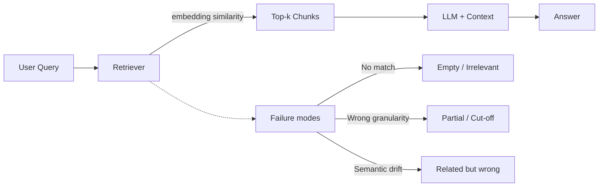

# Poor retrieval

> **Learning Path:** RAG Architecture
> **Section:** 8.3.3 — RAG failure modes

**Poor retrieval**

### The problem
RAG only works if the right context reaches the LLM. The model can't reason about information it never sees. Poor retrieval means the retriever returns irrelevant, incomplete, or missing documents, so the LLM hallucinates, gives stale answers, or confidently answers with the wrong source.

This isn't a model problem. It's a search problem in a lossy vector space.

### Mental model
Think of retrieval as finding needles with a magnet in a haystack where the hay has been chopped, labeled, and re-ordered.

The query is embedded into the same vector space as chunks of your corpus. Similarity is cosine distance between vectors, not semantic equivalence. Chunks are fixed-size windows of text with no built-in understanding of document structure.

Poor retrieval happens when the magnet is the wrong shape for the needle.

### How it fails
**No results / low recall.** Query uses terms not represented in chunks. Synonyms, jargon, or new product names have no embedding neighbors. Chunk size is too small, so the signal is diluted.

**Wrong results / low precision.** The retriever finds semantically related but factually incorrect chunks. Example: "refund policy for enterprise" returns consumer policy. Similarity rewards topical overlap, not task-specific relevance.

**Partial results.** The relevant information spans multiple chunks. A single 512-token chunk cuts a table, procedure, or definition in half. The LLM gets half a truth.

**Semantic drift.** The embedding model maps "cancel subscription" and "pause subscription" close together. For a compliance answer, that's a different legal outcome.

These failures compound: bad chunking makes embedding noisy, noisy embeddings make re-ranking ineffective, and the LLM has no way to signal "I didn't get what I needed."

### Architectural reasoning
Retrieval quality is a function of representation, query, and index design, not just vector search.

When to invest here:
* Answers require precise facts, not general knowledge
* Corpus changes frequently or contains structured data
* Query intent is ambiguous or multi-hop

Options:
* **Hybrid search:** dense vector + BM25 keyword. Keyword catches exact terms, vector catches paraphrase.
* **Query expansion / rewriting:** LLM rewrites user query into multiple variants, or expands with domain synonyms. Improves recall at cost of latency.
* **Better chunking:** semantic chunking by headings, tables, and entities instead of fixed token windows. Smaller semantic units improve precision.
* **Re-ranking:** cross-encoder re-ranks top-k with actual query-chunk interaction. Improves precision, adds latency and cost.
* **Metadata filtering:** route by tenant, date, document type before vector search. Reduces haystack size.

Decision rule: improve recall first, then precision. A hallucination from missing context is worse than a slightly noisy context that can be filtered by the LLM.

### Trade-offs and failure modes
* **Recall vs latency.** Query expansion and larger k increase recall but blow up context window and cost.
* **Chunk size vs fidelity.** Large chunks preserve context but dilute similarity signal and waste tokens. Small chunks increase recall but lose coherence.
* **Embedding model generality vs domain.** General embeddings are cheap but miss domain nuance. Domain fine-tuned embeddings improve relevance but require retraining on updates.
* **Freshness vs index stability.** Frequent re-embedding improves accuracy but causes churn and cost.

Poor retrieval is silent. The system returns a plausible answer with citations that look correct. You need retrieval evaluation, not just end-to-end QA.

### Example
Enterprise support RAG with 10k internal KB articles.

Initial design: 1000-token fixed chunks, single embedding model, top-5 retrieval.

Customer asks: "How do I migrate a prepaid enterprise account to postpaid?"

Retriever returns general migration article for consumer prepaid, because the phrase "prepaid" is strong and enterprise-specific chunks were split across chunk boundaries. LLM answers with consumer steps and wrong billing impact.

Fix: semantic chunking on section headings, hybrid search with BM25 boost on "enterprise", metadata filter `doc_type=enterprise`, and query rewrite to "enterprise prepaid to postpaid migration steps". Recall improves from 0.42 to 0.81 on test set.

### Reasoning challenge
Your RAG answers are correct 70% of the time. Logs show 20% of queries return no relevant chunks, 10% return related but wrong chunks. You can add one change: hybrid search, re-ranking, or semantic chunking. Which do you pick first and why?

### Key takeaway
* Poor retrieval is a representation and search problem, not an LLM problem.
* Similarity ≠ relevance. Chunking, query formulation, and index design determine what the LLM can see.
* Optimize recall before precision. Missing context causes hallucinations; noisy context can be mitigated.
* Measure retrieval independently with recall@k and precision@k on labeled queries, not just final answer quality.
