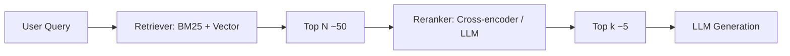

# Wrong ranking

> **Learning Path:** RAG Architecture
> **Section:** 8.3.4 — RAG failure modes

### 1. The problem

You have a RAG pipeline that *finds* the right documents, but the model still gives a weak or wrong answer. The retriever returns a set that contains the truth, yet the LLM ignores it or blends it with noise.

Why? Because retrieval score ≠ generation utility. The first stage is optimized for fast recall, not for ordering by what actually helps the LLM answer this specific query. With a limited context window, order is a constraint. The model attends more to early chunks, and the first 1-3 results disproportionately drive the answer.

Wrong ranking means: relevant documents are present but buried, or a superficially similar document outranks a truly useful one.

### 2. Mental model

Think of retrieval as a buffet and ranking as plating for the chef.

The retriever brings 50 plates of food. The LLM can only taste 5. If you put the best dish last, it may be ignored or the model may be full of filler. Ranking is about maximizing expected utility per token in context, not maximizing cosine similarity.

Similarity measures *aboutness*. Utility measures *answerability* for the current query under the current generation constraints.

### 3. How it works

Two-stage ranking is the standard fix.

Stage 1: fast, recall-oriented. BM25 for lexical signals, embeddings for semantic. Returns Top N with coarse scores.

Stage 2: expensive, precision-oriented. A cross-encoder computes query-document interaction in full, not via dot product. Reciprocal Rank Fusion can combine lexical + vector ranks before reranking. An LLM reranker can score documents with a relevance prompt.

The output is a reordered Top k that fits the context budget.

### 4. Architectural reasoning

When does wrong ranking hurt most?

* **Context budget is tight.** Top-k = 3-5. One mis-ranked item costs ~20% of your signal.
* **Query is ambiguous or multi-intent.** "Refund policy" can mean time window, eligibility, or process. Embedding similarity picks generic policy pages.
* **Documents are long and chunked poorly.** A chunk with the answer is split across boundaries; the chunk with the heading scores higher than the chunk with the fact.
* **Distribution shift.** Embeddings trained on general web rank marketing copy high, internal SOP low.

Alternatives to a separate reranker:
* Retrieve more and let the LLM decide. Works until context and cost blow up.
* Improve chunking and metadata. Helps, but does not fix scoring misalignment.
* Use hybrid retrieval only. Improves recall, not ordering.

Choose reranking when quality > latency and when first-stage recall is good but precision@k is bad. It is an architectural decision to trade latency and cost for generation quality.

### 5. Trade-offs and failure modes

**Latency vs quality.** Cross-encoder is 10-100x slower than vector search. You pay per query. Batch reranking and caching query embeddings help.

**Score calibration.** Retriever scores are not comparable across queries. A 0.78 today is not the same as 0.78 yesterday. Rerankers re-calibrate to the query.

**Reranker overfitting.** A reranker trained on MS MARCO may prefer verbose, explanatory passages over terse factual ones. It can demote the exact sentence you need.

**Chunking induced ranking collapse.** If a document is split into 10 chunks, the retriever may return 3 chunks from the same doc, pushing out other docs. You need deduplication and document-level aggregation, e.g., max or RRF.

**Lexical vs semantic mismatch.** Embeddings rank "How to cancel subscription" high for "cancel my plan", but BM25 ranks the exact phrase higher. Wrong ranking often means you only used one signal.

Common failure signature: good hits in position 6-20, bad hits in 1-5. Recall@20 is fine, precision@5 is terrible.

### 6. Example

Enterprise support RAG. Query: "Customer was charged after cancellation on 2024-11-01, is refund eligible?"

First-stage returns:
1. General cancellation FAQ - high embedding similarity
2. Marketing page about new subscription plans
3. Internal SOP on refunds - actually contains the rule
4. ...

The SOP is ranked 3rd because the chunk starts with generic intro text. The LLM reads FAQ first, concludes "no refunds within 30 days", and hallucinates.

With a cross-encoder reranker and a query expansion that adds "refund eligibility date", the SOP chunk with the sentence "Refunds issued if cancellation before billing date" moves to rank 1, and the answer becomes correct.

### 7. Reasoning challenge

Your RAG for a legal knowledge base shows high recall but users complain about outdated contracts being cited. Top results are recent summaries, but the authoritative 2022 master agreement is always at rank 4-6.

Do you:
A) Add a recency bias to the retriever score
B) Add document-level reranking with a freshness penalty and a source-type boost
C) Increase Top N and let the LLM pick

What constraint would make you choose B over A, and what metric would you watch to know the reranker is not hurting you?

### 8. Key takeaway

* Wrong ranking is a generation problem, not just a retrieval problem. Order matters because context is limited.
* First-stage retrieval optimizes recall and speed. Second-stage reranking optimizes utility for the LLM.
* Monitor precision@k and position of gold documents, not just recall@N.
* Ranking failures come from similarity ≠ relevance, chunking artifacts, and signal under-weighting. Fix with hybrid signals, rerankers, and document-level aggregation.
* The decision is latency/cost vs answer quality. Choose reranking when top-k mistakes are expensive.
