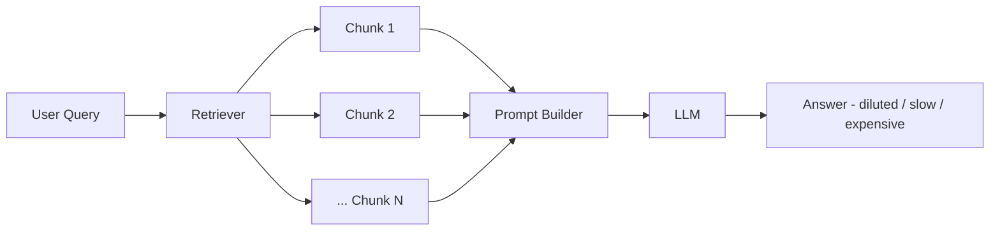
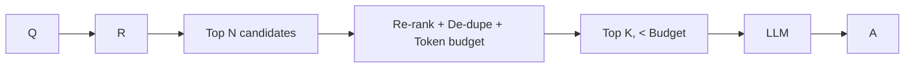

# Context overload

> **Learning Path:** RAG Architecture
> **Section:** 8.3.5 — RAG failure modes

**Context overload in RAG: too much context is worse than too little**

### 1. The problem

A RAG system works only if the model sees the *right* information at inference time. Retrieval is noisy. A good retriever for recall will return 20-40 chunks for a query.

What happens when you concatenate them all:
* You blow the token budget. Even with 128k windows, you pay for every token in and out, and latency grows linearly.
* You dilute the signal. The model’s attention is spread over 10k+ tokens of mostly irrelevant text. Relevant facts get lost-in-the-middle.
* You invite hallucination. Contradictory chunks, outdated versions, and tangential details give the model room to pick the wrong piece.

The failure mode is not “no context”. It is *too much, badly curated context*.

### 2. Mental model

Think of context window as an attention budget, not storage.

You have X tokens to spend per request. Each token costs money, latency, and attention capacity. Retrieval gives you candidates. Your job is to allocate that budget to maximize signal-to-noise for the specific query.

More chunks ≠ better answer. Better *selection and compression* = better answer.

### 3. How it works

Typical flow without a budget:

With a context budget:

Overload manifests as:
* **Token overflow**: prompt exceeds max input, system truncates silently.
* **Attention dilution**: relevant facts buried, model defaults to prior knowledge.
* **Cost/latency blow-up**: 30 chunks × 500 tokens = 15k input tokens per query.

### 4. Architectural reasoning

When to constrain context:
* High-recall domains: legal, support KBs, code repos where retriever returns broad matches.
* Multi-hop queries where you iteratively retrieve.

Options, in order of architectural cost:

* **Top-k reduction + reranking**: Retrieve 50, rerank with cross-encoder or LLM, keep 5-8. Cheap, high impact.
* **Token budget enforcement**: Hard cap in prompt builder. Truncate by tokens, not chunks.
* **Query-focused compression**: Extract only sentences that answer the query from each chunk. Reduces noise without losing recall.
* **Summarization / map-reduce**: Summarize chunks per source, then summarize summaries. Useful for long documents.
* **Hierarchical retrieval**: Retrieve documents first, then retrieve relevant passages within them.
* **Query decomposition**: Break complex query into sub-queries, retrieve smaller focused sets.

Decision rule: Start with rerank + hard token budget. Add compression only if you need recall from long documents.

### 5. Trade-offs and failure modes

* **Recall vs Precision**: Tight K improves precision but risks missing the answer. Rerank helps, but not guaranteed.
* **Latency vs Quality**: Reranking and compression add an extra LLM or embedding call. You trade 100-300ms for better answers.
* **Cost**: Context tokens dominate cost in RAG. Halving input tokens often halves cost.
* **Stability**: Without de-duplication, same paragraph from overlapping chunks repeats and wastes budget.
* **Lost-in-the-middle**: Even within budget, placing critical evidence at the start/end of context improves extraction.

Failure signature to monitor: rising input tokens per query, decreasing citation rate, increasing “I don’t know” or hallucination rate, and user-reported irrelevant answers despite high retriever recall.

### 6. Example

Enterprise support bot for a SaaS product with 2,000 pages of docs.

Retriever returns 30 chunks per query at ~400 tokens each = 12k tokens + system prompt. p95 latency 4.2s, cost $0.06/query.

Architect adds: retrieve 50 → cross-encoder rerank → keep top 6 chunks → enforce 4k token budget → de-dupe overlapping text.

Result: 3.1k input tokens, p95 latency 2.1s, cost $0.02/query. Answer accuracy up 18% because relevant troubleshooting steps are no longer buried.

### 7. Reasoning challenge

You have a 128k context model. Your retriever for a medical Q&A system returns 40 chunks averaging 600 tokens. The product team wants “maximum recall, never miss a citation.”

What do you do, and what metric do you watch to prove you didn’t lose recall?

*Hint: Think about budget first, then evidence preservation.*

### 8. Key takeaway

* Context is a budget. Design for signal per token, not tokens per query.
* Retrieve broad, select narrow. Rerank and de-dupe before you build the prompt.
* Enforce a hard token budget in the prompt builder. Truncation should be explicit, not accidental.
* Measure overload: input tokens/query, citation precision, and answer correctness, not just retriever recall.

You understand context overload when you can say *why* fewer, better chosen chunks beat a pile of retrieved text.
