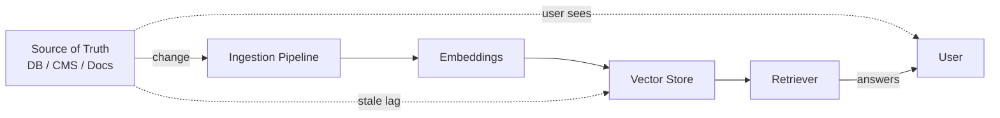

# Stale data

> **Learning Path:** RAG Architecture
> **Section:** 8.3.6 — RAG failure modes

**Stale data in RAG**

### 1. The problem

RAG looks like a real-time lookup, but it is a cache. The source of truth changes, the vector index does not change instantly.

A user asks: *"What is the refund policy as of today?"* The source doc was updated 3 hours ago. The index still contains yesterday's version. The model answers confidently with wrong information.

This is not a model hallucination. It is a data freshness failure. The retrieval layer returned a correct embedding for an obsolete document.

### 2. Mental model

Think of RAG as a read-optimized replica of your knowledge.

Source -> Ingest -> Chunk -> Embed -> Vector DB -> Query

Freshness = lag between source write and index write.

You have the classic cache invalidation problem, but with extra cost: re-embedding is expensive, and re-indexing is eventually consistent.

### 3. How it works

Staleness is created by the update path, not the query path.

Typical sources of lag:
* **Batch ingestion:** nightly crawl → up to 24h stale
* **Polling:** interval check → up to interval + processing stale
* **Event-driven but async:** CDC -> queue -> worker → minutes stale
* **Human-in-the-loop approval:** intentional delay for correctness

The index also has internal staleness: a document updated in the source may still be referenced by old chunk IDs, or a delete is never applied, creating ghost results.

### 4. Architectural reasoning

You need freshness only where it matters.

* When it helps: high-churn domains — pricing, inventory, policies, news, incident status. Low-churn domains — product manuals, legal code, historical archives.
* What it solves: preventing confident wrong answers from outdated embeddings.
* Alternatives:
  * **Accept staleness + guardrails:** add timestamp metadata and refuse to answer if doc age > threshold.
  * **Hybrid retrieval:** query vector store + live SQL/API for recent data, merge results.
  * **Write-through updates:** trigger re-embed on source change via CDC/webhook.
  * **Versioned documents:** store `doc_version` and `last_updated`, filter retrieval to max version per doc.

Choose based on change frequency, cost of wrong answer, and embedding cost.

### 5. Trade-offs and failure modes

* **Freshness vs cost.** Re-embedding on every edit is accurate but expensive. Batch is cheap but stale.
* **Consistency vs availability.** Strong consistency requires synchronous index update before source commit is visible. That adds latency to writes and creates a failure point.
* **Partial updates.** A 10-page policy changes one paragraph. Re-embedding the whole doc is wasteful; re-chunking with overlap can leave stale windows.
* **Silent staleness.** No error is raised. The system returns a high-similarity old chunk. Monitoring must be explicit: compare `source_last_modified` vs `index_last_updated`.
* **Orphaned chunks.** Delete in source, chunk remains in vector DB → ghost retrieval.

The most dangerous failure is *confident staleness*. The model has citations, so the user trusts it.

### 6. Example

Enterprise support RAG over Confluence + Jira.

Policy pages change weekly, incident postmortems daily. Batch nightly ingestion is fine for policies but bad for incidents.

Architecture: CDC from Confluence webhooks → queue → embed worker for immediate re-index of changed pages. Jira incidents are marked `ttl=1h`. Retrieval filters out chunks where `index_ts < source_ts - 5min` and boosts by recency. A fallback live search hits Jira API if no fresh vector hit.

Result: cost is contained, high-risk content is fresh, low-risk content is eventually consistent.

### 7. Reasoning challenge

You run a product catalog RAG for an e-commerce site. Prices and stock change multiple times per hour during flash sales. Embedding the full catalog on every price tick would cost $Xk/day.

Do you:
A) Re-embed the whole catalog every 5 minutes
B) Keep vector index static and join retrieval results with live pricing API at answer time
C) Only re-embed product descriptions, store price/stock as structured fields and filter post-retrieval

What do you choose and what freshness guarantee can you actually provide to users?

### 8. Key takeaway

* Stale data is a cache coherence problem for RAG, not a model problem.
* Freshness is a design choice per data class, not a global setting.
* Measure lag explicitly: source_last_modified vs index_last_updated, and expose it in retrieval.
* Prefer hybrid retrieval for volatile fields: embed for semantics, live lookup for facts.
* If you cannot guarantee freshness, make the model say so.
