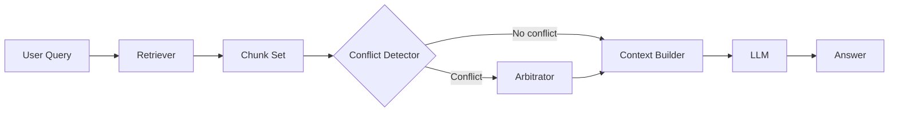

# Conflicting sources

> **Learning Path:** RAG Architecture
> **Section:** 8.3.7 — RAG failure modes

**Conflicting sources** is a RAG failure mode where retrieval returns multiple documents that contradict each other, and the model has no way to decide which is correct.

### 1. The problem

RAG assumes retrieval = truth. You retrieve top-k chunks, concatenate them into context, and expect the LLM to answer faithfully.

That assumption breaks when the corpus contains contradictions:

* A 2021 clinical guideline says dosage is 5mg. A 2024 update says 10mg.
* US policy says expense limit is $10k. EU policy says $5k.
* Product docs v2 and v3 define the same API field differently.

The retriever scores by relevance, not by consistency or authority. The LLM sees both statements and either:
1. Picks one arbitrarily based on position/bias
2. Averages them into a hallucination
3. Presents both without flagging the conflict

For an architect, this is not a model quality issue. It is a data governance and arbitration problem.

### 2. Mental model

Retrieval gives you *candidates*. Reasoning requires *arbitration*.

Think of it as a courtroom: the retriever is the clerk handing the judge a stack of documents. If the documents contradict, the judge needs provenance, recency, and authority to decide. RAG without conflict handling is a judge who just reads the first two pages aloud.

### 3. How it works

Standard RAG flow:
`Query -> Retrieve top-k -> Rank -> Build context -> Generate`

Conflicting sources flow:
`Query -> Retrieve top-k -> Conflict detection -> Arbitration -> Build context -> Generate`

The essential mechanism is adding a reconciliation step before context construction:

Conflict detection is typically:
* **Semantic overlap with opposing polarity**: same entity, different values
* **Metadata divergence**: different `source_authority`, `published_at`, `region`, `version`
* **Provenance clustering**: multiple chunks map to the same claim but disagree

Arbitration applies policy: prefer newer > older, higher authority > lower, region-specific > global, explicit deprecation > legacy.

### 4. Architectural reasoning

When it helps:
* Corpus is large, long-lived, and multi-authored
* Business risk from wrong answer is high: medical, legal, finance, compliance
* Sources have explicit hierarchy: internal > partner > public, current > archived

Alternatives:
* **Retrieve less**: top-1 only. Reduces conflict but increases miss rate.
* **Retrieve more and let LLM decide**: cheaper, but unreliable and non-deterministic.
* **Source filtering pre-retrieval**: filter by region/date/authority at query time. Works if user intent is clear, fails if ambiguous.
* **Post-generation citation check**: verify answer against sources after generation. Catches some errors but late.

Why choose explicit arbitration: you need deterministic, auditable decisions. For an AI Solution Architect, the decision is whether truth is defined by *relevance* or by *policy*. In enterprise RAG, it is policy.

### 5. Trade-offs and failure modes

* **Latency vs correctness**: conflict detection adds LLM or embedding passes. You trade ~50-200ms for safety.
* **Authority modeling cost**: you must maintain metadata: source tier, freshness, ownership. Without it, arbitration is heuristic.
* **Over-arbitration**: always picking "newest" hides intentional historical answers. Users sometimes need superseded policy.
* **False positives**: semantically similar but not contradictory claims get flagged, reducing recall.
* **Non-transparency**: if you silently pick one source, users lose trust. If you surface conflict, you increase cognitive load.

Key failure mode: silent merging. The model blends conflicting numbers into a plausible but wrong answer, and citations point to both sources.

### 6. Example

Enterprise HR RAG with regional benefits.

Query: "What is the annual travel allowance?"

Retriever returns:
* `global_policy_v3.pdf` published 2023-01: $2,500
* `emea_policy_v2.pdf` published 2024-06: $1,800
* `internal_slack_thread` 2024-11: "temp increase to $3,000 for Q4"

Without arbitration, model may answer $2,500.

With arbitration:
* Detector sees same entity `travel allowance` with different values
* Arbitrator applies policy: `region = EMEA` from user profile > global, and `published_at` newest wins
* Context builder includes EMEA $1,800 with citation, adds disclaimer: "Global policy is $2,500, superseded by EMEA 2024 update"
* Slack thread is marked `authority=low`, `type=informal`, excluded

Answer is correct, traceable, and safe.

### 7. Reasoning challenge

You are designing RAG for a bank's compliance assistant. Sources include:
* Regulatory filings, updated quarterly
* Internal memos, updated ad-hoc
* Agent notes from calls

A query about "KYC check required for account type X" returns a 2023 filing saying "required" and a 2024 internal memo saying "waived for tier-1 clients".

What do you implement to decide what to show the agent, and what do you surface to the end user? What metadata do you require from ingestion?

### 8. Key takeaway

* Conflicting sources is a data governance problem, not a prompt problem.
* Retrieval finds relevance; arbitration enforces truth policy via provenance, recency, and authority.
* Silent merging is dangerous. Either resolve explicitly or surface the conflict.
* Architect for auditability: every answer should be traceable to a chosen source with a reason for choosing it.
