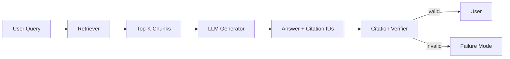

# Citation failures

> **Learning Path:** RAG Architecture
> **Section:** 8.3.9 — RAG failure modes

**Citation failures**

### The problem
RAG is sold as grounded generation. The user asks, the system retrieves, the model answers with sources. That promise breaks when the citation does not actually support the claim it is attached to.

The problem is not hallucinated answers alone. It is *attributed* hallucination: a confident answer with a plausible-looking reference that is wrong, mismatched, or non-existent. For an AI Solution Architect this is a trust and compliance problem. In enterprise, legal, medical, and financial use cases, a bad citation is worse than no citation because it creates liability.

### Mental model
Think of citations as a pointer contract between retrieval and generation.

Retriever promises: these chunks are relevant to the query.
Generator promises: this claim is entailed by the chunks I cite.

A citation failure is a contract violation. The pointer is present but the entailment is false.

### How it works
In practice citation is produced by prompting the model to emit markers like `[doc3:12]` and hope it follows. That is weak.

Stronger architectures make citation explicit:

* **Retrieval-constrained generation:** Only retrieved chunks are in context, and the prompt forces citation for every factual claim.
* **Citation grounding:** After generation, a verifier checks claim → chunk entailment, often with a smaller model or NLI.
* **Chunk-level metadata:** Each chunk carries doc_id, version, and span. Citations must reference that metadata, not free text.

Failure modes cluster around that contract:

* **Hallucinated citation:** Model cites a doc_id that was never retrieved. Common when the model has memorized document names.
* **Unsupported claim:** Citation exists but the chunk does not entail the claim. Classic with large chunks where the model blends info from multiple passages.
* **Granularity mismatch:** Citation points to a 2000-token chunk. The claim is true somewhere in the chunk but the user cannot verify it.
* **Stale citation:** Document updated after embedding index. Citation points to old content.
* **Over/under citation:** Over-citing dilutes trust; under-citing leaves claims ungrounded.

Root causes are architectural: weak retrieval, overly large chunks, no enforcement in prompt, and no post-generation verification.

### Architectural reasoning
When do you need strict citations?

* **When trust is externalized.** If the answer will be used for decisions, audit, or compliance, you need verifiable pointers.
* **When source corpus is authoritative and bounded.** Internal KB, contracts, product docs.
* **When retrieval quality is variable.** You need a safety net because top-K is noisy.

Alternatives exist. You can trade citation strictness for fluency by allowing summarization without pointers, or by using a retrieval-augmented classifier that just ranks sources. Those work for exploratory search, not for regulated use.

The architectural decision is where to enforce the contract: at prompt time, at generation time, or at verification time. Prompt enforcement is cheap but brittle. Verification is expensive but reliable.

### Trade-offs and failure modes
* **Strictness vs latency/cost.** Forcing citation per claim and verifying with NLI adds 2-3x LLM calls. Acceptable for high-risk queries, not for chatty assistants.
* **Chunk size vs precision.** Small chunks improve verifiability but hurt recall and coherence. Large chunks improve recall but create unsupported claims.
* **Open citations vs closed citations.** Letting the model choose which retrieved doc to cite increases flexibility but enables hallucinated doc_ids. Closed citations where you pre-map claims to chunks remove hallucination but constrain generation.
* ** freshness vs index cost.** Real-time citation requires near real-time indexing and versioned doc IDs. Most RAG systems accept eventual consistency and stale citations.

### Example
Enterprise compliance assistant for HR policies.

Retriever returns 3 chunks about parental leave from policy v2.3. The LLM answers: "Parental leave is 16 weeks paid." It cites `[policy_v2.3#sec4]`.

Failure: Policy v2.4 was released last week and changed paid leave to 12 weeks. The index has not been refreshed. The citation is valid syntactically, stale semantically.

Architectural fix: versioned doc IDs in the index, a freshness check on retrieval, and a verifier that extracts the specific span supporting the claim and compares it to the claim. If no span matches, the system downgrades to "unable to verify" instead of returning a bad citation.

### Reasoning challenge
You are building a customer support RAG over support tickets and product docs. Latency budget is 800ms. Leadership wants citations for every answer.

Do you enforce citations in-prompt only, add a post-generation verifier, or both? What failure mode are you most worried about, and what metric would you track to detect it in production?

### Key takeaway
* Citations are a contract, not decoration. The system must guarantee entailment, not just reference presence.
* Most citation failures come from retrieval-generation misalignment, not model hallucination alone.
* Enforce at the right layer: prompt for cheap control, verifier for trust-critical paths.
* Track claim-level support, not just citation presence. Measure citation precision: % of cited claims actually entailed by the cited span.
