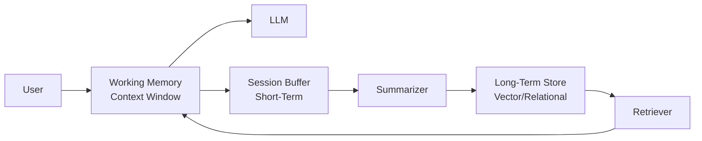

# Conversation memory

> **Learning Path:** AI Memory
> **Section:** 9.1.1 — Memory types

**Conversation memory** is not about making an LLM remember. It's about deciding what to keep, where to keep it, and when to retrieve it.

### The problem

LLMs are stateless. Every turn is a fresh inference over a prompt. Without external memory, a conversation loses continuity after the context window fills, and any knowledge from previous sessions is gone.

That creates three constraints you hit immediately:
* **Context window limit.** You can only feed N tokens per request. History grows linearly with turns.
* **Cost and latency.** Longer prompts = more tokens, slower responses.
* **Persistence.** A user expects the assistant to remember preferences, decisions, and facts from weeks ago, not just the last 4 turns.

You need continuity without paying for the entire history every time.

### Mental model

Think of memory as layers with different retention and recall cost.

* **Working memory** = the context window you send to the model now. Small, fast, expensive to fill.
* **Short-term memory** = recent session history kept in app state or a session store. Used to maintain coherence within a conversation.
* **Long-term memory** = persistent, searchable store of past interactions, user facts, and derived knowledge. Retrieved selectively.

This is the same trade-off you make in distributed systems: cache vs database vs archive.

### How it works

**Working memory.** The actual prompt. You control it with truncation, sliding window, and compression. It gives the model immediate coherence: pronouns, references, last instruction.

**Session / short-term.** Store the full transcript for the active session. On each turn you build a prompt from recent turns, often with a max token budget. When the budget is exceeded you either drop oldest turns or compress them.

**Long-term.** Persisted artifacts: user profile, preferences, past decisions, summarized topics. Stored in a vector DB, graph, or relational store and retrieved with embeddings or keys.

The core mechanism is **summarize and retrieve, not replay**.

* Summarization compresses long sessions into a compact summary that stays in working memory.
* Retrieval pulls only relevant facts for the current intent, e.g. "user's preferred shipping address" or "previous bug we discussed about checkout".

Implementation is simple: write to long-term asynchronously, read via retrieval at prompt construction time. Never put the whole history in the prompt.

### Architectural reasoning

When it helps:
* Multi-turn tasks that need reference to earlier decisions.
* Personalization across sessions.
* Compliance/audit where you need to reconstruct what was said.

Alternatives and why you choose them:
* **Full history in context.** Good for short, high-value conversations where fidelity > cost. Breaks at scale.
* **Summarization.** Good for narrative continuity. Loses detail. Use for high-level context, not precise facts.
* **Retrieval-augmented memory.** Good for factual recall across long time horizons. Needs good chunking and embeddings. Adds latency.
* **Hybrid.** Most production systems: keep last N turns in working memory + retrieve 3-5 relevant past artifacts + a session summary.

Decision rule: keep what the model needs to reason correctly now in context, keep everything else searchable.

### Trade-offs and failure modes

* **Cost vs fidelity.** Larger context = better coherence, higher cost. Summarization saves tokens but can hallucinate or drop nuance.
* **Latency vs recall quality.** Retrieval adds a round trip. Over-retrieval pollutes context with noise.
* **Privacy and scope.** Long-term memory is personal data. You need retention policies, deletion, and access control. Never retrieve unrelated user data into another user's session.
* **Stale memory.** Without invalidation, the model acts on outdated preferences. You need timestamps, versioning, and a way to correct stored facts.
* **Retrieval drift.** Embedding similarity finds "related" not "relevant". You need reranking and grounding, otherwise the model trusts bad memories.

Failure mode to watch: the assistant confidently repeats a summarized fact that was wrong in the original transcript. Summarization errors compound.

### Example

Enterprise support agent.

Working memory holds the last 6 turns.
Session buffer holds the full ticket transcript.
Long-term store holds user profile, past tickets, product entitlements.

On a new message: retrieve user's last 3 resolved issues and preference for email updates, inject a 2-sentence session summary, and keep the last 6 turns verbatim. The prompt stays under budget, the agent remembers the user, and it doesn't pay to re-send 40k tokens of history.

If the user says "use the same fix as last time", retrieval finds the relevant ticket, not the whole history.

### Reasoning challenge

You are designing a financial advisory assistant with strict audit requirements. Users have long histories over years, and every recommendation must be traceable to source documents. Summarization is not allowed for factual claims.

How do you structure memory, and what do you put in context vs store externally? What failure mode worries you most?

### Key takeaway

* Memory in AI systems is an architectural choice about what to keep in context, what to compress, and what to retrieve.
* Working memory is cheap and precise but bounded. Long-term memory is cheap to store but expensive to query correctly.
* Choose hybrid: recent window + summary + selective retrieval. Optimize for correctness and cost, not completeness.
* Design for invalidation, privacy, and retrieval quality from day one; stale or leaked memories are worse than no memory.
