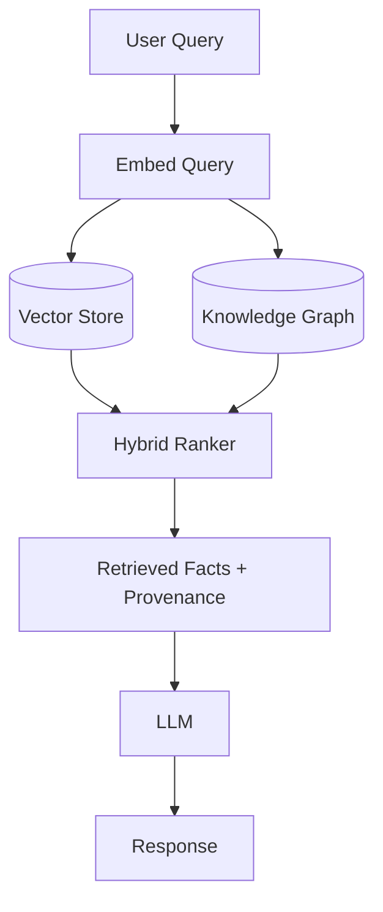

# Semantic memory

> **Learning Path:** AI Memory
> **Section:** 9.1.4 — Memory types

**Semantic memory**

### 1. The problem

LLMs have broad parametric knowledge but it is static, ungrounded, and unverifiable. For an AI system you need:
* facts that are specific to your domain and change over time
* answers that are traceable to a source
* a way to separate *what the world means* from *what happened to this user*

Fine-tuning for every fact update is expensive and slow. Prompt stuffing doesn't scale. You need a persistent, queryable store for meaning.

That's semantic memory: long-term factual knowledge about concepts and relationships, independent of personal experience or time.

### 2. Mental model

Think of it as the system's dictionary + encyclopedia.

Episodic memory = "what happened, when, to whom". A log of interactions.
Semantic memory = "what is true, how things relate". Product SKUs, pricing rules, ontology of entities.

It is not a transcript. It is a compressed representation of meaning you can retrieve by similarity, not exact key lookup.

### 3. How it works

Essentially two mechanisms:

1. **Embedding index.** Text chunks are embedded into vectors. Retrieval is by cosine similarity to the query embedding. Good for "find conceptually related facts".
2. **Structured knowledge layer.** Entities and relations in a graph or relational schema. Good for precise constraints like `product A supersedes product B`.

In practice you run hybrid retrieval: vector search for relevance + graph/structured filter for correctness, then feed top facts as context to the LLM.

The LLM stays the reasoner. Semantic memory supplies the ground truth it can cite.

### 4. Architectural reasoning

Use semantic memory when you need:
* **Controllable, auditable knowledge.** You can update, version, and trace a fact without retraining.
* **Up-to-date domain knowledge.** Prices, policies, product catalogs change weekly.
* **Conceptual reasoning.** Queries like "cheapest laptop with >16GB RAM" require understanding attributes and relations.

Alternatives:
* **Fine-tuning / RAG with raw documents.** Works for one-off Q&A, but lacks a canonical model of meaning. Hard to enforce consistency.
* **Episodic memory only.** Gives personalization but no general facts. You can't answer "what is our refund policy?" from past chats.

Decision rule: If the knowledge is *shared, stable in structure but mutable in content*, and you need *semantic search not exact lookup*, build semantic memory.

### 5. Trade-offs and failure modes

* **Retrieval quality vs latency.** Larger chunking improves recall but hurts precision. Re-ranking helps but adds cost.
* **Stale embeddings.** Content updates without re-embedding cause drift. You need an update pipeline and TTL/versioning.
* **Semantic overload.** Storing everything semantically makes retrieval noisy. Separate semantic memory from episodic memory; don't dump raw conversation logs into the vector store.
* **Hallucination by composition.** LLM can still hallucinate connections between correctly retrieved facts. Provenance and constrained generation mitigate it.
* **Cost.** Embedding + vector DB + graph sync is operational overhead. For small, static knowledge a simple lookup table is cheaper.

### 6. Example

Enterprise support agent for a SaaS product.

Semantic memory contains:
* Product ontology: plan tiers, features, limits, pricing
* Policy knowledge graph: refund rules, SLA definitions
* KB articles embedded with metadata for version and owner

User asks: "Can I upgrade from Pro to Enterprise mid-cycle and get prorated credit?"

Agent embeds query, retrieves semantic facts: upgrade policy node, proration formula, relevant KB article. The episodic memory supplies *this user's* current plan and start date. Working memory holds the current conversation.

Result is grounded, citeable, and does not require model retraining when pricing changes.

### 7. Reasoning challenge

You are building an AI agent for a bank. It needs to:
A. Answer general questions about loan products
B. Recall a specific customer's past applications and notes
C. Follow step-by-step compliance checks

Where do A, B, C live? Would you store B in semantic memory? Why or why not?

### 8. Key takeaway

* Semantic memory stores *meaning*, not events. It answers "what is true" not "what happened".
* It exists to make knowledge updatable, auditable, and separable from the model weights.
* Architect it as hybrid vector + structured graph with clear update and versioning pipelines.
* Keep it distinct from episodic memory for personalization and working memory for short-term context. Mixing them creates noise and compliance risk.
