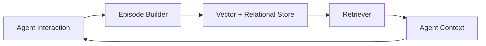

# Episodic memory

> **Learning Path:** AI Memory
> **Section:** 9.1.5 — Memory types

**Episodic memory**

### 1. The problem

An LLM has no memory between sessions. Give it the same prompt twice and you get two independent answers. For an AI agent that is supposed to be useful, this is a problem:

* Conversations lose continuity. The agent forgets you discussed a budget last week.
* The agent cannot learn from its own experience. It repeats mistakes.
* Personalization is impossible without re-providing history every time.

Context windows are finite and expensive. You cannot just dump the entire history into the prompt. You need a way to store *what happened* and retrieve *the right what happened* at the right time.

That is the problem episodic memory solves.

### 2. Mental model

Think of episodic memory as a diary, not a textbook.

Semantic memory is facts: "Paris is the capital of France".
Episodic memory is events: "On 2025-11-03 at 14:22, user Alex asked about Paris flights for 3 people, budget $2,400, prefers non-stop."

It stores who, what, when, where, and why, with enough context to replay the situation.

For an AI system, an episode is a structured record of an interaction or observed event with timestamp and metadata, not just a raw transcript.

### 3. How it works

Episodic memory is a write-once, retrieve-later store for experience.

Write path: After an interaction, extract a summary, key entities, intent, outcome, and metadata. Store the raw text for fidelity, an embedding for similarity search, and structured fields for filtering: user_id, timestamp, session_id, topic tags, sentiment.

Read path: Given current query, retrieve relevant episodes using hybrid search: semantic similarity on embeddings + hard filters on time/user/context. Re-rank by recency and relevance, then inject a small, curated set into the prompt.

The essential mechanism is *selective recall*, not full history replay.

### 4. Architectural reasoning

When it helps:
* Continuity across sessions for personal assistants, support agents, sales copilots.
* Learning from past decisions: "Last time we tried this approach, it failed because..."
* Audit and explainability: why did the agent act this way?

Alternatives:
* No memory: stateless, cheap, safe, but forgetful.
* Full conversation history in context window: simple, but hits token limits and cost fast.
* Semantic memory only: good for facts, bad for *when it happened to whom*.

Choose episodic when the *context of the experience* matters more than the fact itself. If you need "what did this user decide last Tuesday", you need episodes. If you only need "what is our refund policy", semantic is enough.

Architecture pattern: episodic store is separate from the model. Write asynchronously to avoid latency on the request path. Keep a relational index for precise filters and a vector index for fuzzy recall. Add a retention and compaction policy.

### 5. Trade-offs and failure modes

* **Retrieval noise vs recall.** Too broad a search pollutes context with irrelevant past events. Too narrow misses the important one. You trade recall quality for precision.
* **Storage and cost.** Episodes grow unbounded. Without pruning, summarization, and TTL, you pay for storage and slower search.
* **Privacy and security.** Episodes contain PII. You need per-user isolation, encryption at rest, and deletion on request. Episodic memory is a compliance surface.
* **Temporal drift.** Old episodes become misleading. A user's preference from 6 months ago may no longer hold. Recency weighting helps, but does not eliminate stale decisions.
* **Hallucination amplification.** The model can treat retrieved episodes as ground truth. Bad retrieval = confident wrong answers.

Failure mode: an agent that confidently repeats an outdated request because the episodic store returned an old episode with high similarity but no time filter.

### 6. Example

Enterprise support agent.

User opens ticket #4821 on Monday: "My invoice is $120 too high". Agent resolves it.

On Friday, user asks: "Why is my bill higher this month?"

Without episodic memory, the agent asks for details again.

With episodic memory, retriever finds episode {user_id: 4821, timestamp: Mon, topic: billing, outcome: invoice adjusted}. Agent context becomes: "User had a previous billing discrepancy on Monday which was resolved. Ask if this is a new issue or a repeat."

Result: continuity, less friction, and the agent can surface the prior resolution link.

Implementation notes: store episode with user_id, session_id, timestamp, summary, entities {invoice_id}, outcome. Retrieve with filter user_id = X and topic = billing, ranked by recency.

### 7. Reasoning challenge

You are designing a sales copilot that remembers past deals.

Option A: Store every meeting transcript verbatim as episodes, retrieve top 5 by embedding similarity.
Option B: Summarize each meeting into a structured episode with deal_stage, amount, next_steps, and last_updated, retrieve with semantic + filter by deal_id and recency.

Which do you choose, and what breaks if you get it wrong? Consider latency, context pollution, and privacy.

### 8. Key takeaway

* Episodic memory exists to give stateless models continuity of experience, not just facts.
* It is a diary of events with time and context, stored separately and retrieved selectively.
* Use it when personalization, continuity, and learning from past interactions matter.
* Architect for hybrid retrieval, retention policies, and strict per-user isolation.
* The biggest risks are stale data, retrieval noise, and privacy exposure.
