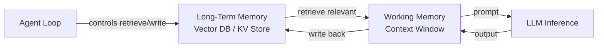

# Working memory

> **Learning Path:** AI Memory
> **Section:** 9.1.7 — Memory types

### The problem

An LLM has no persistent internal state between calls. Every request is stateless. If you want it to reason over a multi-step task, you must explicitly give it the relevant facts for *this* step.

The problem shows up as:
* Context window is finite and expensive. You cannot dump a user's entire history into every call.
* Relevance changes per step. The agent needs the current goal, recent decisions, and intermediate results, not the whole corpus.
* Latency and cost scale with tokens in context.

You need a place to hold just enough working information for the current reasoning step, and discard the rest.

### Mental model

Working memory is the desk surface. Long-term memory is the filing cabinet.

You pull files you need, spread them on the desk, work on them, then put them away. The desk is small, fast, and ephemeral. If the desk gets too full you stop being able to think clearly.

In AI systems this is: the active context window, session state, and scratchpad that the model can see *right now* for the current turn.

### How it works

Working memory is constructed per inference, not stored in model weights.

Essentially:
`Working Memory = System prompt + Session state + Retrieved relevant facts + Recent conversation window + Current task input`

It lives for the duration of one or a few turns, then is summarized or discarded.

Implementation patterns:
* **Session buffer:** keep last N messages or a sliding window of tokens
* **Summarized context:** compress prior turns into a short summary that stays in context
* **Structured scratchpad:** explicit fields like `current_goal`, `pending_tasks`, `facts_known_this_session`
* **KV cache:** during generation the model reuses attention over the current context; this is physical working memory for the forward pass

It is refreshed every turn. Retrieval from long-term memory feeds into it, outputs from it may be written back to long-term memory.



### Architectural reasoning

Use working memory when you need continuity without full history.

It solves:
* **Coherence across turns.** The model can reference decisions made 3 turns ago without re-reading everything.
* **Controlled reasoning.** You can force the model to only consider a curated set of facts for this step.
* **Cost control.** You pay for tokens you actually need now, not the entire history.

Alternatives:
* Put everything in context. Works for short sessions, fails on cost/latency and token limits.
* Rely solely on retrieval at each step. Loses recent causal links and short-term intent.
* Write everything to long-term memory and re-retrieve. Too noisy, loses ordering.

Choose working memory when the task is multi-step, stateful, and the relevant context fits in a few thousand tokens.

### Trade-offs and failure modes

* **Context pollution.** Irrelevant history in working memory drowns signal. Leads to hallucinations and drift.
* **Lossy summarization.** Compressing history loses nuance. The model forgets why a decision was made.
* **Token budget pressure.** More working memory = higher cost and latency. You must actively prune.
* **No durability.** If you don't write important conclusions back to long-term memory, they vanish when the session ends.
* **Recency bias.** The model overweights what is at the end of the window.

The failure mode to watch: working memory grows unbounded and becomes a bloated dump of the past, not an active workspace.

### Example

Enterprise support agent.

Long-term memory: user profile, past tickets, knowledge base embeddings.

Working memory for a single turn:
```
current_intent: "reset password"
recent_actions: ["asked for email", "verified identity"]
constraints: ["no SMS reset on weekends"]
facts_for_this_step: ["user email = a@co.com", "last password change 30 days ago"]
```
Only these fields are in context. The full ticket history is not. After resolution, the agent writes `resolution_summary` and `user_preference` back to long-term memory.

Result: consistent replies, lower cost, and the agent does not confuse this ticket with an old one.

### Reasoning challenge

You are designing a financial analysis agent that processes 10,000-row transaction histories.

Option A: Put the last 2,000 rows in working memory each turn.
Option B: Keep a 200-row sliding window in working memory and retrieve aggregated summaries for older periods from long-term memory.

Which do you pick and what is the key risk you must mitigate with the chosen design?

### Key takeaway

* Working memory is an *active, bounded* context for the current reasoning step, not a database.
* It exists because context windows are limited and expensive; you must curate what the model sees now.
* Good design = explicit retrieve → curate → reason → write-back loop between working and long-term memory.
* The biggest risks are pollution and loss: too much noise in, too little preserved out.
