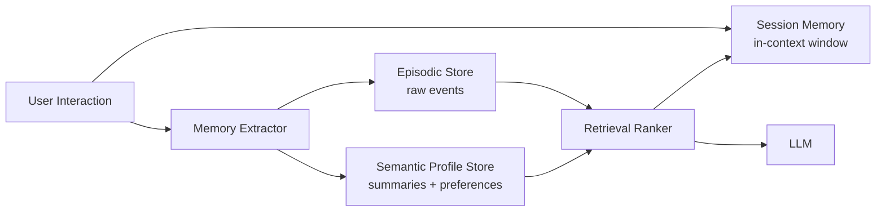

# User memory

> **Learning Path:** AI Memory
> **Section:** 9.1.8 — Memory types

**User memory**

### 1. The problem

A stateless LLM forgets everything when the session ends. That creates three architectural pain points:

* The user repeats context every conversation. "Remind me what we discussed last week."
* The system cannot personalize. It has no durable model of who the user is.
* The agent cannot learn from experience. It repeats mistakes and asks the same questions.

You need continuity without stuffing the entire history into the context window.

### 2. Mental model

Think human memory, not database tables.

* **Working memory** = what’s in the current conversation. Limited, fast, volatile.
* **Episodic memory** = what happened. Raw interactions, timestamps, verbatim events.
* **Semantic memory** = what it means. Summarized facts, preferences, relationships extracted from episodes.
* **Procedural memory** = how to act. Learned workflows and personal shortcuts for this user.

User memory is the durable, user-scoped layer that persists beyond a session. It is built from episodic records and compressed into semantic profiles.

### 3. How it works

Capture → Store → Retrieve → Update.

* Capture: On session close or via streaming, extract user-relevant facts with an extractor LLM. Filter noise, PII, and task-irrelevant chatter.
* Store: Episodic store keeps immutable interaction logs, often vector + relational. Semantic store keeps a compact user profile: preferences, goals, entities, constraints.
* Retrieve: For a new prompt, retrieve relevant episodes and profile slices, rank by recency, importance, and relevance, then inject into context.
* Update: Profiles are updated incrementally with merge/summarize policies, not naive append. Old preferences decay or are versioned.

### 4. Architectural reasoning

When it helps:

* Multi-session personalization: e-commerce, healthcare, finance assistants.
* Continuity of long-running tasks: project tracking, research synthesis.
* Reduced prompt cost: summaries replace full history.

Alternatives and why you choose them:

* In-context only: cheap, private, no infra. Fails beyond ~few turns.
* Session store: Redis / Postgres for short TTL. Good for temporary continuity.
* Episodic + Semantic split: needed when you want both auditability and personalization. Episodic = source of truth, semantic = working model.
* Knowledge graph: when relationships between entities matter more than text similarity.

Decision rule: Use session memory for ephemeral context, episodic memory for compliance/audit, semantic profile for personalization.

### 5. Trade-offs and failure modes

* **Privacy vs personalization.** More memory = better UX, higher risk. You need data minimization, purpose limitation, and user controls for deletion/forgetting. GDPR/CCPA make raw episodic storage expensive.
* **Freshness vs stability.** Overwriting profiles too eagerly loses history; never updating creates stale assumptions. Use time-decay and confidence scores.
* **Write amplification.** Extracting and summarizing on every turn costs LLM calls. Batch, sample, or trigger on high-signal events.
* **Memory poisoning.** Bad retrieval injects outdated or incorrect facts into the prompt and causes hallucination. Guard with provenance, recency filters, and retrieval confidence thresholds.
* **Scaling cost.** Vector search per user is cheap; cross-user search is not. Keep retrieval user-scoped by default.

### 6. Example

Financial planning assistant.

Session memory holds current goal discussion. Episodic store keeps each meeting transcript, documents uploaded, risk questionnaire answers. Semantic profile stores: risk tolerance = moderate, prefers quarterly reviews, avoids crypto, tax residency = DE, prefers German.

New session: User says "show my plan". Retrieval pulls semantic profile for tone and constraints, plus last 2 relevant episodes about mortgage discussion. The LLM never sees the full 18-month history, only distilled facts with citations.

If the user moves to Austria, the profile is updated and old tax residency is archived, not deleted.

### 7. Reasoning challenge

You are building a healthcare triage chatbot. Regulations require you to retain full transcripts for 7 years, but you also want to personalize follow-ups.

Do you store raw transcripts in the same store you use for retrieval to build the user profile? What would you change if a user requests deletion of personal data?

### 8. Key takeaway

* User memory exists to give stateless models continuity and personalization without blowing up context windows.
* Separate episodic raw history from semantic summarized profiles; use each for different purposes.
* Retrieval quality and update policy matter more than storage technology.
* Architect for privacy, decay, and provenance from day one; you cannot retrofit forgetting.
