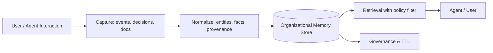

# Organizational memory

> **Learning Path:** AI Memory
> **Section:** 9.1.9 — Memory types

**The problem**

An AI agent can be brilliant inside a single chat and useless the next day. Context windows reset, session stores are per-user, and learned patterns stay trapped in one conversation. The organization therefore repeats questions, re-discovers solutions, and loses institutional decisions every time a user logs out or an agent is replaced.

The constraint is not compute, it's continuity. You need knowledge that persists across sessions, users, teams, and model versions, is auditable, and can be governed. Without it you get siloed memory: fast but disposable.

**Mental model**

Organizational memory is the shared, durable knowledge layer of a company, not the memory of a single user or model. Think of it as the institutional brain: policies, decisions, customer facts, and outcomes that should survive personnel turnover and model upgrades.

It sits above personal episodic memory and model weights. It is curated, versioned, and access-controlled.

**How it works**

Capture -> Normalize -> Store -> Retrieve -> Govern.

Capture is from conversations, tickets, CRM updates, documents, and explicit human approvals. Normalization extracts facts, links entities, and tags provenance: who wrote it, when, source confidence. The store is typically hybrid: vector for similarity, graph for relations, and relational for structured policy. Retrieval is always filtered by role, tenant, and freshness.

**Architectural reasoning**

Use organizational memory when you need:

* Cross-session continuity. The same customer issue should not be re-explained.
* Multi-agent coordination. Agents, workflows, and humans share a single source of truth.
* Audit and compliance. You can explain why the system answered a certain way.

Alternatives:
* Context window only. Cheap, fast, but ephemeral and expensive at scale.
* Personal long-term memory per user. Good for personalization, bad for institutional knowledge.
* Static knowledge base. Accurate but stale without write paths.

Choose organizational memory when learning is a product requirement, not a nice-to-have. It enables decisions like “we will not re-train the model weekly; we will update memory in real time and retrieve it.”

**Trade-offs and failure modes**

* Freshness vs consistency. Real-time writes create contamination risk. Batch curation is safer but laggy. Most systems use a write buffer with human-in-the-loop for high-stakes facts.
* Centralization vs privacy. A single memory is powerful but creates a data exfiltration surface. You need tenant isolation, PII redaction, and strict retrieval policies.
* Signal vs noise. Every conversation can be captured, but most is noise. Without summarization and deduplication, retrieval quality collapses.
* Stale truth. Organizational memory can become a source of hallucination amplification if bad facts are never removed. TTL, confidence decay, and provenance tracking are essential.

Failure mode: a support agent learns a workaround from a chat, writes it to memory, and it spreads to all agents before being validated. You need gates for promotion from ephemeral to organizational.

**Example**

Enterprise support copilot.

Every ticket resolution is captured. A summarizer extracts: customer_id, product, root cause, resolution steps, and outcome. The record is stored with source ticket ID and engineer approval flag. When a new agent handles a similar issue, retrieval pulls approved resolutions and relevant policy, not raw chat history. The memory is updated only after a senior engineer marks the resolution as “canonical”.

Result: new hires get institutional knowledge in minutes, not months, and compliance can prove what advice was given and why.

**Reasoning challenge**

You are designing an AI assistant for a hospital network. Clinicians ask for treatment guidance. Should successful clinical decisions be written to organizational memory automatically, or only after peer review? What happens to retrieval latency, safety, and liability in each case?

**Key takeaway**

* Organizational memory solves continuity and institutional learning, not personal recall.
* It is a governed, shared, persistent knowledge layer built on capture, normalization, and controlled retrieval.
* Design for freshness, provenance, and access control first; retrieval quality depends on curation, not just scale.
* The architectural decision is when to promote ephemeral experience to durable organizational truth.
