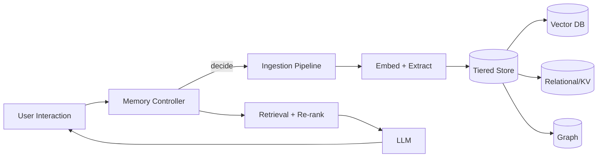

# What should be remembered?

> **Learning Path:** AI Memory
> **Section:** 9.2.1 — Architecture

**9.2.1 — Architecture: What should be remembered?**

### 1. The problem

An LLM is stateless and has a limited context window. An agent that only lives in that window forgets the user between sessions, repeats questions, and cannot learn.

You can keep everything in context, but token cost and latency explode. You can store everything externally, but then retrieval becomes noise and you pay for irrelevant data.

The architectural problem is not storage capacity. It is *selection*: what to keep, in what form, for how long, and how to retrieve it reliably when it matters.

### 2. Mental model

Think of memory as a retrieval policy, not a database.

Human memory is tiered:
* Working memory = the desk you are using now
* Episodic memory = a log of what happened
* Semantic memory = compressed facts and preferences you reuse

An AI memory system needs the same tiers, with explicit control over promotion and forgetting.

### 3. How it works

The controller decides, per interaction:
* **Store or discard?** Is this novel, actionable, or a repeat?
* **What form?** Raw transcript, summary, extracted fact, preference, or action outcome?
* **Where?** Hot working memory for this session, warm vector store for semantic recall, cold store for audit/compliance.
* **When to compress/forget?** Summarize old episodes into a durable summary and expire raw data per policy.

Retrieval is not a single vector search. It is: filter by user/tenant + time + access, retrieve candidates from vector + structured store, re-rank by recency, importance, and relevance to current intent, then ground the LLM with citations.

### 4. Architectural reasoning

When it helps:
* Multi-turn conversations across sessions
* Personalization that persists beyond a single prompt
* Agents that act and must remember outcomes to avoid repeats

Alternatives:
* **Context-only**: simple, no ops. Fails at scale, cost, and continuity.
* **Full history dump**: cheap to build, terrible recall and privacy risk.
* **Tiered memory with explicit policy**: more components, but controllable cost, latency, and correctness.

Choose tiered memory when you need continuity with bounded cost. Choose structured stores for facts you need to query exactly, vector for similarity, graph for relationships.

### 5. Trade-offs and failure modes

* **Freshness vs cost.** Raw logs give fidelity but are expensive to retrieve and noisy. Summaries are cheap but lose detail. You need a compaction policy.
* **Recall vs precision.** High recall brings noise and hallucination risk. Aggressive filtering loses important context. Re-ranking with a small cross-encoder helps.
* **Centralized vs per-user.** Shared memory enables transfer learning but risks cross-tenant leakage. Per-user isolation is safer and simpler to operate.
* **Failure modes to design for:** memory poisoning from bad extractions, retrieval drift where old preferences override new ones, stale memory never invalidated, and privacy leakage via embeddings that are reversible.

### 6. Example

Enterprise support agent.

Ingestion extracts: user ID, intent, product, ticket outcome, explicit preference e.g. “no calls after 6pm”. Raw transcript goes to cold storage 30 days. A summary and preference fact are written to relational KV with TTL. Embeddings of the summary go to vector store.

On next session, the controller retrieves recent summaries + active preferences, filters by user and recency, re-ranks by intent similarity, and injects 3-5 grounded facts into the prompt. Old tickets are summarized into a quarterly user profile, raw logs are deleted.

Result: continuity without replaying 10k tokens of history.

### 7. Reasoning challenge

A finance assistant handles 500 conversations/day per user. Storing every turn costs $X/month and retrieval latency is growing. Summarizing daily loses details needed for compliance audits.

What would you store raw, what would you summarize, and what retention and invalidation policy would you set? Which store types would you use for each?

### 8. Key takeaway

* Memory is a retrieval policy, not a dump. Decide what is worth remembering for future decisions.
* Use tiered storage: working, episodic, semantic. Promote and compress explicitly.
* Retrieval quality beats storage size. Filter, re-rank, and ground with citations.
* Design forgetting: retention, summarization, and invalidation are architectural features, not afterthoughts.
