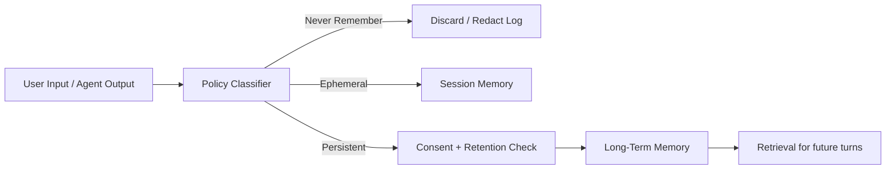

# What should never be remembered?

> **Learning Path:** AI Memory
> **Section:** 9.2.2 — Architecture

**What should never be remembered?**

### 1. The problem

AI memory feels like a pure benefit: remember preferences, context, past conversations, and the agent gets smarter. In practice, memory is a liability surface.

Every thing you store can be retrieved later, leaked via a prompt, poisoned by an attacker, subpoenaed, or become a compliance violation. The cost is not just storage. It's legal risk, security risk, and model degradation.

The architectural question is not "how much can we remember?" It's "what must we *never* persist, even accidentally?"

### 2. Mental model

Think of memory as three buckets, not one.

* **Ephemeral working memory:** session context, kept for minutes, discarded after use.
* **Persistent long-term memory:** user preferences, facts you validated, summaries with consent.
* **Never Remember:** data that must be classified, redacted, or discarded on arrival.

A Never Remember policy is a negative filter applied *before* any vector DB, RAG store, or long-term memory. If it hits the deny list, it never gets an embedding.

### 3. How it works

The mechanism is a gatekeeper, not a cleaner.

1. **Classify on ingest.** Before write, run a lightweight policy check: PII regex, secret detection, toxicity/adversarial pattern, copyrighted text heuristics.
2. **Redact and route.** If matched, strip the sensitive span, keep a redacted placeholder for context continuity, and log only metadata.
3. **Enforce retention by default.** Persistent memory has TTLs and scope limits. Never Remember items have TTL = 0.

This is architectural, not just prompt engineering. The check lives in the memory service layer, so every writer - chat, tool, agent loop - is forced through it.

### 4. Architectural reasoning

When it helps: any system with personal data, regulated data, or open user input.

What problem it solves: prevents accidental persistence of secrets, prevents prompt injection and jailbreak attempts from being stored as "facts", and satisfies data minimization.

Alternatives:

* Store everything and filter on read. Bad. Retrieval is the attack vector.
* Rely on user to not share secrets. Bad. Users do.
* Store raw and encrypt. Still retains liability and poisoning risk.

You choose Never Remember when the cost of a false negative - remembering something you shouldn't - is higher than the cost of a false positive - forgetting something useful.

### 5. Trade-offs and failure modes

* **Personalization vs privacy.** Aggressive deny lists reduce personalization. Mitigate with coarse summaries instead of raw text.
* **Classification errors.** Over-blocking hurts UX, under-blocking is a breach. You need auditable policy, not a hidden regex.
* **Leakage via embeddings.** Even redacted text can leak via nearest neighbor. Never Remember should block embedding generation, not just storage.
* **Poisoning.** An attacker who gets a toxic prompt stored will have it retrieved for other users. Never Remember is the first line of defense against memory poisoning.
* **Compliance drift.** GDPR right to erasure, HIPAA, PCI DSS require provable non-retention. A policy you can't prove is a policy you don't have.

Failure mode to watch: the "helpful assistant" that summarizes a session and accidentally includes a credit card number in long-term memory because the classifier ran after summarization.

### 6. Example

Enterprise customer support agent with RAG memory.

User says: "My name is Alex, SSN 123-45-6789, and my card ending 4242 is on file. Can you fix my order?"

Correct architecture:

* Classifier flags SSN and card number as Never Remember.
* System responds using only redacted context: "I can help with your order, Alex."
* Session memory keeps "user is Alex, wants order fix" for this turn.
* Long-term memory stores only: "User prefers concise updates" if consented, with no PII.

If the agent instead stored the raw transcript, you now have PII in vector DB, logs, and backups.

### 7. Reasoning challenge

A user asks: "Please remember my API key so you can call my internal service for me next time."

Do you store it? How do you respond architecturally, and where does the decision live?

Think about secret management, scope, and who owns the key. The right answer is not a yes/no, it's a design: never store secrets in memory, use a vault with short-lived tokens, and keep the agent stateless with respect to credentials.

### 8. Key takeaway

* Memory is a security and compliance surface. Design for forgetting first.
* Never Remember is a deny-list policy enforced at ingest, not cleanup.
* Classify for PII, secrets, regulated data, adversarial prompts, and ungrounded hallucinations before embedding.
* Ephemeral > Persistent, and Never Remember > both.
* If you can't prove it was never stored, assume it was.

You should leave with a clear mental rule: persist only what you would be comfortable explaining to a regulator, and discard the rest at the gate.
