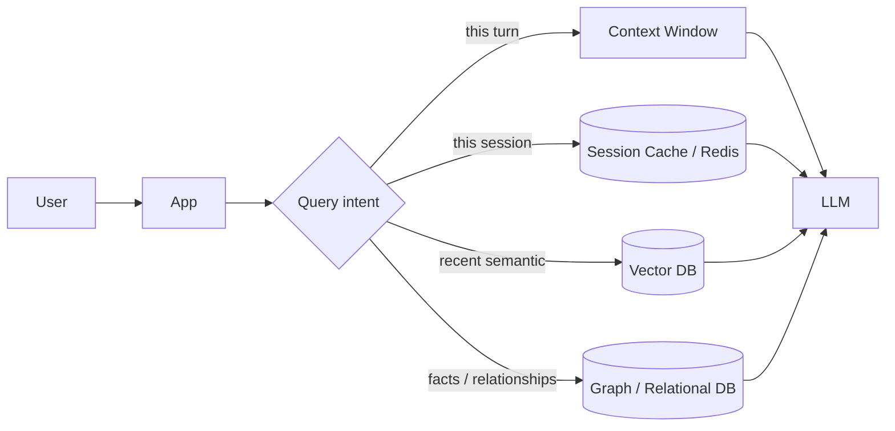

# Where should memory live?

> **Learning Path:** AI Memory
> **Section:** 9.2.3 — Architecture

**Where should memory live?**

### 1. The problem

LLMs are stateless and have a hard context limit. An agent needs continuity across turns, sessions, and users: what was discussed, what the user prefers, what is true about the world.

Put everything in the prompt and you hit three walls fast:
* **Cost and latency:** every token you send is paid for and processed.
* **Window:** you can only fit ~4k-200k tokens, not a user's 2-year history.
* **Statelessness:** the model forgets after the request ends unless you persist it somewhere.

So the question is not "do we need memory", it's *which memory, where, and when*.

### 2. Mental model

Think in tiers like human memory, not one store.

* **Working memory = context window.** Immediate, expensive, volatile.
* **Short-term memory = session / cache.** Last minutes to hours, fast retrieval, ephemeral.
* **Long-term memory = persistent stores.** Hours to years, structured and searchable.

The architecture is a routing problem: which tier answers this query, and what gets promoted between tiers?

Write path is just as important: every user action is evaluated for what to forget, what to keep, and where to promote it.

### 3. How it works

Read path:
1. App classifies need: ephemeral state, recent conversation, semantic recall, or structured fact.
2. Router fetches from the appropriate tier, ranks results, and compresses them into a retrieval budget for the context window.
3. Model generates with retrieved context.

Write path:
1. Emit an event from the conversation.
2. Decide retention policy: discard, cache for session, embed for semantic search, or upsert as structured fact.
3. Write to the right store with provenance: user_id, timestamp, source, confidence.

The key mechanism is **selective retrieval and compaction**, not dumping everything in.

### 4. Architectural reasoning

**In-context / prompt memory**
When it helps: tiny, critical state for the current turn, e.g., the last 2-3 exchanges, a short checklist.
Why choose it: zero latency, no extra infra.
Why not: blows up cost, loses history.

**Session cache, e.g., Redis**
When it helps: multi-turn dialogue state, current cart, temporary preferences.
Why choose it: millisecond reads, simple invalidation at session end.
Trade: volatile, not searchable semantically.

**Vector store**
When it helps: recall similar past conversations, documents, user notes by meaning.
Why choose it: semantic search over unstructured text.
Trade: approximate recall, needs re-embedding on updates, no strong consistency.

**Graph / relational**
When it helps: explicit facts you must not hallucinate: user profile, entitlements, orders, relationships.
Why choose it: precise queries, transactions, auditability.
Trade: rigid schema, poor for free-form recall.

**Model weights / fine-tuning**
When it helps: stable, shared knowledge that rarely changes.
Why choose it: reduces retrieval load.
Trade: slow to update, expensive, blends data with behavior.

Decision rule: put memory as close to the user as latency allows, and as far as consistency requires.

### 5. Trade-offs and failure modes

* **Latency vs richness.** More tiers = richer recall, but more hops. Budget retrieval time per request.
* **Freshness vs recall.** Vector stores drift; you need update or TTL policies or you serve stale memory.
* **Privacy vs utility.** Personal memory is high value and high risk. Never put PII in a shared vector index without isolation and encryption.
* **Consistency vs scale.** Graph/relational gives correctness; vector gives scale. Most systems need both.

Failure modes architects see: retrieval pollution where irrelevant memories enter context and bias the model; write amplification where you log everything and drown in noise; and silent staleness where a user updates a preference but the vector still returns the old version.

### 6. Example

Enterprise sales assistant.

* Working memory: current conversation turns in context window.
* Session cache: current deal context, open questions, last 10 messages.
* Vector DB per tenant: past interactions, call transcripts, knowledge base, isolated by tenant_id.
* Relational DB: CRM facts - account, contacts, opportunity stage, entitlements.

On a question "What did Acme ask about pricing last month?", router hits vector for semantic recall + relational for current pricing entitlements, then compresses to ~800 tokens. Writes from the session are summarized and upserted to vector nightly, with a tombstone in relational for hard facts.

### 7. Reasoning challenge

You are building a health advice agent. Users can ask follow-ups over weeks. You must never leak one user's data to another, and medical facts must be auditable.

Where do you store:
a) the current conversation state,
b) the user's longitudinal symptom notes,
c) general medical guidelines?

What isolation and retention policies would you enforce?

### 8. Key takeaway

* Memory placement is an architectural routing decision, not a storage choice.
* Use the cheapest, fastest tier that satisfies the query; promote only what is worth keeping.
* Separate ephemeral session state, semantic recall, and authoritative facts.
* Design write policies, TTLs, isolation, and provenance before you design retrieval.

You should be able to reason: *what must be recalled, how fresh, how precise, and how sensitive* — then pick the tier that matches.
