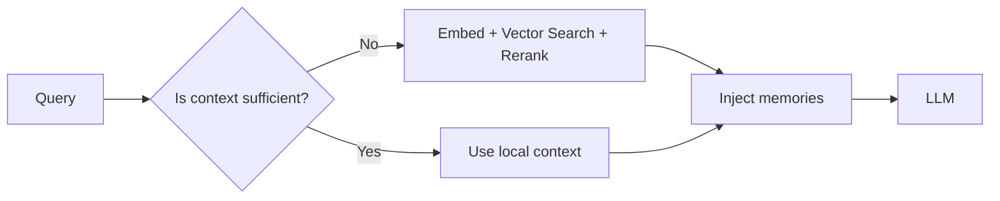

# When should memory be retrieved?

> **Learning Path:** AI Memory
> **Section:** 9.2.4 — Architecture

**When should memory be retrieved?**

### The problem
An LLM is stateless and has a limited context window. Without external memory, each turn is isolated. The model can reason over what you put in the prompt, but it cannot recall that this user talked about a refund last week, what project they’re working on, or what decision was made in step 3 of a multi-step task.

Retrieval exists to bridge that gap. The problem is not *how* to retrieve, it is *when* to pay the cost of retrieval to avoid paying a higher cost in relevance, hallucination, or rework.

### Mental model
Think of memory as an external database and retrieval as a selective copy-paste into the prompt. You want just enough relevant history to make the current decision correct, and no more. Retrieve too early or too often and you waste latency and budget and drown the model in noise. Retrieve too late and the model acts on incomplete context.

### How it works
Retrieval is a policy, not a constant. A typical flow is:

The need check is the architecture decision. It can be rule-based, confidence-based, or model-driven.

### Architectural reasoning: When to retrieve

**1. Session start, not every token.** 
Load long-lived identity and preferences once per session: user profile, org policies, recent project. Keep it in a session cache. Re-retrieving it every turn is wasteful.

**2. On task boundary, not on every turn.**
For multi-step work, retrieve before planning an action and after observing a result. Example: agent needs prior decisions before choosing next tool. Don’t retrieve on filler turns like “thanks”.

**3. On signal of a gap.**
Retrieve when the model’s local context is insufficient. Signals:
* Low confidence or self-check says “I need more history”
* Explicit references: “last time”, “the previous project”, “my usual setup”
* New entity introduced that likely has history: user mentions a ticket ID, repo name, customer
* Task requires continuity: summarization, comparison, follow-up

This is lazy/on-demand retrieval. It minimizes cost and latency.

**4. Proactively for high-stakes continuity.**
For agents that must not forget, prefetch likely memories at session start or when a new topic is detected. Example: support agent loads last 3 interactions for that user/customer automatically. You trade latency for safety.

**5. Conditionally by memory type.**
* Working memory: short, recent, retrieved every step for the current task.
* Episodic memory: retrieved on demand with recency + relevance filters.
* Semantic memory: retrieved rarely, often cached as a knowledge base.

Decision rule:
* Eager retrieval = always retrieve on each turn. Use when latency budget allows and relevance is critical.
* Lazy retrieval = retrieve only on trigger. Use for high-volume, low-context chats.
* Hybrid = session bootstrap + lazy triggers. Most production systems.

### Trade-offs and failure modes

* **Latency vs relevance.** Retrieval adds 50-500ms and cost per call. Over-retrieving kills throughput.
* **Context bloat.** Too many memories push out the current query. Relevance ranking and token budgeting are mandatory.
* **Staleness.** Retrieving old memories without freshness checks causes the model to act on outdated facts.
* **Retrieval hallucination.** Bad similarity matches inject irrelevant data, which the model will confidently use.
* **Privacy/compliance.** Retrieving PII across sessions requires access control and audit. Retrieve less, filter more.

### Example

Enterprise support agent for a bank.
Session start: load user profile, KYC tier, recent products once, cache for 15 min.
On each turn: run a lightweight need check. If query contains “refund”, “last month”, “my loan”, trigger retrieval of recent tickets and transaction notes for that user, limited to last 90 days, top 3.
If query is generic FAQ, skip retrieval entirely and answer from base model + policy KB.
Result: ~60% fewer retrievals, same resolution rate, lower p95 latency.

### Reasoning challenge

You are designing a research assistant for analysts with a 10-second SLA and a chatbot for 10k RPM tier-1 support with a 300ms SLA.

Where would you place retrieval in each system and why? What changes if the support bot must comply with GDPR right-to-erasure?

### Key takeaway

* Retrieve to close a context gap, not by default.
* Bootstrap long-lived context at session start, then retrieve lazily on signals.
* Control cost with retrieval budgets, reranking, and token limits.
* Match retrieval policy to latency budget, task continuity needs, and privacy constraints.
