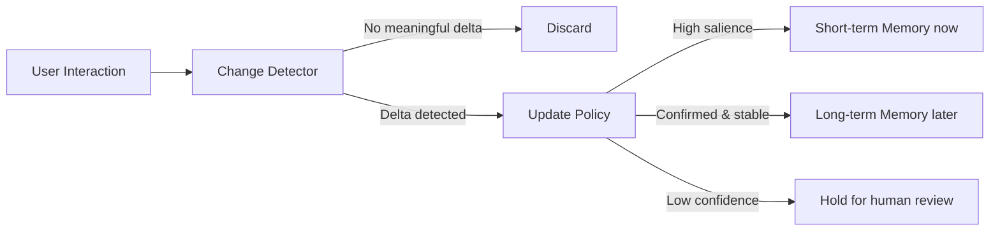

# When should memory be updated?

> **Learning Path:** AI Memory
> **Section:** 9.2.5 — Architecture

**When should memory be updated?**

### 1. The problem

An AI agent needs memory to be useful across sessions, but memory is expensive and fragile. Update on every turn and you pay for embeddings, writes, and re-indexing, you risk drift and poisoning from hallucinations. Never update and the agent forgets preferences, repeats questions, and loses continuity.

The real problem is not *how* to store memory, it's *when* a change is important enough to persist.

### 2. Mental model

Think of memory as a write-back cache with a policy, not a log.

Working memory = current session context, cheap and ephemeral.
Episodic memory = recent interactions, updated selectively.
Semantic memory = consolidated facts and preferences, updated rarely and carefully.

Humans don't consolidate every thought; they consolidate after salience, repetition, or explicit reflection. Same for agents.

### 3. How it works

A practical update path looks like:

Change detection is the gate. Policy decides timing and tier.

**Update modes:**
* **Write-through:** persist immediately on every turn. Fresh, expensive, noisy.
* **Write-back:** buffer in session, flush on close or trigger. Cheaper, risk of loss.
* **Event-driven:** update only on explicit signals: user says "remember this", task completes, preference is confirmed twice.
* **Confidence-gated:** update only if model confidence > threshold and change is non-trivial vs existing memory.

### 4. Architectural reasoning

When it helps to update immediately:
* Safety and compliance facts: user opted out, do not call, medical allergy.
* Identity and authorization changes.
* High-cost errors if stale: pricing, access control.

When it helps to defer and batch:
* Conversational nuance and tone. Summarize session, then extract.
* Low-confidence inferences: "user seems interested in X" needs confirmation.
* High-volume chatter where 90% is noise.

Alternatives:
* Update always vs update on delta. Delta reduces write amplification.
* Update per turn vs update per session vs update per lifecycle event. Session summaries give a natural consolidation point.
* Centralized memory service vs local agent memory. Centralized enables reuse, adds latency and consistency cost.

Choose based on freshness requirement, cost per write, and risk of bad writes.

### 5. Trade-offs and failure modes

* **Freshness vs Stability.** Immediate updates feel responsive but cause flicker. Deferred updates are stable but feel forgetful.
* **Cost vs Accuracy.** Embeddings, vector writes, and re-ranking are not free. Updating too often burns budget for marginal gain.
* **Completeness vs Poisoning.** Aggressive update accepts hallucinations. Overly conservative update misses real preference shifts.
* **Consistency.** Concurrent sessions can write conflicting facts. Without versioning and conflict resolution you get memory schizophrenia.

Failure modes to design for:
* **Update loops:** agent reads its own stale memory, generates response, writes it back.
* **Overwriting:** new ambiguous info overwrites a high-confidence fact.
* **Staleness:** critical preference never promoted from short-term to long-term.

### 6. Example

Enterprise support agent for a SaaS product.

Working memory holds current ticket context.
Episodic memory holds last 10 sessions for continuity.
Semantic memory holds user preferences: timezone, product tier, preferred contact method.

Policy:
* Immediate write-back for explicit preference changes: "From now on email me, not Slack" → semantic memory now.
* Deferred batch at session end: summarize ticket, extract entities, run delta vs existing semantic memory. If delta > threshold, queue for review.
* Confidence gate: inferred preferences like "user is frustrated" never auto-promote; require explicit confirmation.

Result: fresh critical facts, stable long-term profile, and controlled cost.

### 7. Reasoning challenge

A medical triage chatbot learns patient history. A patient says in session 1: "I am allergic to penicillin." In session 3 they say: "I took amoxicillin last week, no problem."

When do you update the allergy memory, and how?

### 8. Key takeaway

* Memory updates are a policy decision, not a default.
* Update timing depends on salience, confidence, and cost of being wrong.
* Separate fast short-term writes from slow, validated long-term consolidation.
* Design for delta detection, conflict resolution, and explicit confirmation for high-risk facts.

You should be able to reason: *what is the cost of stale vs cost of a bad write for this fact, and what trigger justifies persistence?*
