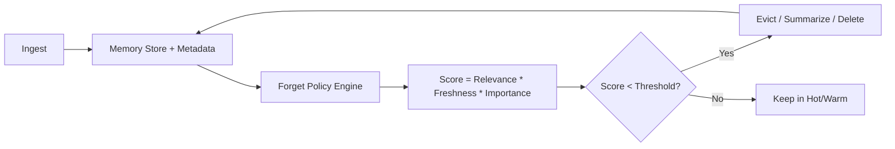

# How do we forget?

> **Learning Path:** AI Memory
> **Section:** 9.2.6 — Architecture

**How do we forget?**

### 1. The problem

An AI memory system that only accumulates eventually fails. Unbounded memory means:
* **Cost and latency grow** with every document, conversation, and embedding.
* **Retrieval degrades** - more noise drowns signal, search recall drops.
* **Staleness poisons answers** - old policies, prices, contacts remain top-ranked.
* **Compliance becomes impossible** - GDPR right to erasure, data retention limits, and PII require provable deletion.

You cannot just keep appending. You need active forgetting.

### 2. Mental model

Memory is not an archive. It is a curated working set.

Think of it as a library with a librarian, not a warehouse. Items have a value over time: relevance * freshness * importance. When value drops below cost of keeping, you forget. Forgetting can mean hard delete, eviction from hot index, or compression into a summary.

### 3. How it works

Forgetting is policy-driven curation on metadata, not magic on the model.

Core signals:
* **Time decay:** TTL, last accessed, data age. Legal retention windows.
* **Usage decay:** access count, recency, LRU/LFU.
* **Relevance decay:** embedding similarity to current queries drops, or feedback signals low usefulness.
* **Explicit intent:** user delete, consent revocation, data classification change.

Actions are tiered:
* **Soft forget:** demote from vector index, move to cold storage.
* **Compress:** replace many interactions with a summary.
* **Hard delete:** remove document, embeddings, and derived artifacts with audit trail.

### 4. Architectural reasoning

Forget at the right layer for the problem you have.

* **Retrieval layer forgetting** solves cost, staleness, and privacy for RAG. Delete the chunk, the embedding, and references. Fast, auditable, no model retraining.
* **Summarization forgetting** solves context window and noise. Keep a condensed narrative instead of raw transcripts.
* **Model-level unlearning** solves weight contamination. Expensive, rarely needed, used only for high-risk data leakage.

Choose forgetting when:
* Memory growth is unbounded and query quality is degrading.
* You have regulatory deletion requirements.
* You need to bound operational cost and latency.

Alternatives are keep-everything with better search, or periodic full rebuilds. Both fail at scale and compliance.

### 5. Trade-offs and failure modes

* **Recall vs freshness.** Aggressive eviction reduces cost but risks losing rare but critical facts.
* **Precision of deletion vs completeness.** Hard delete is provable but can leave orphan references, summaries, or cached answers.
* **Automated vs manual policy.** Automated decay is cheap but can delete things that are infrequently used yet important. Manual review is safe but doesn't scale.
* **Latency of forget.** Immediate deletion is ideal for compliance; async garbage collection is cheaper but creates a window of exposure.

Failure modes to design for:
* Zombie data: deleted from index but remains in backups or model fine-tune snapshots.
* Cascading loss: summarizing then deleting sources destroys provenance.
* Policy drift: forgetting thresholds tuned for cost silently degrade answer quality.

### 6. Example

Enterprise customer support copilot with RAG over tickets, Slack, and CRM.

Architecture: vector store with metadata `created_at, last_accessed, pii_class, retention_days, user_id`. A nightly policy job scores each chunk. Chunks older than 365 days with zero accesses in 90 days are summarized per thread and raw chunks evicted to cold storage. When a user exercises right to be forgotten, a deletion API removes all chunks linked to `user_id`, reindexes, and logs the action.

Result: index size stable, retrieval latency flat, compliance auditable, and answers stay fresh.

### 7. Reasoning challenge

A healthcare assistant stores doctor-patient conversations for personalization. A patient requests deletion of all their data under GDPR, but the model was fine-tuned quarterly on anonymized conversation summaries.

Do you:
A) Delete from vector store only
B) Delete from vector store + trigger unlearning of the fine-tuned model
C) Delete from vector store and mark summaries for next retraining cycle

What do you need to know before deciding, and what is the cost of getting it wrong?

### 8. Key takeaway

* Forgetting is an architectural requirement, not an afterthought.
* Forget by scoring value over time and tiering actions: evict, summarize, delete.
* Design deletion to be provable and complete across stores, indexes, and derived artifacts.
* Trade off cost, freshness, compliance, and recall explicitly; tune policy, don't hide it.
