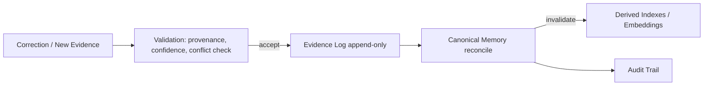

# How do we correct memory?

> **Learning Path:** AI Memory
> **Section:** 9.2.7 — Architecture

### 1. The problem

AI memory accumulates over time from conversations, documents, tool outputs and user edits. That accumulation creates drift:

* **Stale facts**: a user changes address, price, or role, but old embeddings still surface.
* **Conflicts**: two sources say different things.
* **Hallucinations baked in**: a wrong answer gets written back as memory.

If you treat memory as a simple key-value store and overwrite in place, you lose history, you can't audit why a decision was made, and you silently corrupt downstream derived indexes.

Correction is not “make the model forget”. It is: *how do you ingest new evidence that a previous memory is wrong, decide what to keep, and propagate that decision safely?*

### 2. Mental model

Think of memory as **evidence → canonical → derived**.

Evidence is append-only and immutable: raw utterances, documents, user corrections, system logs, each with provenance and timestamp.

Canonical is the current best view of truth for a given entity, built from evidence with explicit conflict resolution rules.

Derived are cheap, denormalized views: vector embeddings, summaries, user profiles, session caches.

Correction is a new piece of evidence that changes the canonical view, which then triggers re-materialization of derived views.

### 3. How it works

Essential mechanisms:

* **Provenance and versioning.** Every memory item has source, timestamp, confidence, and version. Corrections are new versions, not deletes.
* **Conflict resolution policy.** e.g., user explicit > system verified > model inferred. Tie-breakers: recency, source authority, human-in-the-loop.
* **Supersession, not overwrite.** Old versions remain for audit and for historical queries. Canonical pointer moves.
* **Propagation control.** Rebuild only affected derived artifacts. Use materialized view invalidation or incremental re-embedding.

### 4. Architectural reasoning

When it helps: long-lived agents, personalization, RAG over mutable data, compliance-sensitive domains.

Alternatives:
* **In-context correction:** cheap, ephemeral. Fails across sessions.
* **Edit vector DB in place:** fast but no audit, no conflict handling, risks data loss.
* **Retrain/fine-tune:** high cost, slow feedback loop.

Why the evidence/canonical/derived split wins:
* It decouples *what happened* from *what we believe now*.
* It enables auditability for “why did the agent say that?” 
* It lets you correct at the source once and propagate deterministically.

Decision point: if memories are write-once and cheap to rebuild, favor strong consistency and full re-materialization. If scale and latency dominate, favor eventual consistency with TTL and targeted invalidation.

### 5. Trade-offs and failure modes

* **Consistency vs latency.** Immediate canonical update gives correctness; async re-indexing gives speed. You will get stale reads in derived stores.
* **Write amplification.** One correction can touch many derived indexes. Batch and prioritize hot entities.
* **Over-correction by users.** A malicious or mistaken user correction can poison memory. Mitigate with source weighting and human review for high-impact entities.
* **Conflict explosion.** Without a clear policy, you get flip-flopping. Define precedence and a “tombstone” for disputed facts.
* **Loss of history.** Deleting old memories destroys explainability. Keep immutable evidence log.

### 6. Example

Sales copilot with persistent customer memory.

User says in March: “Ship to 123 Main St”. In June: “Correction, we moved to 456 Oak Ave, effective immediately.”

Evidence log appends both statements with provenance = user chat, timestamps.

Canonical address entity reconciles to 456 Oak Ave with supersession pointer to June evidence, policy = latest explicit user > older.

Derived user profile embedding and summary are invalidated and rebuilt. Historical opportunity records still reference March evidence via versioned link, so audit remains accurate.

If later a CRM sync provides a verified address, source authority outranks user chat and canonical updates again, with audit trail explaining the change.

### 7. Reasoning challenge

A customer support agent stores transcript summaries as memory. The user now says “I never authorized that refund”. You have a transcript, a tool log showing refund executed, and the user’s denial.

Do you delete the memory, flag it as disputed, or keep both? What source weighting and propagation do you need?

### 8. Key takeaway

* Memory correction is evidence management, not overwrite.
* Keep an append-only evidence log with provenance; derive a versioned canonical view.
* Define explicit conflict resolution and supersession rules before you need them.
* Propagate corrections intentionally to derived indexes; accept eventual consistency trade-offs.
* Auditability beats immediacy when memories drive decisions.
