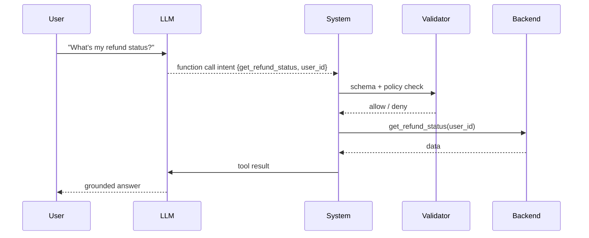

# Function calling

> **Learning Path:** Tool Calling & AI Interfaces
> **Section:** 10.1.1 — Learn

**Function calling**

### The problem

An LLM is text-in, text-out. It can *describe* how to call a database, but it cannot reliably *call* it, and it will hallucinate values when it tries.

That creates three architectural constraints for any production AI system:
1. **Grounding.** You need real data, not plausible text. Order status, user profile, stock price must come from a source of truth.
2. **Actionability.** The model needs to trigger side effects safely: create a ticket, send an email, charge a card.
3. **Observability and control.** You need to know what was requested, validate inputs, log it, and prevent unsafe calls.

Prompt engineering and Retrieval-Augmented Generation solve grounding for *information*. They do not solve reliable action.

### Mental model

Function calling is a contract. You give the model a schema for capabilities it can invoke, and the model is trained to emit a structured call instead of free-text when a capability is needed.

Think of it as: **Model as router, not worker.** The model decides *which* function to call and with what arguments, your system decides *whether* and *how* to execute it.

The model never executes code. It only produces a parseable intent: `function_name` + `arguments`.

### How it works

You describe tools to the model as JSON schema with name, description, parameters and types. During inference the model can choose to emit a function call instead of a final answer.

Request flow:

Key pieces:
* **Schema definition.** Name + description drives selection. Parameter descriptions drive argument quality.
* **Execution layer.** Your code runs the call, validates arguments, enforces auth and rate limits.
* **Result loop.** Tool output is fed back to the model for final synthesis. The model never sees secrets unless you pass them.

This is why function calling is reliable: you control execution, not the model.

### Architectural reasoning

When it helps:
* You need deterministic data from internal systems.
* You need safe, auditable side effects with human-like intent.
* You want to decompose a complex task into verifiable steps.

Alternatives:
* **Prompt-only.** Let the model output text and parse it. Fragile, hallucinated params, no validation.
* **Hardcoded orchestration.** You pre-decide which tool to call. Less flexible, can't adapt to ambiguous user input.
* **Full agent frameworks.** More autonomy, but more complexity and risk.

Function calling sits in the middle: model-driven routing with system-controlled execution.

Choose it when you need *controlled delegation* rather than open-ended generation.

### Trade-offs and failure modes

* **Schema quality = call quality.** Vague descriptions lead to wrong function selection. Missing required params leads to hallucinated values.
* **Latency and cost.** Each call adds a round trip: model -> tool -> model. Chain of calls multiplies tokens.
* **Error handling.** Tools fail, return empty, or time out. The model must be prompted to retry, clarify, or degrade gracefully.
* **Security surface.** A model can be tricked into calling a function with crafted input. Always validate arguments against policy and user identity before execution.
* **Coupling.** Your tool set becomes part of your prompt surface. Changing a schema is a breaking change for the model.

Common failure: letting the model generate free-form arguments for sensitive actions. Always constrain types, enums, and ranges in schema and re-validate server-side.

### Example

Enterprise support copilot.

Tools exposed:
* `get_order_status(order_id)` 
* `create_support_ticket(user_id, issue_type, order_id)`
* `lookup_user_email(user_id)`

User: "My order 12345 hasn't arrived, can you help?"

Model routes to `get_order_status`. Result: shipped 3 days ago. Model asks for confirmation. User confirms issue. Model calls `create_support_ticket` with validated args. Final answer is grounded and auditable.

No free-text parsing, no hallucinated ticket IDs, and you have a log of every tool invocation for compliance.

### Reasoning challenge

You are designing a finance assistant that can check balances and initiate transfers. Should you expose `initiate_transfer(to_account, amount)` directly to function calling?

Consider auth, amount limits, confirmation steps, and what happens if the model mis-parses "transfer $1,000" as $10,000. What architectural guardrails would you add before allowing that call?

### Key takeaway

* Function calling exists to make LLMs actionable and grounded, not just fluent.
* The model proposes calls; your system executes and validates them. Separation of intent and execution is the safety boundary.
* Good schemas and validation matter more than model size for reliable tool use.
* Each call adds latency, cost, and failure modes. Design for observability, retries, and graceful degradation.
