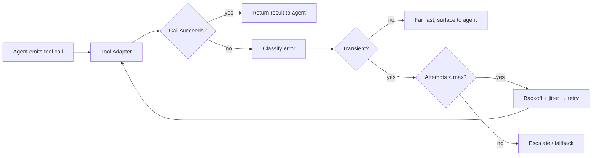

# Tool retries

> **Learning Path:** Tool Calling & AI Interfaces
> **Section:** 10.1.10 — Learn

**Tool retries: why an agent must retry, and when it must not**

### 1. The problem

An AI agent thinks it is calling a function. In reality it is making a network call to an external service with its own failure modes.

What happens when:
* The tool is slow and times out
* The service returns 429 rate limit or 503 overloaded
* A transient network partition drops the request
* The tool succeeds but the response is lost

If the agent treats that as a hard failure, it aborts a multi-step workflow, asks the user for information it already has, or hallucinates a result. The user sees flakiness even though the system is fundamentally sound.

Tool calls are the reliability boundary of an agent. The LLM is stateless and non-deterministic; the tool is stateful and fallible. Without a retry strategy, reliability collapses to the worst transient error rate of the slowest dependency.

### 2. Mental model

A tool retry is not “try again until it works”. It is a bounded, classified recovery policy for transient failures at the agent-tool boundary.

Think of it as an insurance policy with a deductible: you pay latency and cost for a few retries, to avoid paying the much higher cost of a failed user task and a human in the loop.

The core mental model is: **classify error → decide retryability → apply policy → preserve intent**.

### 3. How it works

The essential mechanism is at the tool adapter / orchestrator layer, not inside the LLM.

Key pieces:
* **Error classification.** 4xx client errors are usually permanent. 5xx, timeouts, connection resets, 429 are candidates for retry.
* **Idempotency awareness.** Safe to retry GET / read. Unsafe to retry POST / charge without an idempotency key.
* **Backoff with jitter.** Exponential backoff prevents thundering herd. Jitter spreads retries.
* **Bounded attempts.** Typical policy: 2-3 attempts, max total latency budget e.g. 5s.
* **Context preservation.** The agent should not re-plan from scratch unless the retry exhausted. The same arguments with same idempotency key are re-sent.

Implementation is usually in the tool executor, not the prompt. The agent receives a clean success/failure signal.

### 4. Architectural reasoning

When it helps:
* External SaaS APIs with known transient errors
* Multi-step workflows where one transient failure would waste all prior steps
* Read-only tools where retry cost is low

Alternatives:
* **Fail fast + ask user.** Cheaper, but terrible UX for transient glitches.
* **Retry inside the LLM prompt.** “If it fails, try again”. Unreliable, wastes tokens, and the model forgets state.
* **Circuit breaker.** Stop hammering a degraded service and fail fast for a window.

You choose retries when the cost of a false negative > cost of a few retries. You choose no retry when the operation is non-idempotent and side effects are irreversible.

### 5. Trade-offs and failure modes

* **Latency budget.** Retries add tail latency. In a 3-step agent, three tools each with 2 retries can turn a 1s flow into >10s.
* **Cost.** Each retry costs LLM tokens for re-planning if you surface failure to the model, and API cost for the tool.
* **Retry storm.** Without jitter and max attempts, a degraded service gets amplified load.
* **Duplicate side effects.** Retrying a non-idempotent write can charge a card twice or create duplicate records. Idempotency keys are mandatory.
* **Masking real bugs.** Overly aggressive retries hide persistent errors until they exhaust and confuse users.
* **Agent drift.** If the agent sees a retry as a new observation, it may change its plan. The orchestrator should hide retries from the model.

### 6. Example

Enterprise travel agent booking a flight.

Step 1: `search_flights` succeeds.
Step 2: `check_seat_availability` times out after 2s.
Without retry: agent tells user “seat check failed, please try later”. User abandons.

With policy: adapter classifies timeout as transient, retries with 400ms + jitter, succeeds on 2nd attempt. Agent continues to `create_booking`. Total added latency 600ms, user never knows.

If step 2 were `charge_card`, the adapter uses an idempotency key generated from the agent run id + tool args. Retry is safe. If the service returns 400 “invalid card”, retry is disabled immediately.

### 7. Reasoning challenge

Your agent calls `transfer_money` to move funds between accounts. The call returns 503 Service Unavailable.

Do you retry automatically? What information do you need before deciding, and what would you do differently if the tool were `get_account_balance` instead?

*Hint: think idempotency, side effects, and error classification.*

### 8. Key takeaway

* Retries belong in the tool execution layer, not in the LLM prompt. Classify errors, don’t blindly retry.
* Retry only transient, safe-to-retry failures with bounded attempts, exponential backoff + jitter, and idempotency keys for writes.
* The architectural decision is cost vs reliability: pay a small latency/cost tax to avoid user-facing failures, but never retry non-idempotent operations without guarantees.
* Design for observability: log retry count, reason, and outcome so you can tune policy and detect flaky dependencies.

You should now be able to reason about where retries live, what makes a failure retryable, and when a retry creates more risk than it solves.
