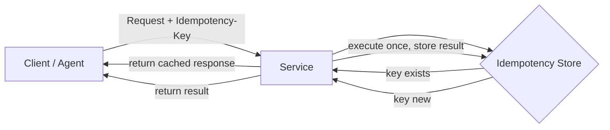

# Idempotency

> **Learning Path:** Tool Calling & AI Interfaces
> **Section:** 10.1.11 — Learn

### 1. The problem

You are building an AI agent that calls tools: book flight, create invoice, charge card. The network is unreliable, the LLM provider may timeout, and your own services retry.

A single user request becomes:
`Agent -> Tool A -> success?`  
If the tool times out after it actually succeeded, the agent retries. Now the user is charged twice, the invoice is duplicated, or the booking is created twice.

The constraint is not bad code. It is **at-least-once delivery in a distributed system**. Retries are required for reliability, but retries create duplicate side effects.

You need a way to make retries safe.

### 2. Mental model

Idempotency means: *calling an operation N times has the same effect as calling it once.*

Think of it as a toggle vs a counter. Toggling a light on is idempotent: on, on, on = on. Incrementing a counter is not: +1, +1, +1 = +3.

For an architect the mental model is: **the operation is defined by its intent, not by how many times it arrives.**

### 3. How it works

You make the server side recognize repeated intent and return the same result without re-executing side effects.

The essential mechanism is a deduplication key tied to intent:

Implementation choices:
* **Natural idempotency**: GET, PUT to a known resource. `PUT /users/123` with same body is safe.
* **Synthetic idempotency**: client generates a stable `Idempotency-Key` for the logical operation. Server stores key → result for a TTL and returns cached result on replay.
* **Business idempotency**: make the operation itself safe by design. `createInvoice(customer, items)` becomes `createOrGetInvoice(idempotencyKey)`. The key is derived from business context, not network.

The client is responsible for generating a stable key per intent. The server is responsible for enforcing it.

### 4. Architectural reasoning

When it helps:
* Network retries, timeouts, and LLM tool calling where the agent cannot distinguish success from failure
* Async messaging with at-least-once delivery
* User-facing actions that must not duplicate: payments, bookings, provisioning

What it solves: you can retry aggressively for availability without risking duplicate side effects.

Alternatives:
* **Exactly-once delivery** via distributed transactions. Rarely practical, high coordination cost.
* **Client-side deduplication only**. Fails when client restarts or multiple clients exist.
* **No retries**. Sacrifices reliability.

Choose idempotency when you own both client and server and can store a small deduplication state. It is the standard compromise for reliability vs cost.

### 5. Trade-offs and failure modes

* **State cost**: you must store idempotency keys and results. TTL matters. Too short = false negatives. Too long = storage growth.
* **Scope**: idempotency is per resource and per key. `POST /orders` with different items but same key must be rejected, not merged.
* **Non-idempotent reads**: `GET` is naturally idempotent, but `POST /search` that triggers billing is not.
* **Key collision**: client must generate keys that are unique per intent, not per attempt. Using request timestamp or random UUID per retry breaks it.
* **Partial failure**: if the operation succeeded but response was lost before storing the key, the retry will re-execute. You need the store write to be atomic with the side effect, or accept a window of risk.

In AI interfaces this is critical: the agent may fire the same tool call from two parallel reasoning paths, or retry after a 30s LLM timeout. Without idempotency you get duplicate emails, duplicate charges, and confused state.

### 6. Example

AI travel agent books a flight.

User intent: "Book me economy SFO -> LAX tomorrow". The agent calls `createBooking(userId, route, date)`.

The first call succeeds but the LLM gateway times out. The agent retries with a new HTTP request.

Without idempotency: two bookings.

With idempotency: client generates `Idempotency-Key = hash(userId, route, date, "economy")`. Server checks store, sees key already processed, returns the existing booking ID. User pays once.

The same pattern applies to `createInvoice`, `sendWelcomeEmail`, `provisionAPIKey`.

### 7. Reasoning challenge

Your agent calls a payment tool `chargeCard(orderId, amount)`. The provider guarantees at-least-once delivery. You can add an idempotency key, but the business rule is: a user can legitimately be charged twice for the same order if they explicitly retry after cancellation.

Do you make `chargeCard` idempotent per `orderId`, per `orderId+amount`, or not at all? What breaks if you choose wrong?

*Think through what the key represents: the user intent, not the HTTP request.*

### 8. Key takeaway

* Idempotency is not an API feature, it is a design choice to make retries safe in unreliable systems.
* Retries are required for reliability; idempotency makes retries safe.
* Enforce it server-side with a stable client-provided key and a deduplication store; natural idempotency where possible.
* The cost is state and correct key scoping; the benefit is you can build resilient AI tool calling without duplicate side effects.
* When in doubt, assume the call will be duplicated and design the operation to be safe on replay.
