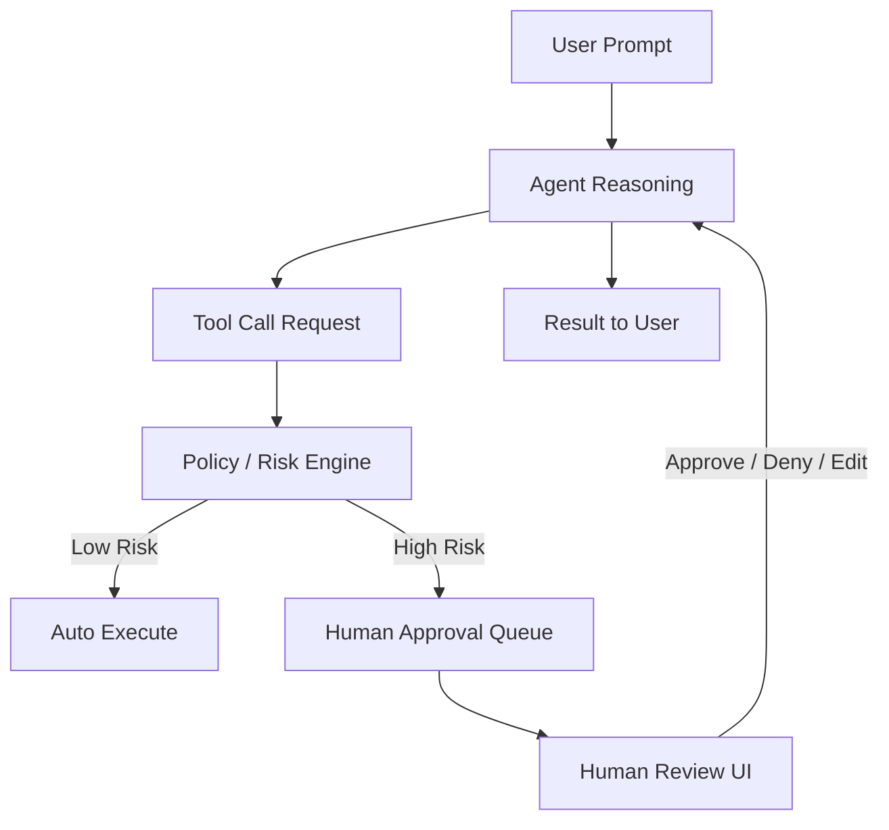

# Human approval

> **Learning Path:** Tool Calling & AI Interfaces
> **Section:** 10.1.12 — Learn

**Human approval**

### 1. The problem

Tool calling gives agents real-world effect. An agent can draft an email, create a purchase order, transfer funds, delete a record, publish content.

The problem isn't capability, it's *liability*. An incorrect or malicious tool call can be irreversible, expensive, and non-compliant. Full automation is fast but unsafe. Full manual is safe but defeats the agent.

You need a way to keep speed where it's safe, and inject human judgment where the cost of error is high.

### 2. Mental model

Human approval is a circuit breaker in the tool call path.

The agent proposes an action, a policy engine scores it, and execution is gated. Low risk actions flow through. High risk actions pause and wait for a human to approve, deny, or edit before the agent can continue.

It's not a review of the whole conversation. It's a decision gate on a specific tool call with context.

### 3. How it works

The essential mechanism is intercept + evaluate + pause + resume.

The agent generates a tool call with arguments. Before execution:
1. **Policy evaluation**: static rules + dynamic risk. Examples: tool type = `transfer_money`, amount > threshold, data classification = PII, new external destination.
2. **Decision**: auto-approve, auto-deny, or require approval.
3. **Pause**: the agent's execution state is saved. The user gets a concise approval request: what the agent wants to do, why, and what data it will touch.
4. **Resume**: on human decision, the agent continues with approved parameters or aborts and replans.

State must be durable. The approval request is tied to a conversation ID and tool call ID so it can be resumed hours later without replaying the whole trace.

### 4. Architectural reasoning

Human approval solves the trust / autonomy trade-off.

Use it when:
* Actions are irreversible or high cost: payments, deletions, external sends
* Compliance requires auditable human sign-off: SOX, HIPAA, procurement
* The agent operates with ambiguous intent: "handle this customer issue" could mean refund or escalate

Alternatives:
* **Human-on-the-loop**: agent acts, human can intervene later. Faster, but risk is already realized.
* **Policy-only auto guardrails**: block by rules, no human. Cheaper, but can't handle context-dependent judgment.
* **Full manual**: human does the tool call. Safe, slow, no leverage.

Choice comes down to risk classification. Most systems use a tiered policy: auto for read-only, approve for write with constraints, deny for destructive.

### 5. Trade-offs and failure modes

* **Latency vs safety.** Approval adds seconds to minutes. For synchronous UX this is painful. Architects often move approval to async workflows with a notification.
* **Approval fatigue.** If everything needs approval, humans rubber stamp. You must tune policies so only the meaningful fraction is surfaced.
* **State complexity.** Pausing an agent mid-plan means you need to preserve tool call arguments, conversation history, and pending steps. Lost state = orphaned approval.
* **Context collapse.** Humans approve a summary, not the full reasoning. Bad summaries cause wrong approvals. The UI must show intent, impact, and editable parameters, not raw JSON.
* **Security.** Approval endpoints are high-value targets. An attacker who can approve tool calls can exfiltrate data. Require strong auth, audit logs, and non-repudiation.

### 6. Example

Enterprise procurement agent.

User: "Order replacement laptops for the design team."

Agent finds open POs, checks budget, builds a draft purchase order for 12 laptops at $2,400 each.

Policy: `create_purchase_order` + amount > $10k = requires approval.

The agent pauses, sends a card to the manager: "Create PO #48291 for 12 MacBook Pro $28,800 to vendor X. Reason: replacement per request. Approve / Edit vendor / Deny."

Manager edits vendor to preferred supplier, approves. Agent executes tool call with edited params and continues to notify finance.

Without the gate, agent could have created a PO to a wrong vendor. With gate, speed is kept for research and only the final commit is reviewed.

### 7. Reasoning challenge

Your customer support agent can call `refund_order` up to $500 automatically. A user says: "I never received my order, please help."

The agent verifies delivery failure and issues a $480 refund automatically. Next day, the user claims they received it and wants another refund.

Do you add human approval for all refunds? Or change the policy? What signal would you use to decide?

### 8. Key takeaway

* Human approval exists to bound agent autonomy where errors are expensive or irreversible.
* It's a policy-driven circuit breaker on tool execution, not a general review process.
* Design for tiered risk, durable pause/resume, and clear human context.
* The real cost is approval fatigue and latency; tune policies so humans only see decisions that need human judgment.
