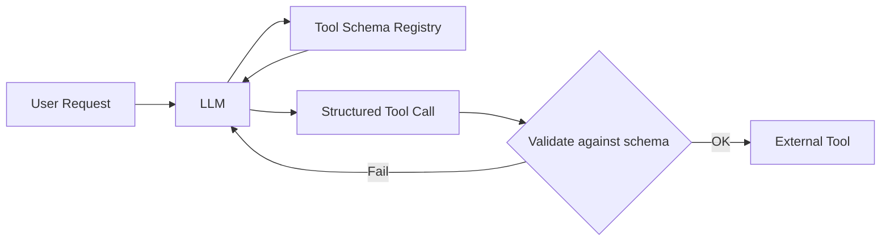

# Tool schemas

> **Learning Path:** Tool Calling & AI Interfaces
> **Section:** 10.1.2 — Learn

**Tool schemas**

### The problem

You want an LLM to call real systems: databases, APIs, internal services. Without a contract, the model invents arguments, uses wrong types, omits required fields, or calls the wrong tool entirely.

Prompting tools in natural language works for demos. In production it fails because:
* The model has no enforced interface, only a description in its context window
* Parameter constraints like enums, ranges, and dependencies are lost
* Multiple similar tools become ambiguous
* Changes to a tool require re-prompting, not a versioned contract

You need a machine-readable description of *what* a tool can do and *how* it must be called, so the model can generate valid calls and the system can validate them before execution.

### Mental model

A tool schema is an API contract for the LLM.

Think of it as OpenAPI for agents. It declares name, description, and a typed parameter schema with required fields, types, enums, and constraints. The LLM reads the schema, reasons about the task, and produces a structured call that matches the contract. A validator sits between the model and the tool.



The schema does not teach the model *how* to use the tool, it constrains *how* it can use it.

### How it works

A schema is typically JSON Schema or OpenAPI-compatible JSON passed to the model as a tool definition:

* `name` and `description`: what the tool does and when to use it
* `parameters`: object with `type`, `properties`, `required`, and constraints like `enum`, `minimum`, `maximum`, `format`
* The model outputs a function call with arguments that must conform to the schema

The runtime validates the call before execution. If validation fails, you can reject, ask for correction, or log the drift.

Good schemas are explicit about intent, not implementation. `create_support_ticket` with `priority: enum[low,medium,high]` is better than `run_api_endpoint`.

### Architectural reasoning

Tool schemas enable safe, composable tool use at scale.

When it helps:
* Multiple tools with overlapping capabilities. Schemas disambiguate via name + description + parameters.
* Production reliability. Validation catches hallucinations before they hit downstream systems.
* Team development. Engineers can version tools independently of prompts. A schema registry becomes the interface.
* Auditability. Every call is structured and loggable.

Alternatives:
* Natural language tool descriptions only. Flexible, cheap, brittle. Good for prototypes.
* Hardcoded prompt templates. Deterministic, unmaintainable as tool count grows.
* Agent-specific DSLs. More expressive, locks you to one model/vendor.

Choose schemas when correctness, safety, and maintainability outweigh the cost of defining and maintaining contracts.

### Trade-offs and failure modes

* **Schema rigidity vs model flexibility.** Over-specifying constraints can make the model avoid a tool it could use creatively. Under-specifying invites misuse.
* **Maintenance burden.** Tools evolve. Schema drift causes silent failures: model trained on old schema, runtime expects new fields.
* **Description quality matters more than type.** A perfect type schema with a vague description leads to wrong tool selection. The `description` is the real UX for the model.
* **Token cost and context.** Large schemas compete with user context. Too many tools at once causes confusion; tool selection becomes a retrieval problem.
* **Validation gap.** Validation ensures syntactic correctness, not semantic correctness. `destination: "NYC"` is valid JSON but may be wrong for the user intent.

Common failures: ambiguous names like `search` vs `search_db`; optional parameters that are actually required for business logic; nested objects that models fill with placeholders.

### Example

Booking flow with two tools.

```json
{
  "name": "search_flights",
  "description": "Find available flights for a given origin, destination and date. Use when user wants options.",
  "parameters": {
    "type": "object",
    "properties": {
      "origin": {"type": "string", "description": "IATA code, e.g. SFO"},
      "destination": {"type": "string"},
      "date": {"type": "string", "format": "date"},
      "passengers": {"type": "integer", "minimum": 1, "maximum": 9}
    },
    "required": ["origin","destination","date"]
  }
}
```

The model cannot call `search_flights` without a date, and cannot invent a free-form passenger count. The runtime can reject a call with `origin: "San Francisco"` before it reaches the airline API. If you later add `cabin_class` with enum, you version the schema and the model adapts without prompt changes.

### Reasoning challenge

You have 40 internal tools. Users frequently ask for "summarize my recent expenses and email the report". You have `get_expenses`, `summarize_text`, and `send_email`. 

Do you define one monolithic `summarize_and_email_expenses` tool, or keep three separate schemas and let the model orchestrate? What schema design choices reduce hallucination and what trade-offs do you accept?

### Key takeaway

* Tool schemas are contracts that make LLM tool use reliable and maintainable, not just descriptive prompts.
* The description drives tool selection; the typed parameter schema drives call validity.
* Design for validation and evolution: clear names, constrained parameters, and versioned schemas.
* Prefer many small, well-described tools over one vague tool; manage selection with routing or retrieval when tool count grows.
