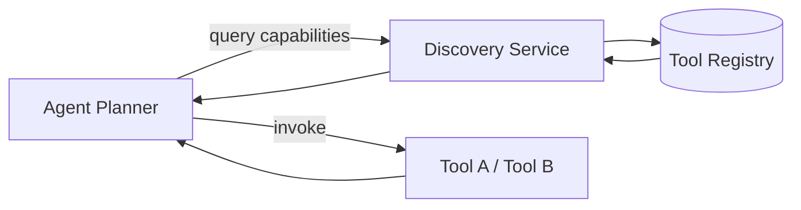

# Tool discovery

> **Learning Path:** Tool Calling & AI Interfaces
> **Section:** 10.1.3 — Learn

**Tool discovery** is about how an AI agent finds out what it can do, without hard-coding every tool.

### 1. The problem

An agent that can call tools is only useful if it knows which tools exist, what they do, and how to call them. In real systems the tool set is not static:

* New internal services ship weekly
* Tools are environment-specific, per tenant, per user
* Permissions change who can call what
* An agent may need the *right* tool for a task, not just *a* tool

Hard-coding a list of functions in the agent prompt or code creates brittleness. Re-deploying the agent for every new tool is not operable. Scanning all services at request time is not scalable.

The need is: discoverable, versioned, permissioned capabilities that an agent can query and select at runtime.

### 2. Mental model

Think of tools as services advertising a contract. The agent is a client that queries a directory, filters by capability and permission, then binds to the tool it needs.

Registry = phonebook. Schema = contract. Capability = what problem it solves.

### 3. How it works

Essentially three pieces:

* **Tool registry / catalog**: a source of truth for available tools. Often a service, database, or file that stores tool metadata: name, description, input schema, output schema, owner, auth requirements.
* **Discovery protocol**: how the agent learns about tools. Pull via list/filter API, or push via subscription/events when tools change. MCP, OpenAPI, and custom catalog APIs are common forms.
* **Binding**: the agent receives a machine-readable schema, validates it against its own planner, and generates a call with the right parameters.

The agent does not need to know Tool A exists at build time. It asks: "I need to transfer money with idempotency" and the registry returns tools matching that capability.

### 4. Architectural reasoning

When it helps:
* Large or evolving tool ecosystems, e.g., enterprise internal tools, multi-tenant SaaS
* Agents that need to choose among functionally similar tools based on cost/latency/region
* Environments where governance and audit require central control of tool exposure

Alternatives:
* **Hard-coded tool list**: Simple, low latency, predictable. Fails as soon as tool set grows.
* **Static config file**: Better than hard-code, still requires redeploy or reload.
* **Discovery service**: Adds indirection and latency, but enables dynamic, governed growth.

Choose discovery when the cost of redeploying agents > cost of running a registry and handling schema drift.

### 5. Trade-offs and failure modes

* **Freshness vs consistency**: A cached catalog is fast but stale. A live query is accurate but adds latency to planning. Most systems use short-TTL cache + invalidation events.
* **Schema drift**: Tool owners change parameters. Without versioning, the agent generates invalid calls. Pin tool versions and validate schemas at bind time.
* **Security and least privilege**: Discovery must be permission-aware. An agent should only see tools it is authorized to call, per user/tenant. Leaking tool metadata can be an attack surface.
* **Over-choice**: Too many similar tools confuse the planner and increase hallucinated calls. Curate capabilities, not just tools. Group by intent.
* **Failure modes**: Registry down = agent blind. Registry poisoning = agent calls wrong tool. Mitigate with local fallback catalog and strict schema validation.

### 6. Example

Enterprise finance assistant. The agent needs to "get current FX rate". Three tools exist:
* `fx-rate-public` – free, 5 min delay
* `fx-rate-licensed` – paid, real-time, requires user entitlement
* `fx-rate-internal` – only for ops team

With discovery, the agent queries the registry with capability `currency conversion` and constraints `user_tier = pro`. The registry returns only `fx-rate-licensed` with its OpenAPI schema. The agent binds, calls, and logs the choice for audit. No redeploy needed when a new provider is added.

### 7. Reasoning challenge

You are building an agent for a hospital. Tools are added by different departments and must be HIPAA-audited. One department wants agents to discover tools instantly; compliance wants a 24-hour approval delay before a new tool is visible to agents.

How would you design discovery to satisfy both? What would you cache, and what would you enforce at the registry layer?

### 8. Key takeaway

* Tool discovery exists to decouple agents from a fixed tool set and enable governed growth.
* The core is a capability-addressable catalog with versioned schemas and permission filtering.
* Optimize for freshness, safety, and curated choice; not maximal tool exposure.
* Design for schema drift, registry failure, and least-privilege visibility from day one.
