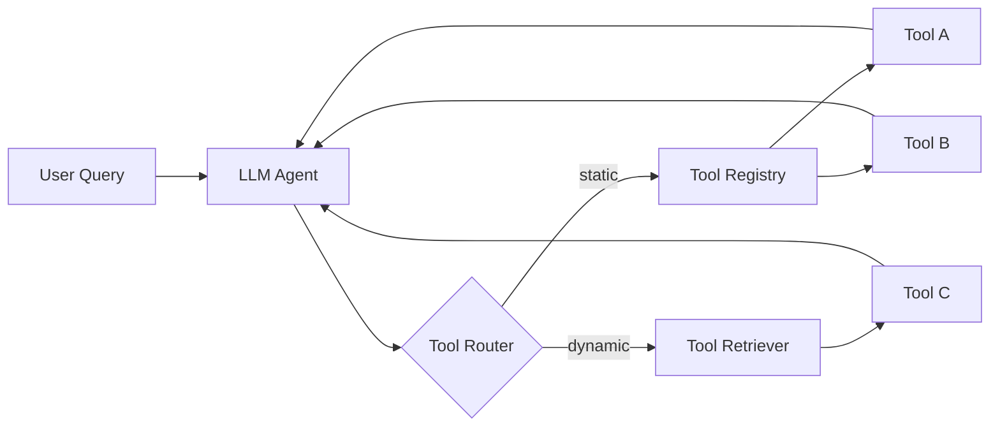

# Tool selection

> **Learning Path:** Tool Calling & AI Interfaces
> **Section:** 10.1.4 — Learn

**Tool selection is not about having the most tools. It's about giving an agent the right capability at the right time.**

### 1. The problem

An LLM can reason, but it cannot act. It has no memory of your systems, no access to live data, no ability to call APIs. You bridge that gap with tools.

The problem then becomes: *which tools should be available, and which tool should be used for a given user intent?*

Give the model too few tools and it cannot complete tasks. Give it too many and it gets lost: hallucinated calls, wrong parameters, slow reasoning, and high cost. Tools also change over time — new APIs appear, old ones deprecate, some are expensive or risky.

You are designing a capability surface, not a feature list.

### 2. Mental model

Think of tools as typed capabilities with a contract.

`Tool = { name, description, input schema, output schema, cost/latency/constraints }`

Tool selection is a mapping problem: `User intent + context → best matching tool(s)`.

The model does not know the world, it only knows the description you give it. Selection quality is therefore a function of how well you describe tools and how you constrain the choice space.

### 3. How it works

In practice selection happens in two layers.

**Design time:** you curate and describe the toolset.
**Run time:** the agent routes to a tool.

Run-time patterns:
* **Full exposure:** all tools in context. Works for < ~20 well-described tools.
* **Hierarchical / router:** a classifier first picks a domain, then a sub-set of tools is exposed. Reduces choice overload.
* **Retrieval-augmented selection:** tools are stored as embeddings, retrieved by query similarity, then injected. Needed for 100s+ tools.

The LLM itself performs selection via function calling, but its accuracy depends on schema clarity, description specificity, and choice set size.

### 4. Architectural reasoning

Choose tool granularity by the decision you want the model to make.

* **Coarse tools** = high-level workflows like `resolve_support_ticket`. Fewer choices, more reliable, but opaque and hard to reuse.
* **Fine-grained tools** = `get_user`, `search_order`, `refund_order`. More composable, testable, and auditable. Requires good routing.

Choose static vs dynamic exposure by volatility and scale.

* Static registry is fine for stable, small core capabilities.
* Dynamic retrieval is needed when tools are created by users, change frequently, or number in the hundreds.

Always separate *safety/cost* tools from *capability* tools. Put risky actions behind a confirmation or policy check, not just in the schema description.

### 5. Trade-offs and failure modes

* **Breadth vs precision.** More tools = more coverage, but higher hallucination and latency. The model confuses similar tools with overlapping names.
* **Description quality vs maintenance.** Vague descriptions cause wrong calls. Overly detailed descriptions bloat context. Treat tool descriptions as API docs for a non-human consumer.
* **Latency vs correctness.** Retrieval adds round trips but improves hit rate. Calling the wrong tool is more expensive than not calling one.
* **Tool overload failure.** Classic failure: agent loops, picks wrong tool repeatedly, or invents parameters. Symptom = rising retries and error rate.
* **Schema drift.** Tool changes without updating the model description leads to silent failures. Version your tool schemas.

### 6. Example

Enterprise support agent.

Initial design exposed 80 internal tools directly. Success rate 62%, many `search_*` vs `lookup_*` confusion.

Refactor:
* Hierarchical router: Intent → Domain {billing, shipping, account}
* Per domain: 8-12 fine-grained tools with strict input schemas
* Retrieval for long-tail internal tools, gated behind a `needs_rare_tool` classifier

Result: success rate 84%, average tool calls per task dropped from 4.2 to 2.1. The architecture traded a little latency for a much smaller effective choice set at each step.

### 7. Reasoning challenge

You are building a procurement agent with 300+ vendor APIs. Some APIs are read-only, some mutate state and cost $0.50 per call. The model frequently picks a cheaper but incomplete API and then needs a second call.

Do you: increase description detail, reduce tool set per turn with a router, or add a cost-aware reranker? What constraint drives your choice?

### 8. Key takeaway

* Tool selection is a design problem about choice set size and description fidelity, not model intelligence.
* Expose the minimal sufficient capability for the current intent; use hierarchy or retrieval to scale.
* Clear schemas and distinct names beat more tools.
* Instrument selection: track tool hit rate, hallucination rate, and retry loops. They tell you when the set is too big or too vague.

You should finish able to reason: *given a task, how many tools should be visible, how are they described, and how do we prevent the model from picking the wrong one?*
