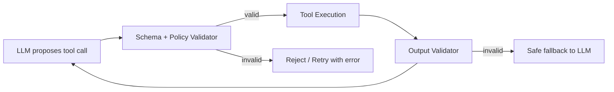

# Tool validation

> **Learning Path:** Tool Calling & AI Interfaces
> **Section:** 10.1.5 — Learn

**Tool validation**

### 1. The problem

When an LLM is allowed to call tools, the model is no longer just generating text. It is generating *structured actions* with parameters that will be executed against real systems.

That creates a new failure surface:
* The model hallucinates a tool name or parameter that doesn't exist
* The model fills a parameter with a value of the wrong type, format, or range
* The model tries to call a tool the user is not allowed to use
* A user prompt is injected into a tool argument to make the model call a privileged tool

Without a validation layer, a bad call either crashes the tool, corrupts data, or leaks privileged capability. Prompt instructions are not a security boundary.

### 2. Mental model

Tool validation is a contract enforcement layer between the LLM and the execution environment.

Think of it as a type checker + policy gatekeeper. The LLM proposes a call, the validator checks it against a formal contract before it is allowed to run, and optionally checks the result before it is returned to the LLM.

LLM -> Validator -> Tool -> Validator -> LLM

It does not try to make the LLM smarter. It assumes the LLM will be wrong and contains it.

### 3. How it works

Essentially three checks, in order:

**Schema validation.** The tool is defined by a JSON Schema / OpenAPI spec: name, parameters, types, required fields, enums, ranges. The validator parses the LLM output and rejects calls that don't conform. This catches hallucinations and type errors before they reach code.

**Policy validation.** Allowlist the tools the agent can actually use in this context. Check authorization and business rules on the arguments: `user_id` in the call matches the authenticated user, `order_id` belongs to them, `amount` is within limits, `action` is permitted for the current session.

**Output validation.** The tool returns data. Validate shape and sanity before feeding it back to the LLM. If the tool returns an error, unexpected nulls, or data that violates assumptions, sanitize or fail gracefully instead of letting the model hallucinate from a malformed response.

### 4. Architectural reasoning

Use tool validation when:
* Tool calls have side effects: writes, money movement, access to PII
* Multiple agents or users share the same tool set with different permissions
* You need replayability and observability of agent actions

Alternatives:
* Rely on prompt instructions only. Cheap, but unenforceable. Fails under adversarial input.
* Validate inside the tool implementation. Works, but mixes policy with business logic and duplicates checks across tools.
* Validate via LLM self-check. Slow and circular.

Why a separate validation layer wins: it is declarative, testable, and centralized. You can change policy without retraining the model, and audit every rejected call.

### 5. Trade-offs and failure modes

* **Strictness vs. availability.** Over-validation rejects legitimate but unusual calls, causing retries and degraded UX. Under-validation lets bad calls through. Start strict on side-effecting tools, permissive on read-only tools.
* **Latency.** Validation adds a hop. Keep schemas compiled, checks in-process, and policy lookups cached. The cost is tiny compared to tool execution.
* **Error feedback to the LLM.** If you just reject silently, the model loops. Return a structured error like `invalid_parameter: amount must be >0` so the model can self-correct.
* **Schema drift.** If the tool changes and the schema isn't updated, validation will break the agent. Treat tool schemas as versioned contracts.
* **Output poisoning.** Valid input can still produce malicious output from a compromised tool. Output validation and output allowlisting limit blast radius.

### 6. Example

Customer support agent with three tools: `get_order`, `cancel_order`, `refund_order`.

Contract:
* `cancel_order(order_id:string, reason:string)`
* Policy: `order_id` must belong to `session.user_id` and order status in [`pending`,`processing`]. Max 1 cancellation per 24h.

The LLM proposes `cancel_order(order_id="12345", reason="change mind")`. Validator checks schema -> ok. Checks policy -> order belongs to user? yes. Status? pending? yes. Allow call.

If the LLM proposes `cancel_order(order_id="99999", reason="")`, policy rejects. The validator returns a structured error to the LLM: `policy_violation: order not owned by user`. The model retries with a different order or asks the user.

No code in the tool needs to re-check ownership; the validator already enforced it.

### 7. Reasoning challenge

You are building a research agent that can call `search_web`, `fetch_url`, and `delete_internal_doc`. You want the agent to be helpful but never delete production docs.

Where do you enforce the delete restriction: in the system prompt, in a tool allowlist per user role, or both? What happens if a user tries prompt injection to make the agent call `delete_internal_doc` on a file they don't own?

### 8. Key takeaway

* Tool validation exists because LLMs are unreliable action generators, not because tools are unreliable.
* Validate schema first, then policy, then output. Treat the contract as code.
* Centralize validation so policy is auditable and changeable without model changes.
* Give the LLM structured rejection signals so it can recover instead of looping.
* For side-effecting tools, prefer fail-closed validation over permissive prompting.
