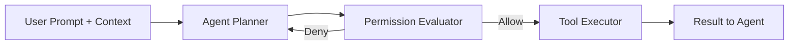

# Tool permissions

> **Learning Path:** Tool Calling & AI Interfaces
> **Section:** 10.1.6 — Learn

**Tool permissions**

### 1. The problem

When an agent can call tools, it stops being a chatbot and starts being an actor. A tool call is an external side effect: write to a database, send an email, charge a card, delete a file, invoke another service.

The problem is not accuracy. It is authority. Without a gate, the model can:
* Expose data it should not read
* Perform actions the user did not intend
* Escalate privileges across tenants
* Be tricked by prompt injection into calling dangerous tools

You need a way to decide *before execution* whether this specific agent, for this specific user, in this specific context, is allowed to call this specific tool with these specific arguments.

### 2. Mental model

Think of tool permissions as a capability check between planning and execution.

The LLM planner proposes: `call tool X with args Y`.
The permission layer asks: `Is this allowed?` based on policy, not on the model's confidence.

It is authorization for AI actions, not authentication for users. The model is untrusted code generation; the permission system is the trusted runtime.

### 3. How it works

The essential mechanism is a pre-execution policy evaluation.

Evaluation inputs:
* **Who**: user identity, role, tenant, session
* **What**: tool name + operation, resource target
* **How**: arguments, data scope, risk level
* **When/where**: time, IP, sensitivity of data involved

Policy is declarative: `allow read_customer if role = support AND customer_id in user's scope`. Deny by default. The agent never sees denied tools; it gets a safe error to re-plan.

Audit is mandatory. Every allow/deny is logged with the full decision context for forensics and policy tuning.

### 4. Architectural reasoning

Use tool permissions when tools have side effects, data access, or cost.

It solves:
* **Blast radius control.** A compromised or misaligned prompt cannot reach production systems.
* **Least privilege for agents.** Different users get different tool sets. A support agent reads tickets, a finance agent writes invoices.
* **Compliance.** Separation of planning and execution makes it auditable.

Alternatives:
* Hardcoded allowlists per agent. Simple, but not scalable and mixes policy with code.
* Prompt-based safety instructions. Cheap, but brittle. The model can be jailbroken.
* Post-execution review. Too late for destructive actions.

Choose a central permission evaluator, not per-tool checks. It gives you one place to reason about policy, caching, and audit.

### 5. Trade-offs and failure modes

* **Safety vs autonomy.** Strict policies reduce hallucinatory abuse but force more re-planning and user clarification. Overly permissive policies restore autonomy but increase risk.
* **Latency.** Policy evaluation adds a round trip. Cache decisions for stable contexts, but invalidate on role change.
* **Policy complexity.** Fine-grained policies are accurate but hard to maintain. Start coarse: tool-level, then resource-level, then argument-level.
* **TOCTOU and prompt injection.** The model can propose benign args and then the tool interprets them maliciously. Validate arguments structurally, not just by name.
* **Permission leakage.** Returning different error messages for "tool doesn't exist" vs "tool denied" lets an attacker enumerate capabilities.

### 6. Example

Enterprise CRM assistant.

Tools: `search_contacts`, `create_deal`, `send_email`, `delete_note`.

Policy:
* Support role: read only on contacts belonging to assigned accounts
* Sales role: read/write deals for own pipeline, can send email to contacts in pipeline
* No role can delete notes

The agent plans to `create_deal` for customer X. Permission evaluator checks user role, account ownership, and that `customer_id` is in scope. Allow. If the same prompt tries `send_email` to an external domain, deny and return a safe failure. The agent can ask for clarification instead of leaking data.

### 7. Reasoning challenge

You are building a multi-tenant AI agent platform. Each tenant brings their own tools via MCP. A tenant admin wants agents to be able to call any of their tools without per-tool approval to move fast.

What do you allow, and what guardrails do you require before you enable that? What breaks if you trust the tenant's tool manifest completely?

### 8. Key takeaway

* Tool permissions are authorization for AI actions, not just input filtering.
* Decide allow/deny before execution with a policy based on who, what, and context.
* Deny by default, log every decision, and keep policy separate from the LLM planner.
* The real trade-off is safety and auditability vs agent autonomy and latency.
