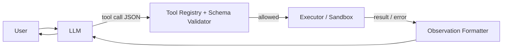

# Tool execution

> **Learning Path:** Tool Calling & AI Interfaces
> **Section:** 10.1.7 — Learn

**Tool execution**

### 1. The problem

A language model can reason, but it cannot act. It has no real-time data, no write access, no persistent memory, and no guaranteed correctness. 

When you ask an agent to "check inventory, reserve an item, and email a receipt", the model can generate the text of an email, but it cannot reliably call your inventory service, respect business rules, or know the current stock.

The need is not for smarter prompting. It is for a controlled boundary where the model's intent is translated into a safe, verifiable action in your system.

### 2. Mental model

Think of the LLM as a planner with no hands, and tool execution as a set of arms with strict contracts.

The model outputs *what* it wants to do and *why*. The runtime decides *whether* it can do it, *how* to do it, and *what to feed back*. The loop is:

Intent → Tool Call → Execution → Observation → Next reasoning step

The model never executes code. It proposes structured calls; a runtime executes them.

### 3. How it works

The essential mechanism is a closed loop, not a single call.

1. **Schema binding.** Tools are described by JSON Schema / OpenAPI: name, parameters, types, required fields. The model is constrained to emit calls matching the schema.
2. **Validation & policy.** Before execution, the runtime checks authorization, input shape, rate limits, and business policies. This is where you stop hallucinations.
3. **Execution.** The executor runs the real function, API, or service call. It can be sync or async, local or remote.
4. **Observation.** The raw result is normalized into a concise, model-safe observation and fed back. The model never sees raw stack traces.
5. **Iteration.** The model can chain calls until it has enough evidence to answer.

The key architectural property is *separation of proposal from execution*.

### 4. Architectural reasoning

Tool execution helps when you need the model to interact with the world under constraints.

**When it helps**
* Real-time data: pricing, inventory, user profile
* Actions with side effects: create order, send email, schedule meeting
* Domain logic the model cannot know: internal APIs, compliance rules
* Reducing hallucination by grounding answers in actual tool output

**Alternatives**
* RAG only: good for read-only knowledge, no actions
* Hard-coded workflows: deterministic but not flexible to new intents
* Full autonomous code execution: powerful, high risk

Choose tool execution when you want flexible intent understanding with deterministic, auditable actions.

### 5. Trade-offs and failure modes

**Latency vs correctness.** Each tool round trip adds 100ms-2s. Chaining 3-4 tools can dominate response time. You trade speed for groundedness.

**Safety vs autonomy.** More tools = more capability, but larger attack surface. You need allowlists, parameter validation, and output sanitization. Never let the model build SQL or shell commands from free text.

**Partial failure.** Tools fail, time out, return ambiguous data. The model must handle errors gracefully. Without explicit error handling in the loop, you get silent degradation.

**State drift.** Tools have side effects. If two agents call `reserve_item` concurrently, you need idempotency keys and transactional semantics. The model is stateless; your executor must enforce consistency.

**Observability.** You need logs of: prompt → tool chosen → parameters → result → next prompt. This is essential for debugging and cost control.

### 6. Example

Enterprise support agent.

User: "My order hasn't arrived and I want a refund."

Agent flow:
1. LLM proposes `get_user_by_email` with email from conversation history.
2. Runtime validates user exists and agent has permission, executes.
3. Observation returns orders list. LLM proposes `get_order_status(order_id)`.
4. Result: delayed shipment. LLM proposes `create_support_ticket` with reason and `offer_refund` with amount from policy lookup.
5. Final answer summarizes actions taken with ticket ID.

The model never knows DB schema. It only knows tool contracts. Policy enforcement lives in the executor, not the prompt.

### 7. Reasoning challenge

You need an agent that can update customer credit limits. The tool `adjust_credit_limit(user_id, new_limit)` has financial side effects and compliance audit requirements.

Do you:
A) Expose the tool directly to the model with a high limit range, or
B) Expose a constrained tool `request_credit_review(user_id, reason)` that writes to a queue for human approval?

What do you lose and gain with each? Which failure modes become acceptable?

### 8. Key takeaway

* Tool execution exists to bridge LLM intent with safe, verifiable system actions.
* The runtime, not the model, owns validation, authorization, and error handling.
* Design tools with narrow, idempotent contracts and explicit observations.
* Optimize for observability, failure isolation, and policy enforcement over raw tool count.
* The architectural decision is about trust boundaries: what the model may propose vs what the system may actually execute.
