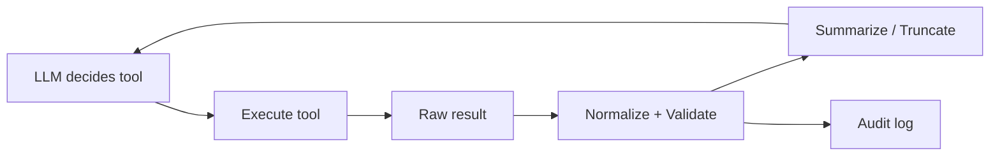

# Tool results

> **Learning Path:** Tool Calling & AI Interfaces
> **Section:** 10.1.8 — Learn

**Tool results** are the feedback loop that makes tool calling useful. Without handling them well, you just have an LLM that can call APIs and then hallucinate about the answers.

### The problem

An LLM can't know the price of a flight today, the balance in your CRM, or whether a container is healthy. It can *call* a tool to find out, but the result comes back as raw data, error text, or a huge JSON blob.

The problem is not calling the tool. It's what you do with the result before the model uses it again:
* The result may be too large for the context window
* It may be late, partial, or an error
* The model may misinterpret schema, units, or stale data
* Multiple tools can return conflicting information

If you feed raw tool results straight back, you get context overflow, slow responses, and brittle reasoning. If you filter too aggressively, you lose fidelity and create silent hallucinations.

### Mental model

Think of tool results as evidence that must be ingested, normalized, and summarized before the next reasoning step.

```
User -> LLM -> Tool Call -> Tool Results -> LLM -> Response
                     ^                |
                     |_______________|
```

The loop is only as good as the result handling layer. That layer decides what evidence is kept, how it's represented, and when to stop looping.

### How it works

A robust tool results pipeline does three things:

1. **Normalization.** Tools return different shapes. Normalize to a canonical schema with provenance: `source, timestamp, status, data, error`. This prevents the model from confusing a 404 from Service A with a 200 from Service B.

2. **Fidelity control.** Truncate, summarize, or paginate results before they hit the LLM. Keep the raw result for audit, but feed the model a concise, structured summary with key fields only. For example, return `price: $342, availability: 3 seats` not the full 5KB fare rules JSON.

3. **Interpretation guardrails.** Validate the result against the tool's contract. Did the call succeed? Is the data fresh enough? Is it within expected ranges? Surface validation failures as explicit tool result messages, not silent drops.

The flow:


### Architectural reasoning

Tool results enable the decision to separate *action* from *reasoning*. The LLM reasons, the system executes.

Use this pattern when:
* The answer requires live, external data or side effects
* Multiple tools can be composed to answer one query
* You need auditability of what data influenced the model

Alternatives:
* **Prompt engineering with static knowledge** - cheaper, but stale and hallucinates
* **RAG only** - good for documents, bad for actions like bookings or real-time checks
* **Pre-aggregation** - reduces latency but loses freshness

Choose tool results when correctness and freshness matter more than latency, and when you can afford a multi-turn loop.

### Trade-offs and failure modes

* **Context vs fidelity.** More result data improves accuracy but costs tokens and latency. Architects need a policy: max tokens per tool, priority fields, and summarization rules.
* **Latency vs completeness.** Waiting for all tools serially is slow. Parallel calls help, but then you must merge partial results and handle out-of-order responses.
* **Error amplification.** A tool returning an error string that looks like success data will be trusted by the model. Always wrap results with a machine-readable envelope.
* **Stale evidence.** Without timestamps, the model can't reason about freshness. A price from 2 hours ago is a bad decision.
* **Result explosion.** A search tool returning 100 rows will overflow context. You need pagination, top-K, or a ranking summarizer.

Common failure: feeding the entire raw API response into the prompt. The model gets lost in noise, misses the key field, and hallucinates the rest.

### Example

Enterprise support agent needs to refund an order.

1. LLM calls `get_order(order_id)` -> returns 12KB JSON with line items, taxes, history.
2. Normalizer extracts: `order_id, status=paid, amount=$129.99, created=2024-11-02, refundable=true`.
3. LLM calls `check_refund_policy(customer_tier)` -> returns `max_refund_window=90d`.
4. Result handler compares timestamps, decides `eligible=true`.
5. LLM asks user confirmation, then calls `create_refund`.

The model never saw the full JSON, only the evidence it needed, with provenance.

### Reasoning challenge

You have two tools: `inventory_service` returns stock = 5, timestamp 30s ago. `warehouse_api` returns stock = 0, timestamp 5s ago but with error rate 15% historically. The user asks "Can I buy 1 now?" 

What do you feed the model, and how do you represent uncertainty?

### Key takeaway

* Tool results are evidence, not just data. Normalize, validate, and summarize them before the next LLM turn.
* Control fidelity explicitly: what fields survive, how old is it, and what's the source.
* Design for failure: timeouts, partial results, and conflicting data are normal. Make them visible to the model.
* The architectural win is decoupling reasoning from execution, with a clear contract for how results are ingested.

You should be able to reason about when to summarize vs pass raw, how to prevent context blow-up, and how to keep the agent honest about what it actually knows.
